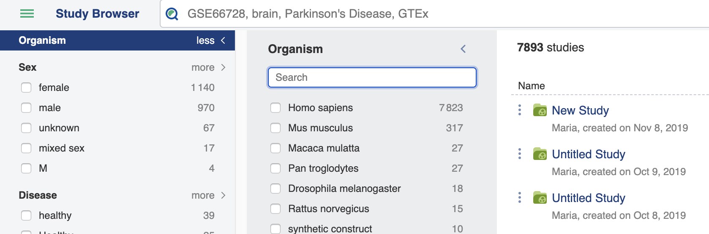
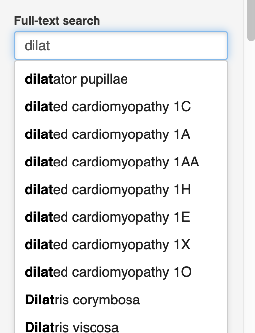
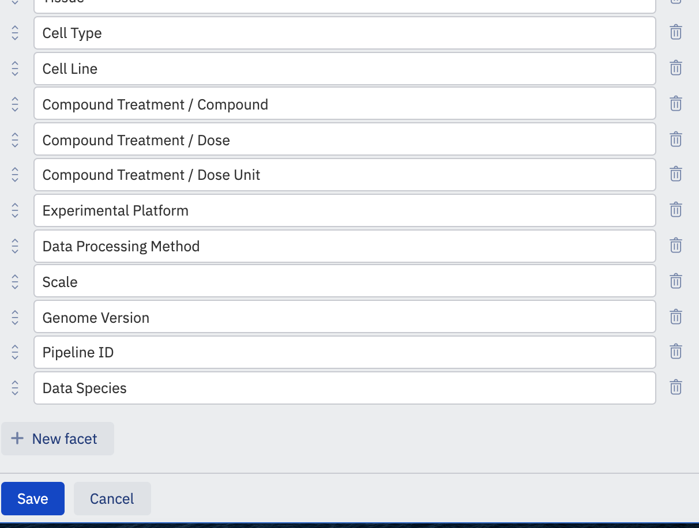
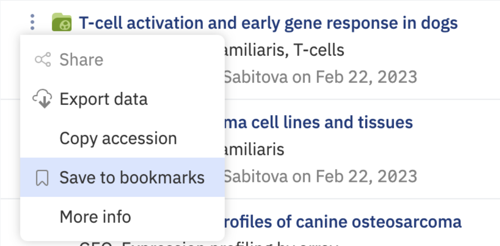
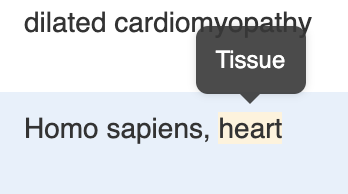

# Study Browser

The Study Browser is the main interface to quickly search and discover studies of interest.

## Getting to the Study Browser

Click ‘Browse studies’ on the dashboard after you sign in to launch the Study Browser.


You can also use the short cut dock in the top lefthand corner of any window.


## Exploring the Study Browser


### Basic Search Syntax

At the top of the window is the main search bar. In the text box you can search by the name of a study,
the accession of a study, sample or signal object, or by any text that is in any metadata field across
all of the data you have visibility of. As you begin typing you will be offered auto-complete suggestions
based on dictionaries of terms that are present in ODM.

The search is synonym-aware (exact and related), so if you type in ‘human’ the auto-complete suggests ‘Homo sapiens’ as the preferred label of humans and the results from synonyms are automatically included in search results.

#### Wildcard (? and *)

Question marks (?) match any character, and you can use asterisks (\*) to allow any number of (including zero) wildcard characters:

```
*
```

#### Exact Phrase Matching

ale will find “male” and “female” for example. Use quotes (“”) to search for an exact phrase. For example, “single cell” will find results that contain the whole phrase only.

Terms can be joined with the AND operator (by default the OR operator is used), and they can be excluded with a preceding NOT.

The main panel displays the results of your search and filter options, if you have any,
otherwise all studies are displayed that your user account has visibility of,
ordered by date with the newest at the top.

If your search term matches a term from an ontology which has child terms, then once initial results have been retrieved there is the option to toggle ‘extend query’, which will add search results for child terms (those with the subClassOf property in the ontology). This is only available if the number of terms (including synonyms) is fewer than 30,000.

### Logical Operators

The Study Browser’s main search bar supports logical operators AND, OR, and NOT to help refine your queries. These operators can broaden or narrow your search and filter out unwanted results. Below we explain each operator, how they behave, and how to combine them effectively, along with some important limitations and best practices.

#### AND Operator (Narrowing Your Search)

Use the `AND` operator to require that all specified terms are present within a single data layer of an entity (such as Study-level metadata or within Sample Metadata). This is useful when you want to focus your search on records that include multiple keywords in the same context.

- Behavior: AND means “must include”. A study will only be returned if both of the terms connected by AND are found in its metadata.

- Use Case: If you have too many results for a single term, adding an `AND` term will focus on the overlap. For example, searching for `cancer AND blood` will return only studies that mention both “cancer” and “blood”. This yields a more specific list than searching for either term alone. In contrast, a search for `cancer blood` (with no operator, see OR below) would show any study that contains either word.

- Example: If you’re interested in studies about a specific drug dosage, you might search `aspirin AND 100`. This query finds studies where “aspirin” and the number “100” occur together (for instance, a study with samples treated with 100 mg of aspirin).

Note: The AND operator must be written in uppercase AND for the system to recognize it as a logical operator. (Lowercase “and” is treated as a normal word, not as an operator.)


#### OR Operator (Broadening Your Search)

By default, the Study Browser uses an OR logic between words. This means if you enter multiple words separated by spaces (with no explicit operator), the search will return studies containing any of those words. The OR operator is useful when you want to broaden your search or aren’t sure which of several terms might appear.

- Behavior: OR means “either term can appear”. A study will be returned if at least one of the terms is found. When you enter words with spaces, the system interprets it as OR by default.

- Use Case: Use OR to cover synonyms, related terms, or alternative keywords. For example, searching for aspirin ibuprofen will find studies that mention either “aspirin” or “ibuprofen” (or both). This is equivalent to explicitly searching aspirin OR ibuprofen. It casts a wide net to ensure you don’t miss studies that use one term or the other.

- Default Behavior: You typically do not need to type OR between terms – typing multiple terms (e.g. heart lung) automatically applies the OR logic. However, you can include the OR operator for clarity or to form more complex queries (especially in combination with AND or NOT).

- Example: If you want studies related to liver disease, you might search hepatic OR liver to cover both a technical term and a common term. This will return any study that mentions either “hepatic” or “liver”.

Like AND, use uppercase OR if you write it out. (The word “or” in lowercase will be treated as a normal word to search, not as a logical command.)

#### NOT Operator (Excluding Terms)

Use the NOT operator to exclude records that contain a certain term. This helps filter out unwanted results that happen to contain a specific word.

- Behavior: NOT means “must not include”. If a study’s metadata contains the term after NOT, that study will be omitted from the results (even if it matches other parts of your query).

- Use Case: Use NOT when you want to refine your search by removing a subset of results that are not relevant. For example, if you are interested in cancer studies but want to exclude any involving mice, you could search cancer NOT mouse. This will find studies that mention “cancer” and at the same time do not mention “mouse”. Any study that includes the word “mouse” will be filtered out of the cancer search results.

- Examples: gene NOT cell will return studies that mention “gene” but exclude those that also talk about “cell”. Similarly, aspirin NOT ibuprofen finds studies referencing aspirin but filters out any that also reference ibuprofen.

As with the other operators, use uppercase NOT. Place NOT directly before the term you wish to exclude (e.g. NOT virus). You can prepend NOT to multiple terms in a query if needed to exclude several keywords.

#### Combining Operators

You can combine AND, OR, and NOT operators in a single query to build more sophisticated search conditions. This allows both general and advanced users to precisely target the studies of interest. 

When mixing different operators, keep in mind how the logic will be applied:

- In complex queries, parentheses ( ) can be used to group terms and control the order of evaluation (just like in a mathematical expression). It’s often best to use parentheses when you have more than two terms or multiple operators, to make the query logic clear.

- Example (mixing AND/OR): Suppose you want studies about cancer that involve either lung or breast tissue. You can search cancer AND (lung OR breast). This query will return studies that contain “cancer” and either of the terms “lung” or “breast”. In other words, it finds studies on cancer that are related to lung tissue or breast tissue. Without the parentheses, writing cancer AND lung OR breast could be ambiguous to the system (see Operator Precedence below), so adding parentheses ensures the intended grouping.

- Example (with NOT): You can also combine exclusion. For instance, virus AND (mouse OR rat) NOT human finds studies that mention “virus” and either “mouse” or “rat”, excluding any that mention “human”. This would retrieve animal virus studies while filtering out human-related ones. In this query, parentheses group the OR logic, and NOT excludes the undesired term.

There’s no strict limit to how many operators you can use, but readability becomes important. It’s a good practice to keep queries understandable and use parentheses for clarity when multiple operators are involved.

### Operator Precedence

When you combine operators without parentheses, the Study Browser follows a standard precedence order to decide how the query is evaluated:

1 - NOT is applied first (it binds closest to the term it prefixes, excluding those terms from results).

2 - AND is evaluated next.

3 - OR is evaluated last.

This means AND operations will be resolved before any OR operations at the same level, unless you use parentheses to override the order. For example, in the query A OR B AND C (without parentheses), the search will interpret it as A OR (B AND C). In other words, it will first find studies that have both B and C, and then add studies that have A. If your intention was to group A OR B together, you should use parentheses: (A OR B) AND C to force that grouping. 

Similarly, NOT applies only to the term immediately following it. For example, cancer AND NOT mouse is effectively interpreted as cancer AND (NOT mouse). (In practice, you would typically phrase this as cancer NOT mouse without an extra AND, as described above.) 

Using parentheses is the safest way to ensure the query is interpreted exactly as you intend, especially in more complex searches. When in doubt, add parentheses to group your terms logically.


### Limitations and Best Practices


Finally, be aware of some current limitations of the Study Browser search, and follow these best practices to get the best results:

- Use Uppercase for Operators: Always write AND, OR, and NOT in uppercase. The search engine recognizes these as logical operators only when capitalized. If you use lowercase (“and”, “or”, “not”), the system will treat them as ordinary words to search for (or possibly ignore them as common words), which can lead to unexpected results. For example, heart and lung (lowercase) would not apply the AND logic – it would likely be treated like heart lung (an OR search), whereas heart AND lung will correctly enforce that both terms must be present.

- Combine Terms Thoughtfully (Single-Entity Context): The search currently works best when all your AND terms apply to the same “entity” or level of data. In practice this means all terms should appear either in the study’s own metadata or within a single sample’s metadata. The Study Browser does not support combining terms across different levels with AND. For example, if you search study_title_term AND sample_attribute_term, the query will only return a result if there is a single study or sample entry that contains both terms. If one term appears only in the study description and the other only in a sample of that study, the study will not be returned by an AND query. Likewise, two terms that each appear in different samples of the same study will not be matched together with AND. To work around this, focus your AND queries on terms that you expect to co-occur in one context. If you need to find studies where one term is in the study info and another is in the sample, you may have to perform separate searches or use filters (see below).

- Be Cautious with Multi-Value Fields: If a field contains multiple values (for example, a study has a list of several keywords, or a sample has multiple compounds listed), using AND to search for two or more of those values can be tricky. Due to how the search index works, sometimes a study that indeed has both values might not show up. For instance, if a study has an attribute “Keywords” with values X and Y, a search for X AND Y may not return that study because the values are stored separately in the data. In general, all values in a multi-value field are indexed, but the search might not always consider the combination as a single hit. If an AND search isn’t yielding an expected study, try searching for each term individually to verify they exist, or consider searching for one term and then using the filters to narrow down the other term.

- No Field-Specific Syntax in Search Bar: The main search bar searches across all metadata fields at once; you cannot restrict a query to a specific field by typing the field name (for example, searching Title:ABC AND Tissue:blood is not supported in the free-text search bar). Typing a colon or field name in the query won’t filter the results by that field and may result in no matches. Instead, if you want to filter by a particular field or attribute (such as finding all studies with Tissue = “blood”), use the filtering options in the Study Browser’s filter panel on the left. Use the search bar for keyword searches and use the filters for precise field-based filtering.

- Use Filters for Complex Queries: As a best practice, combine the search bar with the side filters for complex queries. For example, rather than trying to craft a single query like cancer AND lung AND NOT human, you could search for “cancer” in the search bar, then apply a filter on Tissue = lung in the filter panel, and exclude species = human via another filter. This approach may yield more reliable results given the current limitations of the search syntax.

- When Mixing Operators, Use Parentheses for Clarity: As noted, if you use multiple different operators in one query, parentheses are your friend. They make the query logic clear both to you and to the system. This prevents confusion about how the search will be executed. It’s easy to misinterpret a complex query, so adding parentheses around OR clauses or overall groupings ensures you get the expected results. For example, use virus AND (mouse OR rat) instead of virus AND mouse OR rat if you intend the former logic.

By keeping these points in mind, you can effectively use AND, OR, and NOT to navigate and filter studies in the Genestack Study Browser. With practice, logical operators become powerful tools to pinpoint exactly the studies you’re looking for while avoiding irrelevant results. Happy searching!

### Filter panel

The filter panel allows you to filter your results with search facets. Set facets to refine search results. Facets are
automatically generated from the metadata of available datasets, and the suggested list of facets varies
depending on a search results. Click ‘More’ to explore the whole list of suggested items.



Bookmarked studies can be shown by clicking on the Bookmarks icon. Access allows you to see your studies, those that are accessible to you (for example, public studies) or those that have been shared with your user account/group.

If there are additional facet terms a **Find more** link will be displayed.
Clicking on this allows you to type in terms and you can select from the presented list of options.



### Configuring the filter panel

Exactly which metadata fields are available as search facets can be configured by users who have the permission to configure facets. To change the facets click the cog icon at the bottom of the filter panel.



You can add facets to the filter panel by clicking the **New facet** button and typing the full name of the metadata field which you want to appear. Names are case sensitive. You can also reorder the facets by dragging the icon next to the facet name, or delete them from the panel by clicking the bin icon. Once you are happy click the **Save** button to apply the changes. If your facet is empty or a duplicate it will not be allowed and the panel change won’t save until this is corrected.

### Results panel


The main panel in the study browser shows the results of your search, or if no search terms/filters have been applied, all studies that you have visibility of. The first column displays the name of the study, and you can click this to look at the study in more detail. It also lists information about which user created or imported the study, and the date.

To the left of the study titles is a three dot link. Click this to open a menu that allows you to share the study (if you have permission), export data, copy the accession of the study, add it to your bookmarks, or view more information.



Under the study title there is a summary of the metadata that is associated with the study. This displays information such as the organism, tissue, cell-type, disease and so on and is pulled straight from the metadata fields of the samples in the study.

You can hover over any name in the summary column and the name of the metadata field where the data comes from will appear.



There is also information of who imported the study into ODM and when.
To the right of the study title you can see how many samples are present in the study.

And finally you can use the bookmark flag at the end to flag studies for viewing later.
