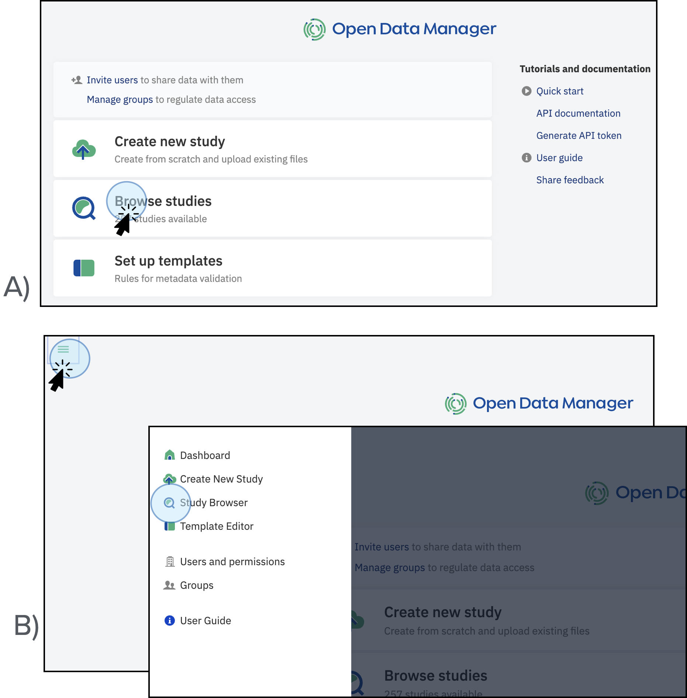

# Study Browser

The Study Browser is the main interface to quickly search and discover studies of interest. 

!!! Important
    You can only access the studies if you have the required permissions (Access all data). Refer to the section [User Setup](setup.md) to learn more about users and permissions.

## Getting to the Study Browser

You can access the studies menu by clicking on **Browse Studies** from the dashboard, or by clicking at the top left menu and selecting **Study Browser**.

<figcaption>Access the available studies in ODM (based on your permissions) by clicking <strong>Browse studies</strong> on the main dashboard (A), or by clicking on the top left menu and selecting <strong>Study Browser</strong> (B).</figcaption>

## Search for Data

At the top of the window is the main search bar. You can search by the name of a study, the accession number, sample or signal object, or any text within any metadata field across all data visible to you.

* As you type, autocomplete suggestions based on dictionaries of terms present in ODM will appear. 

<figcaption>Search for data. The system provides an autocomplete feature that offers values for different ontologies in the search bar. For example, if you type <strong>bowe</strong>, the system will suggest autocompleting options containing the word <strong>bowe</strong></figcaption>

* The search is synonym-aware, meaning if you type in **‘human’**, it will suggest *Homo sapiens* and include results for synonyms.

<figcaption>Search for data. The system will suggest autocomplete options based on preferred ontologies. For example, if you type <strong>human</strong>, the system will suggest the label <strong>"Homo sapiens"</strong></figcaption>

* Use question marks (?) to match any character.

<figcaption>Search for data. User question marks to match any missing characters. For example, if  you type the word <strong>c?ncer</strong>, the system will suggest studies containing the word <strong>cancer</strong></figcaption>

* Use asterisks (\*) to allow any number of wildcard characters.

<figcaption>Search for data. Use asterisks to allow any number of wildcard characters. For example, if you type <strong>*ale</strong>, the system will display studies containing the words <strong>male</strong> and <strong>female</strong></figcaption>

* Use quotes (“ ”) to search for an exact phrase.

<figcaption>Search for data. Use quotes to search for an exact phrase or word. For example, if you type <strong>“single cell”</strong>, the system will display studies that contain the words single cell in any of its components (metadata or experimental data)</figcaption>

* Terms can be joined with the **AND** operator (by default the OR operator is used), and they can be excluded with a preceding **NOT**.

<figcaption>Search for data. The use of operators will display a different number of available studies depending on the specific functions: <strong>OR</strong> will display studies where one or the other conditions are met; <strong>NOT</strong> will display studies where one condition is met but not the other; whereas <strong>AND</strong> will display studies where two conditions are met</figcaption>

* The main panel displays your search results and filter options. If no search is performed, all studies accessible to your user account are displayed, ordered by date with the newest at the top. 

<figcaption>Search for data. If no filters are applied, the system displays the list of all the available studies within the ODM</figcaption>

* If your search term matches a term from an ontology with child terms, you can toggle **extend query** to include child terms in the search results. 
* This feature is available if the total number of terms (including synonyms) is fewer than 30,000.

<figcaption>Search for data. Extend the query to include child terms in the search results. For example, the number of available studies with the word <strong>cancer</strong> increases when the option Extend query is selected</figcaption>

## Filter Data

* By default, all studies you have permission to access are displayed. Given the potential number of studies, search and filtering options in the left-hand panel of the **Study Browser** help you find specific studies of interest. 
* You can search by study name, accession number, or any relevant metadata field. 
* The facets beneath the search bar allow you to filter search results based on sample data (metadata) fields.

<figcaption>Filter data. Use the filters to narrow the search of studies. For example, select <strong>Data class</strong> and then tick the option <strong>Expression</strong> to find exclusively studies containing gene expression as experimental data (GCT format files)</figcaption>

## Bookmark studies

* You can save preferred studies for easy access. To the left of a study title is a three-dot link. Click this to open a menu that allows you to share the study (if you are the owner) and save it to bookmarks.

<figcaption>Bookmark studies. Save preferred studies to access them easily. To do so, click on the three-dot link next to the name of the study and click on <strong>Save to bookmark</strong></figcaption>

* Bookmarked studies are accessible by clicking on the Bookmarks icon. This section allows you to see your studies, those accessible to you (e.g., public studies), or those shared with your user account/group.

<figcaption>Bookmarked studies. Bookmarked studies are accessible by clicking on the button <strong>Saved</strong>. A new window will appear where you can access the saved studies or remove the bookmark if needed</figcaption>

## Configuring the filter panel

Users with permission (Admins) can customize which metadata fields are available as search facets.

To do this:

1. Click the cog icon at the bottom of the filter panel to change the facets.
2. Add facets by clicking the **New Facet** button.
3. Type the exact name of the metadata field (names are case-sensitive).

You can reorder facets by dragging the icon next to the facet name or delete them by clicking the bin icon. Click the **Save** button to apply changes. The panel will not save if your facet is empty or a duplicate.

<figcaption>Configure facets. Reorder the facets to display for searching studies. Click on <strong>Configure facets</strong> at the bottom left of the page. A new window will open where you can add, rename, delete or drag facets. The changes will apply after clicking on <strong>Save</strong></figcaption>

!!! Important
    You can only access the Configure facets option if you have the necessary permissions. For access, an admin must edit the settings. Refer to the [User Setup](setup.md) section for more information.

## Navigation and Help

* Use the shortcut dock in the top left-hand corner of any window to return to the main dashboard.
* Click on Quick Guide in the top right of your window for reference guides and examples on how to use ODM.

<figcaption>Navigation and help. Click on the left panel to return to the main dashboard. Click on the button Quick Guide on the right to explore Quick User Guides</figcaption>

* On the right side of the board, you can access account details and check the status of any tasks you are running. 
* Click the question mark next to the search bar to open the search help section for more details about advanced search functionality.

<figcaption>Navigation and help. Click on the question mark symbol <strong>(?)</strong> to open the search bar help section including operators, ontologies, and wildcards. Click on the <strong>Tasks</strong> option to visualize the status of any task you are running. Click on <strong>View all</strong> to visualize the last tasks you have run and their status (running, done, failed, etc.)</figcaption>

