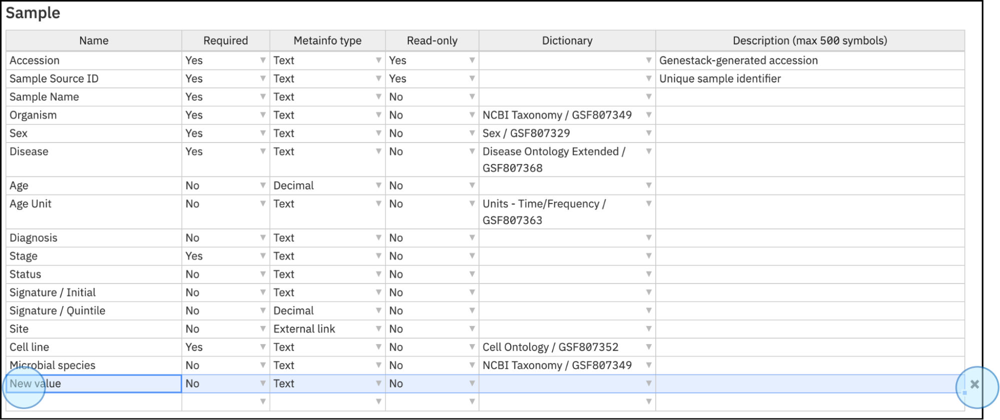

# Template Editor

The Template Editor in ODM enables users to create, customize, and update templates for data import and validation. These templates define metadata attributes, ensuring terms and values are harmonized and validated according to predefined rules.

## What is a template?

A **Template** in ODM is a structured framework that defines metadata attributes for data objects, ensuring that terms and values are harmonized and validated according to predefined rules. Templates specify the required fields, data types, validation dictionaries, and descriptions, providing consistency in how metadata is managed across studies, samples, and experimental data.

Each data object (e.g., Study, Sample, Expression, Variant, Flow Cytometry) uses a separate template.

Templates include the following metadata options:

* **Name**: The name of the metadata field that should be included (e.g., “Accession,” “Organism”).
* **Required**: Indicates whether the metadata field is mandatory. If a required field is left blank or incorrectly filled, it will be highlighted in red.
* **Metainfo Type**: Specifies the type of metadata, such as text, integer, decimal, date, yes/no, or external link.
* **Read-only**: Defines whether the metadata field can be edited (“yes” means it cannot be edited).
* **Dictionary**: Enables the use of a predefined dictionary to provide standardized terms, helping with data curation and validation.
* **Description**: A brief description of the attribute, shown as a hint during data curation.

## Accessing the Template Editor

To access the Template Editor:

1. Click **Set Up Templates** on the Dashboard.
2. Alternatively, click on the menu in the top-left corner and select **Template Editor**.

<figcaption>Access the Template Editor by clicking <strong>Set up templates</strong> on the dashboard (A) or by clicking the three lines at the top left corner of the dashboard and selecting <strong>Template Editor</strong> (B)</figcaption>

## Template Editor Overview

When you open the Template Editor, you can see the list of available templates in your ODM instance, including the dates of creation, the author, and the latest update. There is no limit on the number of templates you can create.

<figcaption>View of the Template Editor. Explore the full list of templates, creation dates, authors, and latest updates</figcaption>

## Editing Templates

Click on the three dots next to each template to access options:

* **Rename**: Change the name of the template.
* **Duplicate**: Create a copy of the template, useful for creating similar templates with slight modifications.
* **Set as default**: Assign a new default template for any new studies. The default template can also be set when creating a new study (see the section [Create a new study](create-study.md) for more details).
* **Export**: Export the selected template in JSON format, allowing for modification and integration with downstream applications.
* **Copy accession**: Each template has a unique accession number, which is used for API endpoints.
* **Add to bookmarks**: Mark the template as a favorite.
* **More info**: View detailed information about the template, including sharing settings and included ontologies.

<figcaption>Edit templates. Click on the three dots next to the template’s name to access editing options such as rename, duplicate, export, etc. You can select the default template (A) or a new template from the list (B)</figcaption>

## Exploring Templates

Click on any template to open it in a new window and explore its features. This window displays the components of the template for each part of your study:

* Study
* Sample
* Library
* Preparation
* Expression
* Variant
* Flow Cytometry

<figcaption>View of the templates and their features. Explore templates, including sections such as samples metadata, library preparation, etc.</figcaption>

Alternatively, access the Template Editor from a study by opening the study, clicking on the study title in the top bar, then clicking on the template title and selecting **Explore**.

<figcaption>Access the <strong>Template Editor</strong> from an open study by clicking on the study title, then the template name, and <strong>Explore</strong></figcaption>

## Edit Template Metadata

Within the Template Editor, specify metadata fields and their properties:

* **Name**: Name of the metadata field (e.g., "Accession," "Organism," "Sample name").
* **Required**: Indicates if the field is mandatory. Required fields left blank or incorrectly filled will be highlighted in red.
* **Metainfo type**: Type of metadata (text, integer, decimal, date, yes/no, external link).
* **Read-only**: Permission setting for editing the metadata (Yes/No).
* **Dictionary**: Standardized terms for data curation and validation.
* **Description**: A hint or description for the attribute shown during curation.

<figcaption>Template Editor view: rows represent metadata attributes, and columns show classification features like <strong>Required</strong> and <strong>Metainfo Type</strong></figcaption>

## Actions on Templates

* **Grouping Metadata Fields**: Group fields under a common header using the **"/"** character (e.g., Signature/Initial and Signature/Quintile).

<figcaption>Use the <strong>"/"</strong> symbol to create subgroups within metadata fields. For example, The category Signature contains two values: Initial and Quintile. Use the / to create subgroups within the Signature attribute. The changes will be visible in the study where the template is being applied</figcaption>

* **Export Template**: Export templates in JSON format via the **Export** option.

<figcaption>Export the template in JSON format. In the template editor window, click on the name of the template, whether the Default template (A) or another template from the list (B), and click on  <strong>Export</strong>. This action will automatically start the download of the template in JSON format</figcaption>

* **Change Template**: Change the template associated with a study by selecting the study name and **Apply another**, then choosing the desired template.

<figcaption>Change the template applied to the study. On the study view, select the name of the study (top bar) and click on the name of the template. Then select <strong>Apply another</strong>. This action will show a list of available templates. Select the preferred one and click on Apply. You can also explore the template before applying by clicking on <strong>Explore</strong></figcaption>

## Creating a New Template

Users with appropriate permissions can create new templates. Refer to the section User Setup for more on user roles and permissions. Templates can be created via:

* **Python Script**: Import a new template using JSON files. Follow the instructions in the [Create a new template](https://github.com/genestack/user-docs/blob/develop/docs/tools/odm-sdk/terminal/templates/create-or-update-template.md)  section on the ODM GitHub page.

<figcaption>Import a new template using JSON files. Follow the instructions in the <a href="https://github.com/genestack/user-docs/blob/develop/docs/tools/odm-sdk/terminal/templates/create-or-update-template.md">Create a new template</a> section</figcaption>

* **Graphical User Interface**: Duplicate an existing template, rename it, and customize the metadata fields as needed. To create a new template, navigate to the template editor to see the list of templates. Then select any template and click on the option **Duplicate**, and select a new name for this template.

!!! note
    It is recommended that you assign a new name to identify your templates easily. This action will create a new template with the same metadata fields. Customize the metadata fields and actions by opening the template editor for the recently created template. 

<figcaption>Create a new template from a previously created template, whether the Default template (A) or a template from the list (B). Simply select the template (from the template editor), click on the three dots next to the template, and click on <strong>Duplicate</strong>. Select a new name for the template. This action will create a new template with the same metadata fields. You can open it to customize the metadata fields</figcaption>

## Dictionaries and Ontologies

Dictionaries and ontologies are essential in metadata curation and validation for ensuring accuracy, consistency, and organization.

### What Are Dictionaries?

Dictionaries in ODM provide controlled vocabularies that standardize the names and definitions of data elements, crucial for:

* **Standardization**: Consistent use of terms and values across datasets.
* **Clarity**: Clear definitions that reduce misinterpretation.
* **Validation**: Ensuring data entries match predefined acceptable values.

For example, a dictionary for the **Species** attribute ensures correct and uniform scientific names.

### What Are Ontologies?

Ontologies extend the functionality of dictionaries by organizing data into structured, relational frameworks. They offer:

* **Hierarchical Structure**: Categories and subcategories that clarify data relationships.
* **Conceptual Clarity**: Defined concepts and their relationships support better data analysis.
* **Enhanced Metadata**: Additional context, such as taxonomic lineage, enriches the dataset.

For example, the **NCBI ontology** organizes species names hierarchically, aiding in accurate classification and analysis.

<figcaption>Dictionaries and ontologies. Selecting the <strong>NCBI Taxonomy</strong> for the <strong>Microbial species</strong> attribute ensures <strong>Data Consistency</strong>: All species names conform to the standardized taxonomy provided by the NCBI, avoiding discrepancies such as misspellings or synonyms. <strong>Accurate Classification</strong>: The ontology's hierarchical structure allows for accurate classification and grouping of species, facilitating comprehensive data analysis. <strong>Enriched Context</strong>: The additional information provided by the ontology (e.g., genetic data, ecological information) enriches the dataset, providing valuable insights for researchers.</figcaption>

### Why Use Dictionaries and Ontologies in ODM?

Incorporating dictionaries and ontologies into your metadata curation process offers several benefits:

* **Improved Data Quality**: By standardizing and validating data entries, these tools significantly reduce errors and inconsistencies.
* **Enhanced Data Interoperability**: The use of standardized vocabularies and structures enables seamless data integration across different systems and datasets.
* **Facilitated Data Analysis**: The additional context and relationships defined by ontologies support more advanced data queries and insights.

## Validation

**Validation** in the context of data curation refers to ensuring that metadata fields conform to predefined rules and standards set by a specific template. This process is essential for maintaining data integrity, consistency, and reliability.

### Steps in validation

* **Template-Based Validation**: Metadata fields are checked against a designated template. Templates are designed to include rules for each type of data object, such as Study, Sample, and experimental data. They specify required fields and acceptable values.

<figcaption>Metadata fields are validated against dictionaries and ontologies set in templates</figcaption>

* **Error Indication**: If any required fields are missing or contain incorrect values according to the template, the system flags the metadata as **Invalid**. The specific field that is invalid is highlighted with a red background, providing a clear cue for correction.

<figcaption>Invalid metadata is highlighted in red, with details accessible by clicking Invalid metadata</figcaption>

* **Customizable Templates**: Modify metadata fields as needed, with caution against changing the Default template to avoid organization-wide impacts.

<figcaption>Customize templates. Add, remove, and update values in the templates. You can change the settings of each attribute depending on the needs of your studies</figcaption>

* **Customizable dictionaries and ontologies**. Users have the flexibility to choose or load their dictionaries within the templates, which allows for specialized metadata curation and harmonization. This feature supports the use of standardized and unified terms, making the data more consistent and interoperable.

!!! note "Important" 
    Uploading dictionaries is an advanced feature and it is done via a Python script. Follow the instructions on the [GitHub pages](https://github.com/genestack/user-docs/blob/develop/docs/tools/odm-sdk/terminal/dictionaries-and-ontologies/creating-new-dictionary.md)

<figcaption>Change ontologies in the template editor by selecting a new option. To change the current ontologies, open the template editor, select the metadata field to change, click on the triangle, and select the new ontology</figcaption>

* **Changing Templates**: The specific template applied to a dataset can be changed if necessary. To do this, users can click on the **Apply another.**.. option from the study title drop-down menu. This allows for dynamic adjustment of validation rules to fit different data curation needs.

<figcaption>Change templates. On the study view, click on the title of the study (top bar) and select the template. Click on Apply another to change the template. This action will change the template (and its current metadata field) automatically</figcaption>

### **Importance of Validation**

Validation is crucial for:

* **Ensuring Data Quality**: By enforcing metadata standards, validation helps maintain high data quality.
* **Facilitating Data Harmonization**: Custom dictionaries and standardized terms within templates aid in harmonizing metadata, making it easier to integrate and compare data from different sources.
* **Streamlining Data Management**: Automated error detection and clear indications of invalid fields streamline the data curation process, saving time and reducing manual errors.

By adhering to these validation processes, users can ensure that their metadata is accurate, complete, and standardized, which is fundamental for effective data management and analysis within the ODM.