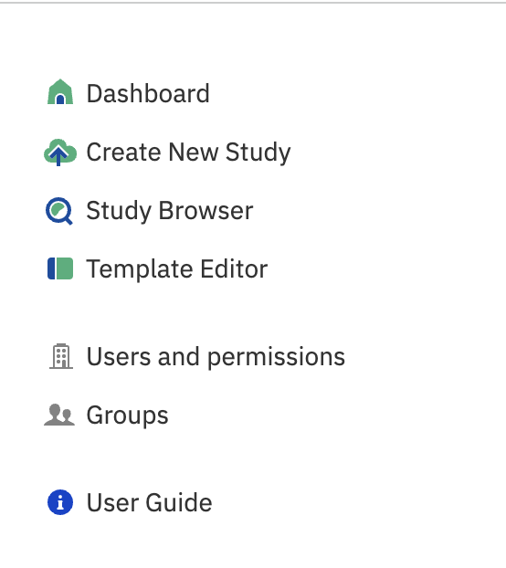

# Template Editor

The Template Editor application allows you to create, customize, and update templates for data import/validation.

## Accessing the Template Editor

To get started, click **Set up templates** on the Dashboard:

Or use the shortcut dock and select **Template Editor**:

On the application page you will see the available templates. Also, you can find out by whom and when it was
created, updated. Click on the template name to explore it in more detail.

## What is a template?

Templates control metadata attributes in Genestack, which allow terms and values to be harmonized and validated.
A separate template is used for each data object, e.g. “Study”, “Sample”, “Expression”, “Variant”
and “Flow cytometry”.

Templates include the following metadata options:

- *Name* — name of metadata field that should be included in the metainfo (e.g. “Accession”, “Organism”);
- *Required* — determines whether the metadata field should be mandatory or not; if a field is marked as required
  and is left blank or it is incorrectly filled in, it is highlighted in red;
- *Metainfo type* — indicates metadata type for the filed, namely: text, integer, decimal, date, yes/no and external link;
- *Read-only* — represents permissions for editing, where “yes” means that you cannot edit; the metadata
- *Dictionary* — allows you to specify a dictionary providing standardized and unified terms that can be used in data
  curation and to help validate and harmonise metadata.
- *Description* - description for the attribute that will be shown during curation as a hint.

## Create and edit template

If you have the permission to edit/manage templates you can click on the template name and select **Duplicate** to create your own editable copy of a template and modify it if needed.

Autocomplete can help you to specify an appropriate dictionary term to be used in metadata validation in the Metadata Editor.

## Grouping/compounding metadata fields

Metadata fields can be grouped together under a common header using the **/** character. Use the common header before
the **/** character. For example:

## Export template

You can export a JSON file which contains the template information by clicking the template name and selecting export from the drop down menu:

## Change template

By default a **Default Template** is associated with data, which includes metadata
columns along with associated controlled dictionaries and ontologies. The associated template can be changed in the **Metadata Editor**
when editing metadata.

From the **Metadata Editor**, click the study name, then **Apply another** and select
the template of interest from the list of suggested files. Click **Explore** to open it with the Template Editor.

