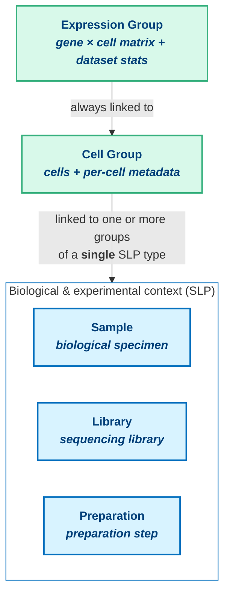

# About single-cell HDF5 transformations

The single-cell HDF5 transformation converts a single-cell HDF5 file into the ODM-compatible output. It extracts expression data and cell metadata, optionally harmonises metadata, and can create or update biosample objects in ODM. The output objects are imported and linked automatically. The result is feature-level indexed data ready for downstream analysis and cross-study discovery without manual file preparation.

The transformation runs via the ODM Processors Controller API. For an overview of configurations, images, and jobs (the three building blocks shared by all transformations), see [About the Processors Controller](../about-processors-controller.md).

## The ODM entity model for single-cell data

Understanding the transformation requires familiarity with how ODM represents single-cell experiments.

**Sample, Library, and Preparation groups** (collectively referred to as SLP) represent the biological and experimental context. A Sample describes a biological specimen; a Library describes the sequencing library prepared from it; a Preparation describes a preparation step. These entities either already exist in ODM or can be created by the transformation.

**A Cell Group** is the collection of individual cells from an experiment, together with their metadata. Each Cell Group is linked to one or more parent groups of a single SLP type (Sample, Library, or Preparation). This linkage allows ODM to associate cell-level observations with the correct experimental context.

**An Expression Group** represents the gene-by-cell expression matrix (compressed for efficient retrieval) along with computed dataset statistics. An Expression Group is always linked to a Cell Group.

The transformation creates the Cell Group and Expression Group and links them into the existing (or newly created) SLP structure. This is why the configuration requires specifying how the resulting Cell Group connects to its parent. For the broader ODM data model, see [Data model](../../../key-concepts/key-concepts.md).

## What the transformation reads from the source file

The transformation extracts three types of data from an HDF5 source file.

**Cell metadata** is extracted primarily from `obs` in H5AD input (or the equivalent in 10x H5). This includes per-cell annotations such as barcodes, cluster assignments, and quality control metrics. Multidimensional representations from `obsm` (PCA, UMAP coordinates) and pairwise cell annotations from `obsp` can also be extracted.

**Feature metadata** is extracted from `var`, and optionally from `varm` and `varp`. This includes per-gene annotations such as gene identifiers and gene names.

**The expression matrix** is extracted from `X`, which contains count or normalised expression values. The transformation validates that the number of features in the matrix matches the extracted feature metadata, then writes the matrix in a Brotli-compressed format optimised for ODM ingestion.

## The role of metadata curation

Metadata curation standardises cell metadata so that it can be imported, linked, and indexed correctly in ODM. Certain fields must use expected names and data types to ensure consistent linking and indexing: the transformation handles this during processing.

As part of curation, the transformation performs automatic attribute mapping: commonly used attribute names from tools such as Seurat, Scanpy, or Cell Ranger are recognised and renamed to canonical ODM API names without any configuration. Attributes that do not match any known name are retained and their names are automatically converted to camelCase. Curation applies only to the data produced for import into ODM: the source file is not modified. For the full list of recognised names, see [Attribute mapping reference](attribute-mapping-reference.md).

## Biosample metadata and the aggregation model

Some single-cell datasets store tissue, disease, or other biosample-level attributes in cell metadata, repeating the same values for every cell. The transformation can aggregate these attributes into related biosample objects: Sample, Library, or Preparation groups in ODM.

Aggregation is performed by grouping cells using a designated biosample identifier. Only attributes that are consistent across all cells in the same biosample are assigned to the related biosample objects. Attributes assigned to biosample objects are automatically removed from cell metadata, reducing duplication.

## Linking created objects

When the transformation uploads a Cell Group, it links it to a parent Sample, Library, or Preparation entity. This is usually handled automatically: if the transformation creates new SLP objects, the Cell Group is linked to them; otherwise, the transformation identifies the most appropriate existing SLP target in ODM. You can override this by specifying the target explicitly in the configuration. For the full resolution rules, see [Transformation process reference](transformation-process-reference.md).

The Expression Group created by the transformation is linked to the corresponding Cell Group.

## Supported input formats

The transformation accepts HDF5-based input: H5AD (AnnData), 10x Genomics H5 (converted internally to H5AD before processing), and legacy 10x H5 (v<3, single-genome only). For the full per-format catalogue, see [Available images reference](../available-images-reference.md).

## Transformation logs

A single-cell job produces a processing log like any other transformation. For what the log records, how it is retained, and how to retrieve it, see [About the Processors Controller](../about-processors-controller.md#transformation-logs).

## Known limitations

Currently, only one transformation process can be run per attachment. If you need to run another transformation job on the same data, import a new copy of the attachment or create a new study.

!!! warning "Editorial TODO: resolve before publishing"
    Verify: the one-transformation-per-attachment constraint is a platform-level rule not present in the transformation-images-develop/ image code. Confirm against an authoritative source before publishing. (Same constraint also flagged in available-images-reference.md.)

## Where to start

- **Start here:** [Single-cell getting started](single-cell-getting-started.md), a single-cell quickstart from upload to queried data.
- **General workflow:** [How to run a transformation](../how-to-run-a-transformation.md), the step-by-step API workflow applicable to any transformation type.
- **Per-task how-tos:** [Ingest cell and expression data](ingest-cell-and-expression.md), [Create sample/library/preparation groups](create-sample-library-preparation-groups.md), [Update existing biosample metadata](update-existing-biosample-metadata.md).
- **Dry-run iteration:** [Iterate on a configuration using dry runs](iterate-with-dry-runs.md) and [Discover which biosample attributes are available](discover-biosample-attributes.md).
- **Configuration spec:** [Configuration reference](configuration-reference.md), the full `data` field schema for `hdf5-cells`.
- **Pipeline internals:** [Transformation process reference](transformation-process-reference.md), the internal processing pipeline.
