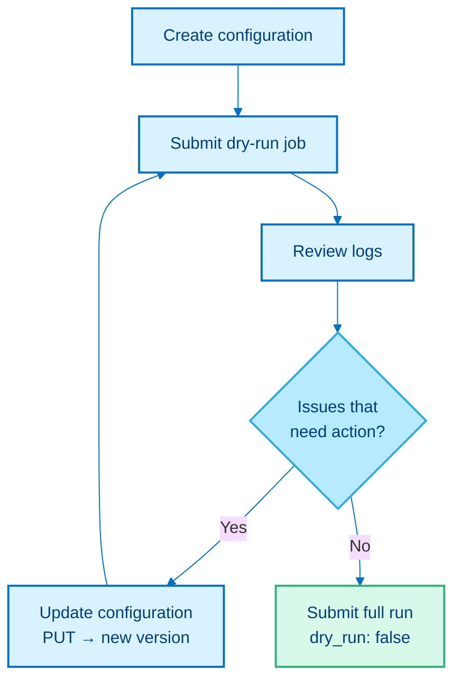

# How to iterate on a configuration using dry runs

This guide describes the recommended cycle for refining a transformation configuration before committing to a full run. Use this when an initial dry run reveals warnings or errors that require attention.

## The iteration cycle



## Step 1: Review the dry-run logs

After a dry-run job completes, retrieve the logs:

```
POST /api/v1/transformations/jobs/{id}/logs
```

Look for:

- **Configuration validation errors:** invalid field values or missing required keys.
- **File structure report:** which metadata keys (`obs`, `var`, `obsm`, etc.) are present in your file. See `transformation-process-reference.md#15-file-structure-inspection`.
- **Linking validation warnings:** whether all cell `batch` values map to existing SLP objects. See `transformation-process-reference.md#41-dry-run-exit`.
- **Curation warnings:** columns flagged for automatic renaming or data type conversion.

## Step 2: Update the configuration

Update the configuration using:

```
PUT /api/v1/transformations/configurations/{id}
```

The request body follows the same structure as the original `POST`. Updating does not overwrite the configuration: the current state is saved as a previous version and the active version is incremented. The same `id` is reused, and earlier versions remain retrievable.

## Step 3: Resubmit the dry run

Resubmit the job against the same configuration `id`. Each dry run uses the latest version by default, so you can keep iterating on the same configuration without creating a new one for each attempt.

## Step 4: Repeat until clean

Repeat until the dry run completes without errors or warnings that require action.

## Step 5: Submit the full run

Submit the same job with `dry_run: false` in the request body.

## Related

- [Manage configurations](../manage-configurations.md): full CRUD for configurations.
- [Discover which biosample attributes are available](discover-biosample-attributes.md): another use of dry-run mode.
- `transformation-process-reference.md`: pipeline internals referenced in the logs.
