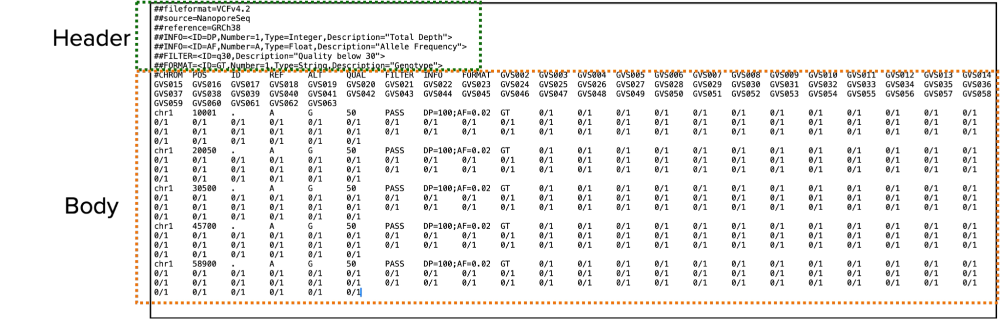
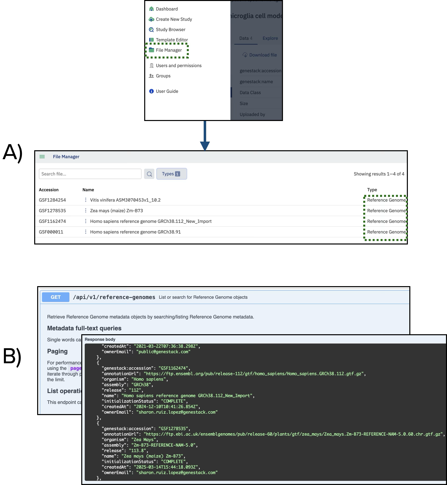
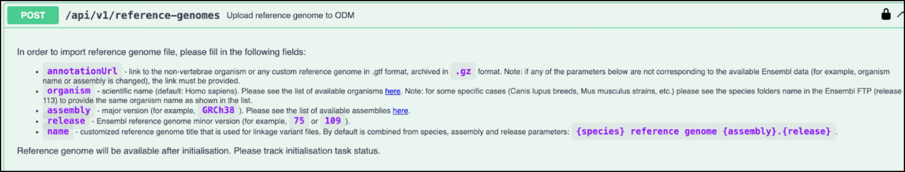
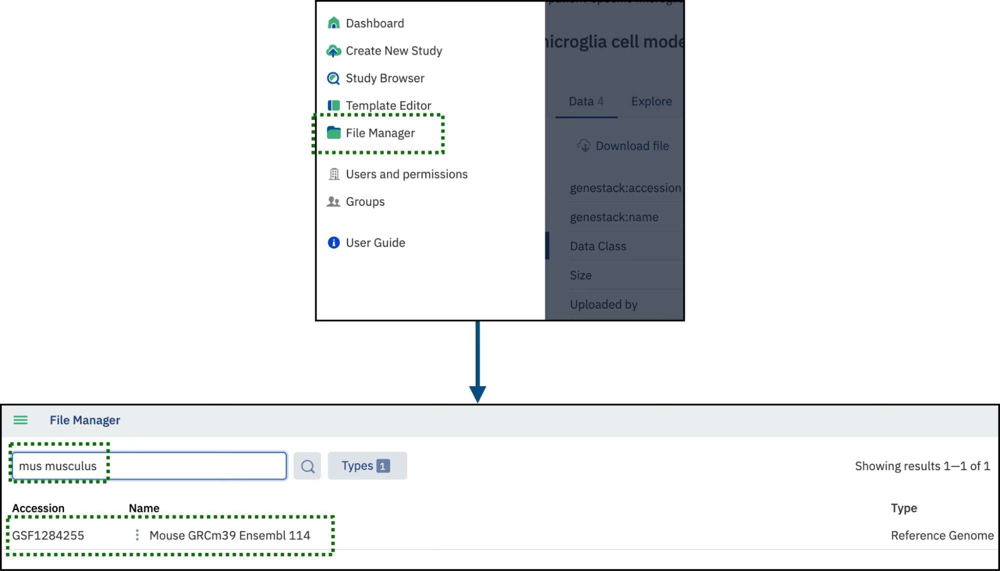
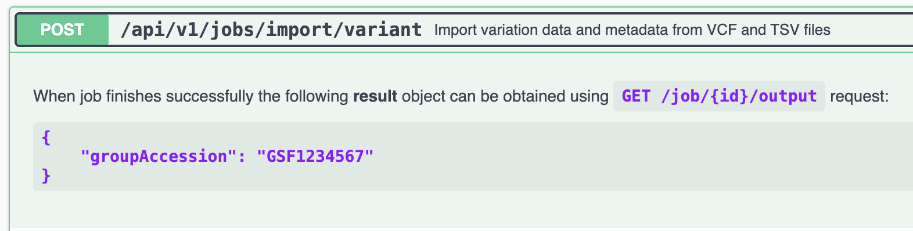
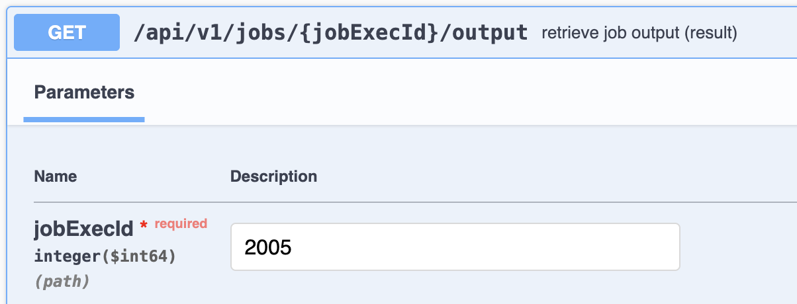
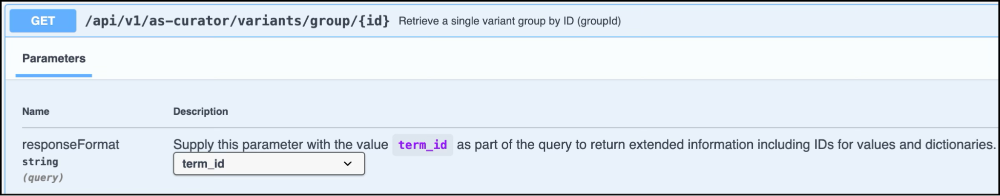
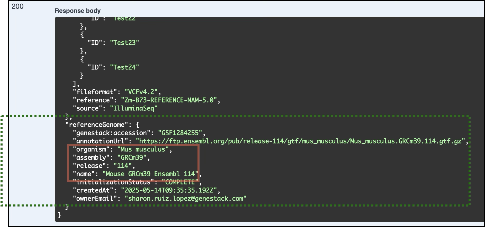
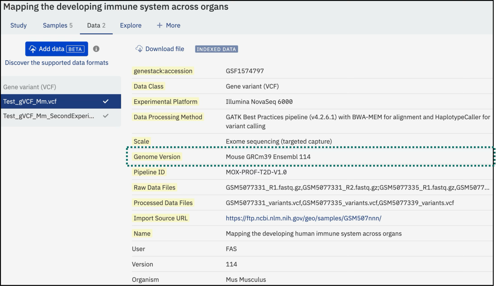
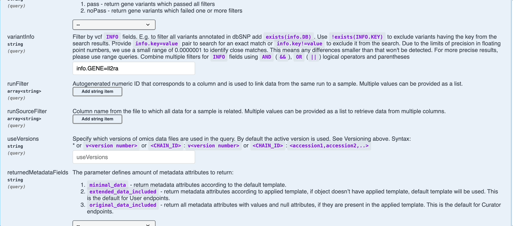

# Working with Reference Genome

This guide explains how to import, manage, and extract VCF files using ODM APIs, with a focus on working with different 
reference genomes. ODM is a flexible platform that allows users to work with various species by importing custom 
reference genomes.

## **Variant files and Reference Genomes**

### **Description of VCF files**

VCF (Variant Call Format) is a standardized file format for storing DNA sequence variations detected in genomic sequencing data. It is both human-readable and machine-parsable, making it widely adopted in genomics.

A VCF file includes:

* **Header**: Contains metadata, including the reference genome, version, and description of each column.
* **Body**: Contains the actual variant data. Each row represents a variant.

#### **Important Columns in the VCF Body:**

* **CHROM**: Chromosome of the variant
* **POS**: Genomic coordinate
* **ID**: Variant identifier (e.g., dbSNP ID)
* **REF**: Reference base(s)
* **ALT**: Alternative base(s)
* **QUAL**: Confidence score of the variant
* **FILTER**: Filter status
* **INFO**: Additional annotations (e.g., allele frequency)
* **FORMAT & Sample Data**: Genotype details for each sample


<figcaption>The VCF format contains detailed information about the variants, positions, and genotypes</figcaption>

For more details and examples of VCF files, refer to the section [Supported File Formats](docs/user-guide/doc-odm-user-guide/supported-formats.md)

### **Reference Genomes**

A reference genome is a representative example of a species’ DNA sequence that serves as a baseline for comparing and interpreting sequencing data. In variant analysis, sequencing reads are aligned to the reference genome to identify differences such as single-nucleotide polymorphisms (SNPs), insertions, deletions, and structural variations.

In ODM, the reference genome plays a crucial role during the import of variant files (e.g., VCF). It is used to **index variants**, map their positions to specific genomic regions, and annotate them with gene information when available. This indexing enables advanced features such as:

* **Gene-based variant search**: Users can search for variants by specifying gene names, even if the original VCF file does not include gene annotations.
* **Accurate interpretation of genomic intervals**: Variants can be analyzed in the context of known gene structures (exons, introns, UTRs, etc.).

By default, ODM uses the **GRCh38** human reference genome. However, users can:

* **Import other versions of human reference genomes** (e.g., GRCh37) if needed for compatibility with legacy datasets.
* **Add custom reference genomes** in **GTF (Gene Transfer Format)** for non-human organisms, enabling similar search and annotation functionality.

## **Importing Custom Reference Genomes**

Users can import their reference genomes into ODM using the API to work with species-specific or non-standard genomic data. This is particularly useful for non-human studies or for datasets aligned to alternative versions of a genome.

Before importing a new reference genome, users are encouraged to **check which reference genomes are already available** in the system. This helps avoid duplication and ensures consistency across datasets. Users can:

* Browse existing reference genomes in the **File Browser** (under the Reference Genomes category), or
* Use the API endpoint: `GET /api/v1/reference-genomes.` This returns a list of reference genomes currently registered in the system.

{width=70%}
<figcaption>Users can explore the existing Reference genomes by opening the File Manager in the GUI or via the endpoint <code>GET /api/v1/reference-genomes</code></figcaption>

### **Required File Format**

If the reference genome needed is not listed in the **File Browser** or returned by the `GET /api/v1/reference-genomes` endpoint, users can import a custom reference genome into ODM to support their dataset.

Custom reference genomes must be provided in **Gene Transfer Format (GTF)** and compressed as **.gtf.gz**. This format includes essential gene structure information such as:

* Exons
* Introns
* Coding regions
* Transcription start and end sites

### **Source for Reference Genomes**

Custom genomes can be obtained from:

* **Ensembl**
* **NCBI**
* **Custom in-house assemblies**

### **Import Steps**

1. Use the endpoint: `POST /api/v1/reference-genomes`

2. Provide the required details, including:
    * **annotationUrl**: URL to the GFT file of the genome annotation file (compressed in .gtf.gz format).
    * **organism**: Scientific name of the species (e.g., *Mus musculus*).
    * **assembly**: Genome assembly version (e.g., Zm-B73-REFERENCE-NAM-5.0).
    * **release**: Minor version of the reference genome.
    * **name**: A custom title for the reference genome, typically derived from species, assembly, and release details


<figcaption>The <code>POST /api/v1/reference-genomes</code> endpoint allows users to upload custom reference genomes into ODM</figcaption>

**Request Example**:

``` json
{
  "annotationUrl": "https://ftp.ensembl.org/pub/release-114/gtf/mus_musculus/Mus_musculus.GRCm39.114.gtf.gz",
  "organism": "Mus musculus",
  "assembly": "GRCm39",
  "release": "114",
  "name": "Mouse GRCm39 Ensembl 114"
}
```

**Response Example**:

``` json
{
  "genestack:accession": "GSF1284255"
}
```

This response confirms successful import and provides a unique **accession ID**.

The newly imported reference genome is now available in ODM and visible in the File Manager.

{Width=90%}
<figcaption>The File Manager displays imported reference genomes along with other files in the ODM instance</figcaption>

## **Importing VCF Files with custom Reference Genomes into ODM**

Once the reference genome is imported, users can upload VCF files and link them to the appropriate genome.

### **Preparing Metadata**

To upload VCF files, you must also provide a metadata file in TSV (tab-separated values) format. This file should include at least the following fields:

* **Genome Version**: The exact name of the reference genome as it appears in ODM
* **Organism**: The species associated with the genome

| Genome Version                | Organism      |
|------------------------------|---------------|
| Mouse GRCm39 Ensembl 114     | Mus musculus  |

Additional optional fields, such as **Version**, **Accession**, or **User**, may also be included and will not interfere with the upload. The system is flexible and accepts metadata files with varying numbers of columns.

??? note "Note"

    Here are examples of metadata files with different numbers of features (columns).

    - **3 columns**: [Metadata_Mm_3columns.tsv (S3 link)](s3://bio-test-data/Metadata_Mm_3columns.tsv), [Download via HTTPS](https://bio-test-data.s3.us-east-1.amazonaws.com/Metadata_Mm_3columns.tsv)
    - **5 columns**: [Metadata_Mm_5columns.tsv (S3 link)](s3://bio-test-data/Metadata_Mm_5columns.tsv), [Download via HTTPS](https://bio-test-data.s3.us-east-1.amazonaws.com/Metadata_Mm_5columns.tsv)
    - **11 columns**: [Metadata_Mm_11columns.tsv (S3 link)](s3://bio-test-data/Metadata_Mm_11columns.tsv), [Download via HTTPS](https://bio-test-data.s3.us-east-1.amazonaws.com/Metadata_Mm_11columns.tsv)


A metadata file in tabular format ensures the VCF file is linked to the correct reference genome  

### **API Upload Procedure**

To upload VCF files into ODM, use the same **standard import endpoint** employed for other bulk data types such as transcriptomics, libraries, samples, and flow cytometry.

Use the endpoint: `POST /api/v1/jobs/import/variant`

{width=80%}
<figcaption>The <code>POST /api/v1/jobs/import/variant</code> endpoint is used to import gene variant files</figcaption>

**Request Example**:

``` json
{
  "metadataLink": "s3://MyBucket/SRL_ReferenceGenomes/Metadata_Mm_5columns.tsv",
  "dataLink": "s3://MyBucket/SRL_ReferenceGenomes/Test_gVCF_Mm.vcf",
  "templateId": "GSF1574668"
}
```

As with other data types, the request should include:

* A **metadata file** with information about the reference genome and organism
* A **VCF file** compressed **.vcf.gz** or plain **.vcf** (See example of a [VCF file](https://bio-test-data.s3.us-east-1.amazonaws.com/gVCF_Mm_Demo.vcf))
* A **link structure** connecting the data to samples, libraries, or preparations

!!! note "Important" 
    Unlike transcriptomics or flow cytometry data, **a reference genome must be specified** when importing VCF files. If no metadata is provided, the system defaults to using the **human reference genome (GRCh38)**. To use a different genome, you must include a metadata file where the **Genome Version** matches the name of a **previously imported custom reference genome** in your ODM instance.

### **Tracking Job Status**

Once submitted, you can track the import job status via:

Endpoint: `GET /api/v1/jobs/{jobExecId}/output`

{Width=80%}
<figcaption>The endpoint <code>GET /api/v1/jobs/{jobExecId}/output</code> retrieves job execution details</figcaption>

### **Completion and Accession ID**

Once completed, the system assigns an accession number to the imported file.

**Response Example**:

``` json
{
  "status": "COMPLETED",
  "result": {
    "groupAccession": "GSF1574797"
  }
}

```

## **Verifying the Reference Genome Used for Variant Indexing**

After uploading a VCF file, users may want to confirm which reference genome was used during indexing, especially important when working with **custom reference genomes**.

**How to Check the Reference Genome**

Use the following API endpoint to retrieve details about the indexed variant group:

Endpoint: `GET /api/v1/as-user/variants/group/{id}`


<figcaption>Use the endpoint <code>GET /api/v1/as-user/variants/group/{id}</code> to retrieve information about variant groups</figcaption>

Replace **{id}** with the **group accession** of your imported VCF file (e.g., GSF1278671).

The response includes metadata about the variant group. Scroll to the bottom of the response to find the referenceGenome section, which provides full details:

{Width=80%}
<figcaption>The endpoint displays details of the variant files, including the reference genome</figcaption>

#### **Key Fields to Review**

* **name**: Name of the reference genome used
* **organism**, **assembly**, **release**: Core genome attributes
* **annotationUrl**: Link to the annotation file used (e.g., GTF from Ensembl)
* **genestack:accession**: ODM accession for the reference genome
* **initializationStatus**: Should be COMPLETE if the genome is ready for use

This information helps ensure that the variant data was indexed against the correct reference genome, particularly when working across multiple organisms or custom genome builds.

## **Linking VCF Files to Sample Metadata**

Once the VCF file is imported, it needs to be linked to the corresponding sample metadata records to make the variant data accessible and meaningful in the ODM interface.

The linking process is **identical** regardless of whether the file uses a **custom** or **default** reference genome.

To link the variant file to samples, follow the **standard linkage procedure** used for other data types. For detailed steps, see [*Linking Data to Samples*](user-guide/quick-start/contributor-api.md#linking-your-entities).

**API Endpoint:**

`POST /api/v1/as-curator/integration/link/variant/group/{sourceId}/to/sample/group/{targetId}`

You will need to provide:

* **Source ID**: the accession of the VCF file group (e.g., GSF1278671)
* **Target ID**: the accession of the sample metadata group (e.g., GSF1278546)

### **Confirming a Successful Link**

Once the VCF file is linked to the sample metadata, the variant data becomes accessible both in the **ODM interface** and via the **API**.

#### **In the ODM Interface**

You can explore the data in the **Gene Variant Data** section of ODM. If the file is successfully linked, you’ll see the variants associated with your samples, organized by gene or genomic feature.

{Width=80%}
<figcaption>Successfully imported and linked VCF files can be explored in ODM’s Gene Variant Data section</figcaption>

#### **Using the API**

To confirm that your variant data is correctly indexed and linked to a gene from your **custom reference genome**, you can query the API directly.

**Endpoint:**

`GET /api/v1/as-user/variants`

Use the variantInfo parameter to filter results by gene or feature. For example:

```
variantInfo
info.GENE=Il2ra
```

This query retrieves all variant records associated with the gene **Il2ra** (interleukin 2 receptor, alpha chain), based on the annotation from your custom reference genome.

The response will include:

* Variant positions
* Genotypes
* Associated sample IDs
* Additional metadata from the VCF file


<figcaption>Example query using variantInfo, info.GENE=Il2ra showing the resulting variant data</figcaption>

ODM streamlines the management of genetic variant data by supporting custom reference genomes, VCF file import, and metadata linkage. Whether you’re working with human or non-human species, ODM ensures that variant data is well-organized and ready for analysis.
