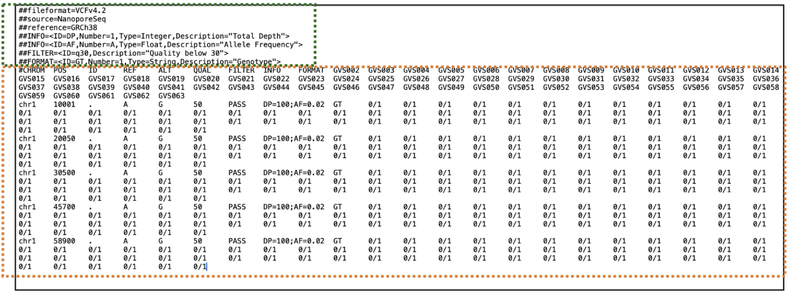
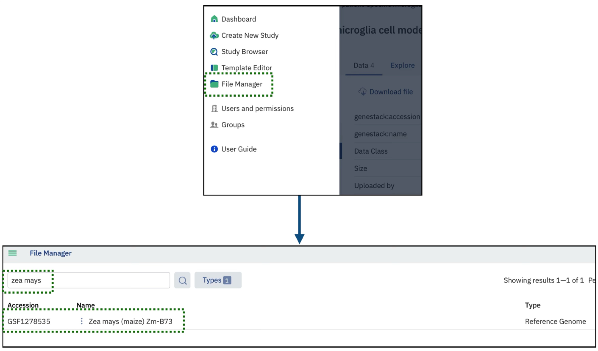
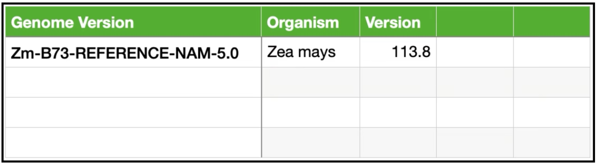
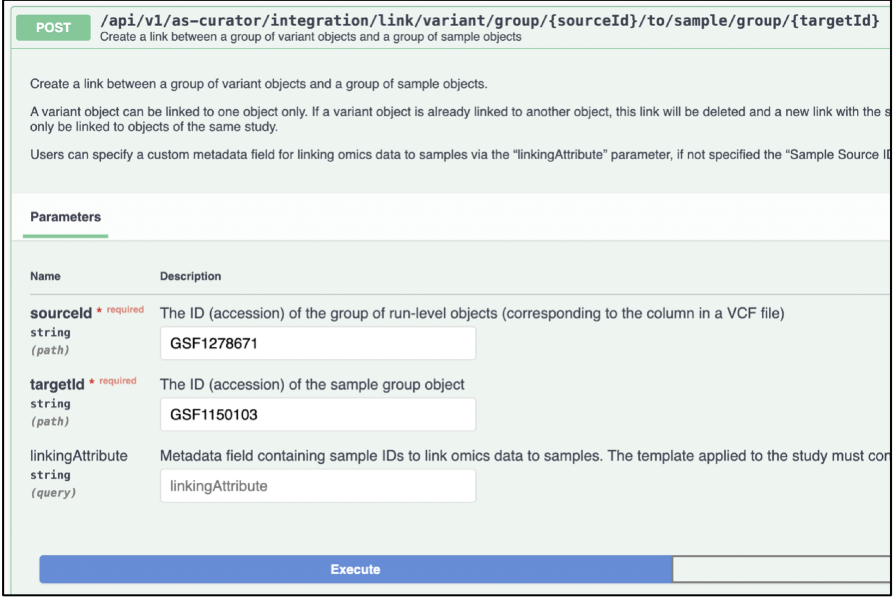
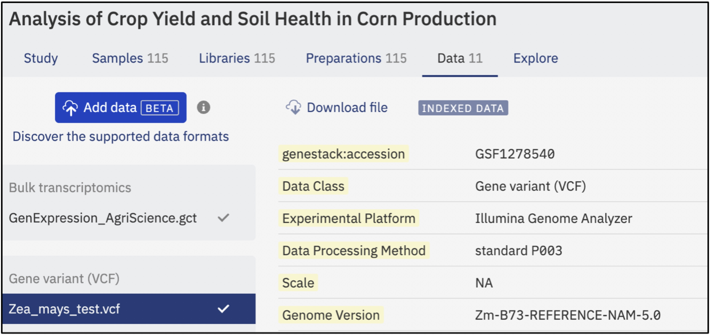

# Working with Reference Genome

This guide explains how to import, manage, and extract VCF files using ODM APIs, with a focus on working with different 
reference genomes. ODM is a flexible platform that allows users to work with various species by importing custom 
reference genomes.

## Understanding Reference Genomes

A reference genome is a standardized representation of a species' genome, used as a comparative framework to identify 
genetic variations. When analyzing genetic variants, sequencing data is aligned to a reference genome, enabling 
researchers to determine mutations, structural changes, and variant effects.

By default, ODM uses the human genome (**GRCh38**) as the reference genome. Any VCF file uploaded without specifying 
a reference genome will be mapped against GRCh38. However, researchers working with non-human species, such as plants, 
animals, or model organisms, require custom reference genomes for accurate data interpretation. ODM supports the import 
of alternative reference genomes, ensuring flexibility for diverse research applications.

## VCF Format Overview

The Variant Call Format (VCF) is a widely used file format for storing genetic variation data from sequencing experiments. 
It is designed to be both human-readable and machine-parsable, making it ideal for bioinformatics applications. 

A typical VCF file consists of two main sections: the header and the body.

**Key Features of the VCF Format:**

* **Header**: Contains metadata such as the VCF version, reference genome, and column descriptions.  
* **Body**: Lists variant data, where each row represents a single variant.

### **Important Columns in the VCF Body:**

* **CHROM**: Chromosome where the variant is located.  
* **POS**: Genomic position of the variant.  
* **ID**: Identifier (e.g., dbSNP ID).  
* **REF**: Reference base(s) at the variant position.  
* **ALT**: Alternative base(s) observed at the variant position.  
* **QUAL**: Variant quality score.  
* **FILTER**: Quality control filter status.  
* **INFO**: Additional metadata, such as allele frequency.  
* **FORMAT**: Defines genotype fields for samples.  
* **Sample Data**: Genotype information for individual samples.



## Importing Reference Genomes into ODM

To enable proper variant mapping, users can import new reference genomes into ODM. These reference genomes must be in 
Gene Transfer Format (**GTF**), which contains details about gene features such as exons, introns, and coding regions.

New reference genomes can be sourced from public repositories such as Ensembl or custom datasets.

### Steps to Import a New Reference Genome via API

1. Use the `POST /api/v1/reference-genomes` endpoint to import a new reference genome.
2. Provide the required details, including:  
   * **annotationUrl**: URL to the GFT file of the genome annotation file (compressed in .gtf.gz format).  
   * **organism**: Scientific name of the species (e.g., *Zea mays*).  
   * **assembly**: Genome assembly version (e.g., Zm-B73-REFERENCE-NAM-5.0).  
   * **release**: Minor version of the reference genome.  
   * **name**: A custom title for the reference genome, typically derived from species, assembly, and release details

**Example request:**

``` json
{
  "annotationUrl": "https://ftp.ebi.ac.uk/ensemblgenomes/pub/release-60/plants/gtf/zea_mays/Zea_mays.Zm-B73-REFERENCE-NAM-5.0.60.chr.gtf.gz",
  "organism": "Zea Mays",
  "assembly": "Zm-B73-REFERENCE-NAM-5.0",
  "release": "113.8",
  "name": "Zea mays (maize) Zm-B73"
}
```

**Example response:**

``` json
{
  "genestack:accession": "GSF1278535"
}
```

The response confirms successful import, assigning a unique accession number. Users can locate the imported genome 
in ODM’s **File Manager** using this identifier:



Once the genome is available, it can be used as a reference for variant files.

## Importing Gene Variant Files

To import VCF files and link them to a specific reference genome, users must specify the reference genome ID in the metadata.

### Steps to Import Gene Variant Files

1. Use the `POST /api/v1/jobs/import/variant` endpoint to upload a VCF file.
2. Create a metadata file in tabular format specifying the reference genome for the VCF file.
    
   A metadata file in tabular format ensures the VCF file is linked to the correct reference genome.

3. Include the metadata file link and the VCF file link in the API request.

**Example Request to Import VCF:**

``` json
{
  "source": "S3",
  "metadataLink": "s3://my_instance/SRL_GenVariant/Metadata_RefGen2.tsv",
  "dataLink": "s3://my_instance/SRL_GenVariant/Zea_mays_example.vcf",
  "templateId": "GSF1150101"
}
```

**Example response:**

``` json
{
  "jobExecId": 2005,
  "startedBy": "sharon.ruiz.lopez@genestack.com",
  "jobName": "IMPORT_VARIANT_VCF",
  "status": "STARTING",
  "createTime": "14-03-2025 06:11:48"
}
```

The response indicates that the job has started. Users can track progress using the endpoint: 

`GET /api/v1/jobs/{jobExecId}/output`

Once completed, the system assigns an accession number to the imported file.

**Expected response**:

``` json
{
  "status": "COMPLETED",
  "result": {
    "groupAccession": "GSF1278671"
  }
}
```

This confirms that the VCF file has been successfully imported and linked to the specified reference genome.

## Linking Gene Variant Files to Sample Metadata

After importing a VCF file, it must be linked to its corresponding sample metadata. This is done via the following API endpoint:

`POST /api/v1/as-curator/integration/link/variant/group/{sourceId}/to/sample/group/{targetId}`

 
Users can link VCF files to sample metadata by providing both accession numbers

Once linked, the variant data becomes accessible in the Gene Variant Data section of ODM.


Successfully imported and linked VCF files can be explored in ODM’s Gene Variant Data section

ODM provides a flexible and scalable solution for working with VCF files, supporting multiple reference genomes beyond 
the default human genome. By leveraging these capabilities, users can efficiently import, manage, and link genetic 
variant data across different species, enhancing their data analysis workflows.
