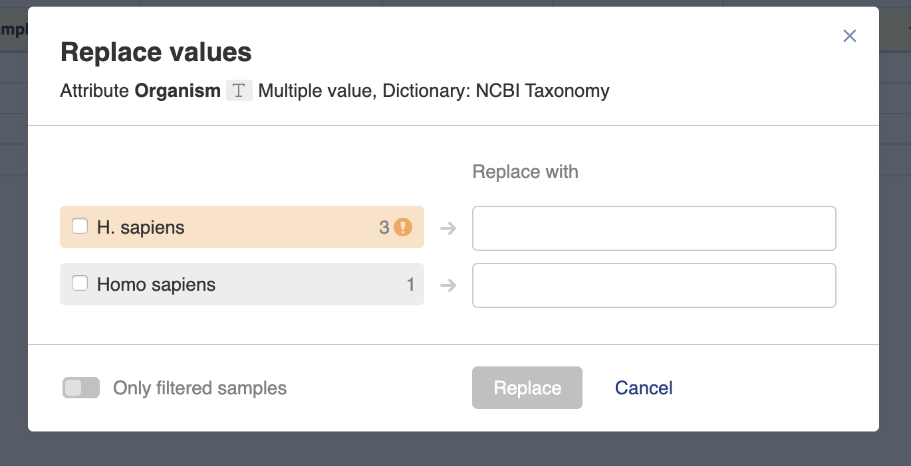
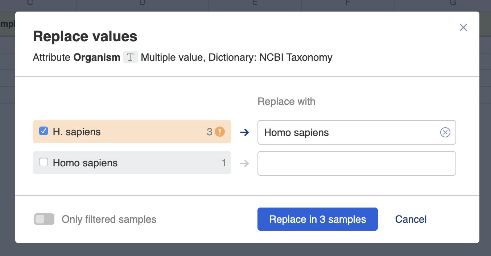

# Bulk replace metadata values

**Role:** Contributor.

Use bulk replace to update the same metadata field across many samples or data rows at once.

## Steps

1. In the Metadata Editor, navigate to the **Samples** or **Data** tab containing the field you want to update.

2. Click the column header of the metadata field that contains incorrect values.

3. Select **Bulk replace** from the drop-down list.

   

4. The **Replace values** window opens. Enter the new value in the replacement field.

   

5. If the field is controlled by a dictionary, autocomplete suggestions will appear so you can select a validated term.

   

6. Click **Replace in…** to apply the replacement.

## Replacing values for filtered samples only

If you have filters applied in the Samples tab, you can choose to replace values only for the samples that match your current filter. This leaves unfiltered samples unchanged.

## Using bulk replace from the Validation Summary

Clicking the **Invalid metadata** link opens the **Validation Summary** pop-up, which lists all invalid metadata terms. Click a term in the list to immediately open the **Replace values** window pre-filled with that term, allowing you to type in the correct value and apply the replacement.

## Special values

The terms **Not applicable** and **Not recorded** can always be entered in any field. A field set to either of these values will always pass validation.
