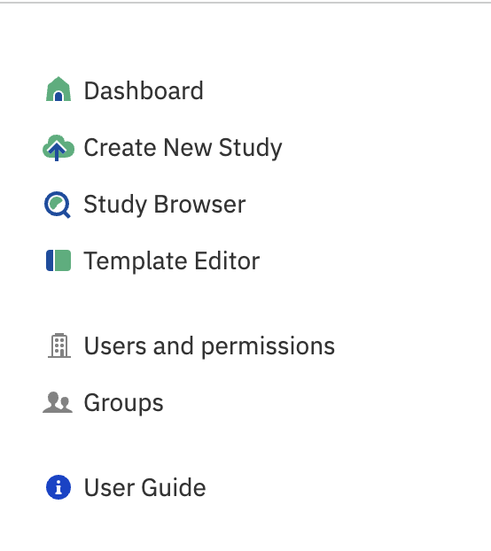
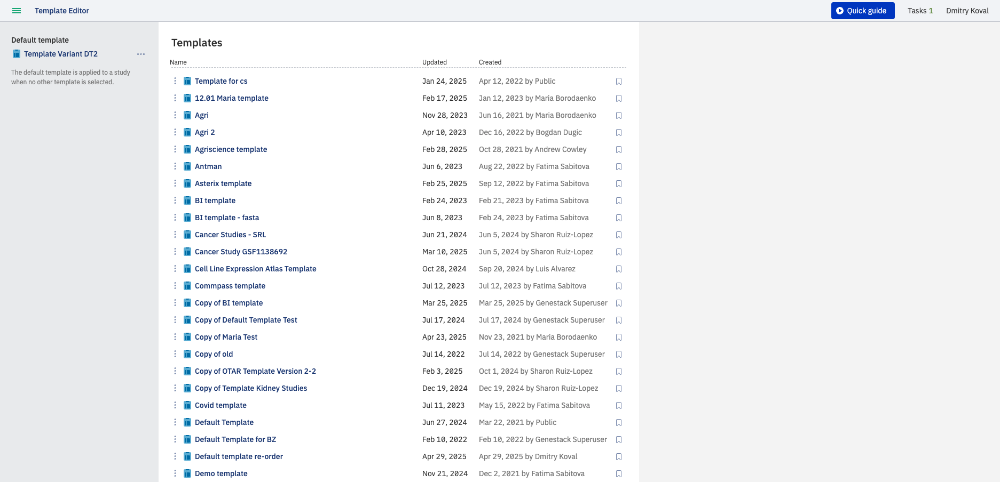
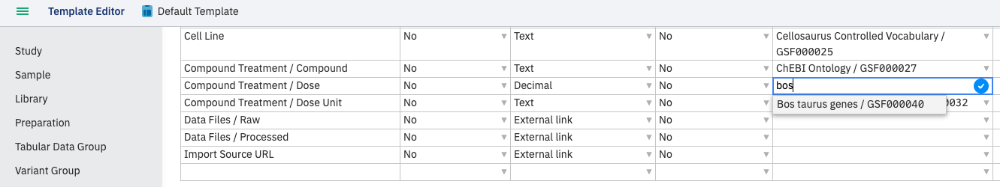
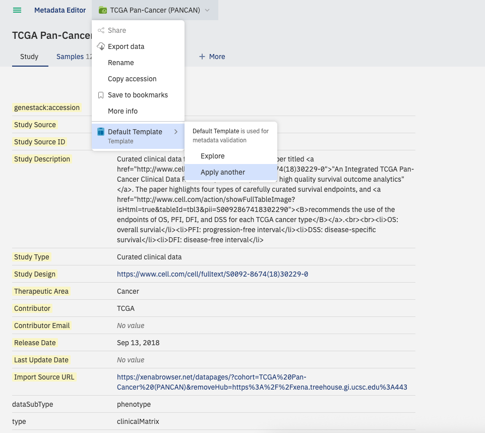

# Create and customise a template

**Role:** Contributor.

Templates control metadata attributes in Genestack, allowing terms and values to be harmonised and validated. A separate template is used for each data object type — "Study", "Sample", "Expression", "Variant", and "Flow cytometry". For a deeper explanation of how templates work and when to create vs. reuse, see [Templates and validation explained](../../explanation/templates-and-validation.md).

> For the GUI workflow, this guide covers all steps. The template API is not yet documented — [PLACEHOLDER].

## Accessing the Template Editor

To get started, click **Set up templates** on the Dashboard, or use the shortcut dock and select **Template Editor**:

On the application page you will see the available templates along with information about who created or last updated each one. Click on a template name to explore it in more detail.

## Template attributes

Templates include the following metadata options:

- *Name* — name of the metadata field to include (e.g. "Accession", "Organism").
- *Required* — determines whether the field is mandatory. Required fields left blank or incorrectly filled are highlighted in red.
- *Metainfo type* — indicates the metadata type: text, integer, decimal, date, yes/no, or external link.
- *Read-only* — when set to "yes", the field cannot be edited.
- *Dictionary* — specifies a dictionary providing standardised terms for data curation and validation.
- *Description* — a hint shown during curation to explain the field.

!!! abstract "Mandatory Attributes"
    All templates contain mandatory technical fields that are **grayed out** in the user interface and cannot be edited or removed.

    **Common field:**

    - `genestack:accession`

    **Tabular data fields:**

    - `Features (string)`
    - `Features (numeric)`
    - `Values (numeric)`
    - `Data Class` (for Tabular, Variants, and Flow Cytometry data)

## Create and edit a template

If you have permission to edit or manage templates, click on a template name and select **Duplicate** to create your own editable copy, then modify it as needed.

Autocomplete can help you specify the appropriate dictionary term to use in metadata validation in the Metadata Editor.

## Grouping metadata fields

Metadata fields can be grouped under a common header using the **/** character. Place the common header before the **/** character. For example:

## Change the template applied to a study

By default, a **Default Template** is associated with data. The associated template can be changed in the **Metadata Editor** when editing metadata.

From the **Metadata Editor**, click the study name, then **Apply another**, and select the template of interest from the list. Click **Explore** to open a template in the Template Editor.

## Template validity checks

When you apply or modify templates, a **validity check** is automatically triggered to ensure consistency between the template and associated studies.

- **When changing a template assigned to a study:** The validity check runs **only for that specific study**.
- **When editing a field in a template:** The validity check is triggered for **all studies that use this template**.
