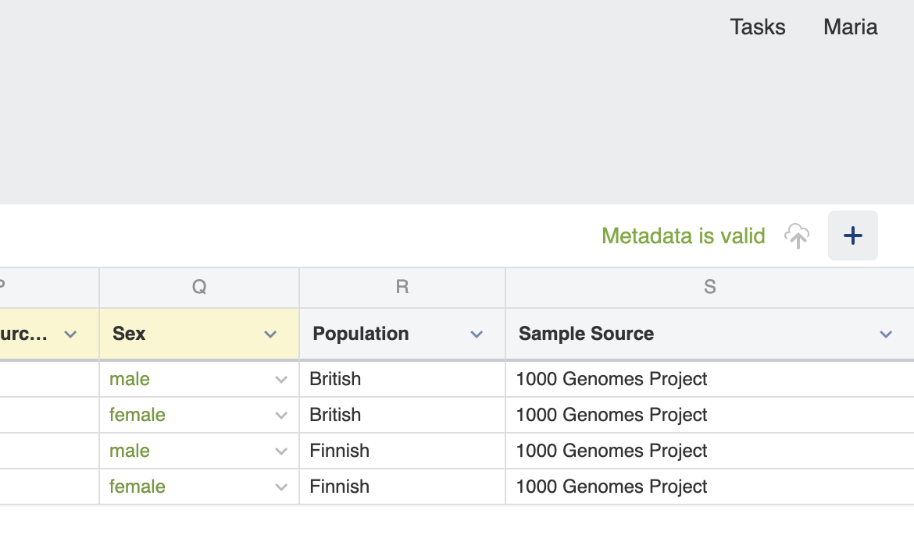
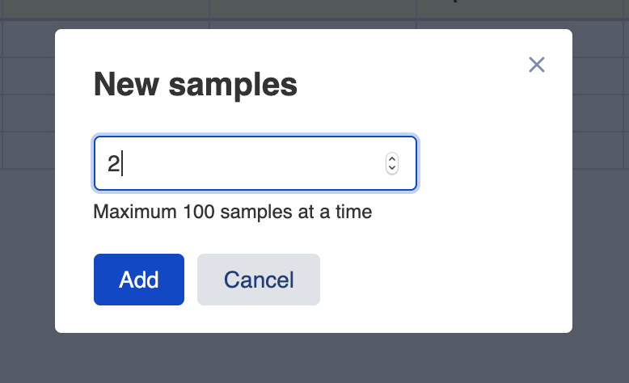
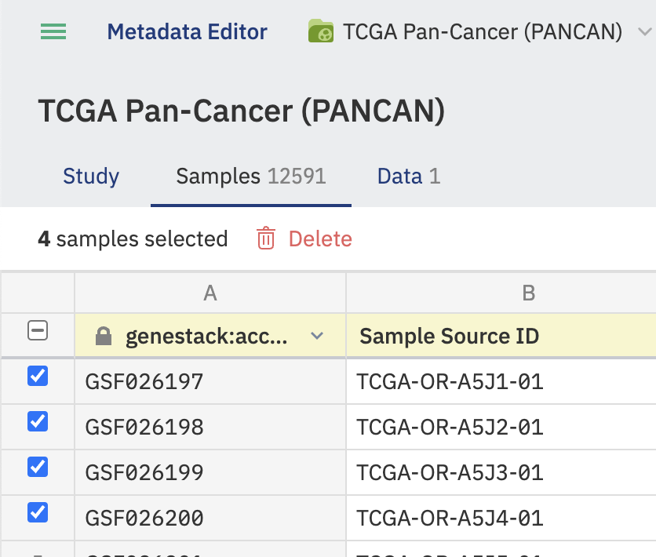

# Edit study metadata

**Role:** Contributor.

You must switch the Metadata Editor to Edit mode before making changes.

> To replace a value across many rows at once, see [Bulk replace metadata values](bulk-replace-metadata.md).

## Study tab

The Study tab provides general information about the study, such as experiment description, contributors, and their contact details.

To rename the study, click on the study title link at the top of the page and select **Rename**. Type the new name and click the blue **Rename** button.

Columns containing invalid metadata are highlighted in red and an **Invalid metadata** flag is displayed.

### Study Ownership Transfer via GUI

**1. Who Can Transfer Ownership**

Ownership transfer can be initiated under the following rules:

| Initiator                                                    | Conditions                      | Allowed? | Notes                                               |
|--------------------------------------------------------------|---------------------------------|:--------:| --------------------------------------------------- |
| Current Study Owner                                          | Always                          |   Yes    | Owner can transfer regardless of other permissions. |
| User with **Manage organisation** *and* **Access all data**  | Study is *not* shared with user |   Yes    | Designed for super-admin use cases.                 |
| User with **Manage organisation** (with access to the Study) | Study is shared with user       |   Yes    | Covers org-level admins who can see the Study.      |
| Any other user                                               | —                               |    No    | Not permitted.                                      |

Additional rules:

* Target must be **another active user** (cannot transfer to deactivated accounts).
* Transfers are one-study-at-a-time in this release (no bulk multi-study transfer UI).

**2. Transfer Workflow (UI)**

1. Navigate to the Study menu.
2. Hover on the Owner option in the Study menu.
3. Select **Transfer ownership** (visible if you meet the transfer criteria above).
4. Choose the new owner from the active-user list (searchable dropdown).
5. Review the confirmation dialog showing:
    * Current owner
    * New owner
    * Access impact summary (new owner gains full access; previous owner loses access unless the study is shared back to them)
    * Cascade notice: applies to all study objects and versions.
6. Confirm to execute the transfer.
7. The Owner field updates immediately.

**3. Access Changes After Transfer**

* **New owner** receives full access to the study and all related objects (all versions).
* **Previous owner** loses access *unless* the study is explicitly shared back to them.

**4. Ownership Transfer History in Metadata Versioning**

Each transfer generates a *Changing Ownership* historical entry, similar to entries in the study's metadata Version History.

**Captured:** Previous Owner • New Owner • Initiating User • Date & Time.

**Display Examples:**

* *Ownership transferred — From `User A` to `User B` by `User C` on 2025-07-18 14:32 UTC.*
* *Ownership transferred — `User A` transferred ownership to `User B` on 2025-07-18 14:32 UTC.* (transfer by current owner)

!!! note "Ownership Version History entries are **informational only**; you cannot roll back to a prior owner from the Version History window. To change again, perform a new transfer."

## Samples tab

The Samples tab displays metadata describing each sample in the study — for example, organism, cell line, and disease. Metadata columns defined by the applied template are highlighted in yellow.

**Add and delete samples**

When you create a new study, it contains four samples by default. You can add or delete samples as needed.

To add samples, click the **+** button, specify the number of samples to add in the dialog that appears, and click **Add**.

To remove samples, hover over the samples you want to exclude, select them, and click the **Delete** button.

## Data tab

The Data tab displays metadata for the data files associated with a study. If more than one version of an omics file is available, the different versions can be toggled.

## See also

- [Validate metadata](validate-metadata.md)
- [Manage study versions](../studies-import/manage-versions.md)
