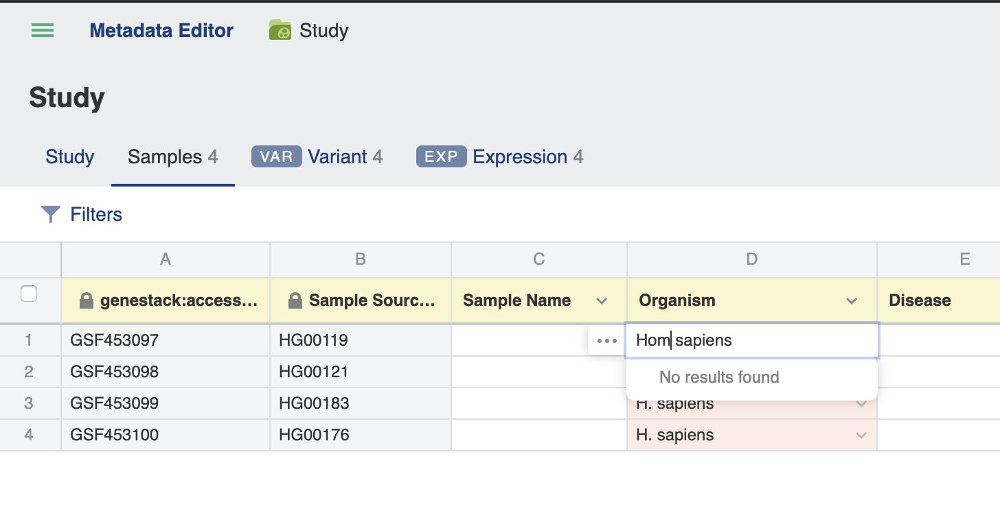
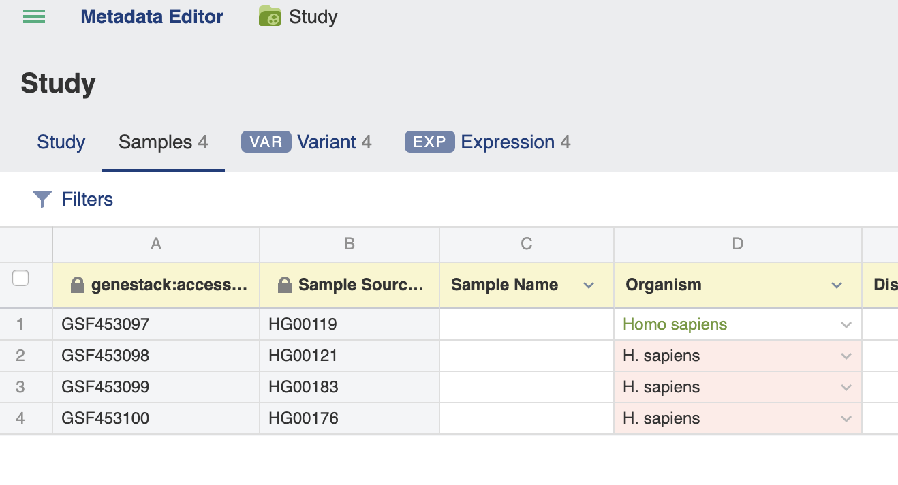
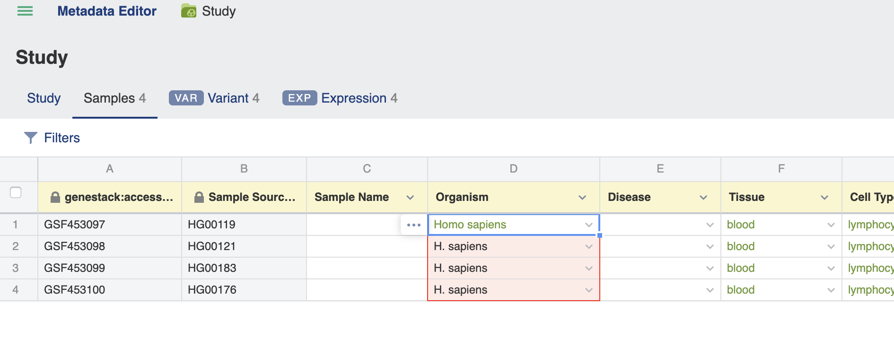
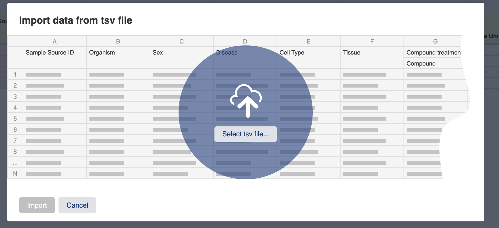

# Validate metadata

**Role:** Contributor.

> To understand what validation checks and why it matters, see [Templates and validation explained](../../explanation/templates-and-validation.md).

**Contributors** can view, validate, and edit metadata. Metadata fields are checked against the template applied to the study. Each template defines the required fields and validation rules for the Study, Samples, and data tabs.

If required metadata fields are missing, contain typos, or do not match the applied template, an **Invalid metadata** flag appears in the upper-right corner. Invalid fields are also highlighted in red.

## Correcting metadata manually

Click the field you want to change and type the new value.

When all fields in a tab have been corrected, the Invalid metadata flag is replaced with a green **Metadata is valid** flag.

For fields that have **dictionaries or ontologies** specified in the template, click the arrow next to the field to select a term from the list of suggested dictionary terms. You can also start typing and use autocomplete to find the appropriate term.

Values matching dictionary terms are marked in green.

## Propagating values across cells

Values in metadata columns can be propagated by dragging the bottom-right corner of a cell across adjacent rows.

## Bulk replacing values

To replace multiple incorrect values at once, use the **bulk replace** function. See [Bulk replace metadata values](bulk-replace-metadata.md) for details.

## Using the Validation Summary

Clicking the **Invalid metadata** link opens the **Validation Summary** pop-up, which lists all invalid metadata terms. Click a term to immediately open the **Replace values** window and correct it.

## Special values

The terms **Not applicable** and **Not recorded** can be entered in any field and will always pass validation.

## Importing metadata from a file

You can also import and validate metadata in bulk. Click the **Import** icon in the upper-right corner and select a local TSV file containing the metadata you want to associate with the imported files.

