# View study metadata

**Role:** Any authenticated user. Consumers can view metadata; Contributors can also edit it.

The **Metadata Editor** lets you explore study, sample, and data metadata across all tabs.

## Getting to the Metadata Editor

To open an existing study, click on the study name in the search results in the Study Browser application.

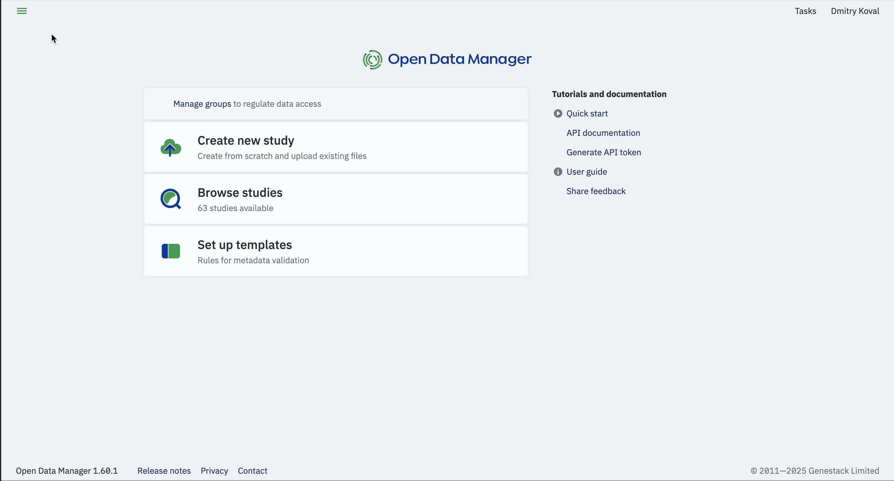

You can also reach the Metadata Editor by clicking **Create a new study** on the Dashboard. The Metadata Editor will open and prompt you to select a metadata template (the Default template is applied by default).
You can explore each template by hovering over its name and clicking the **Explore** link.
By default, a new study contains two tabs — Study and Sample — providing metadata for the study and its samples respectively.

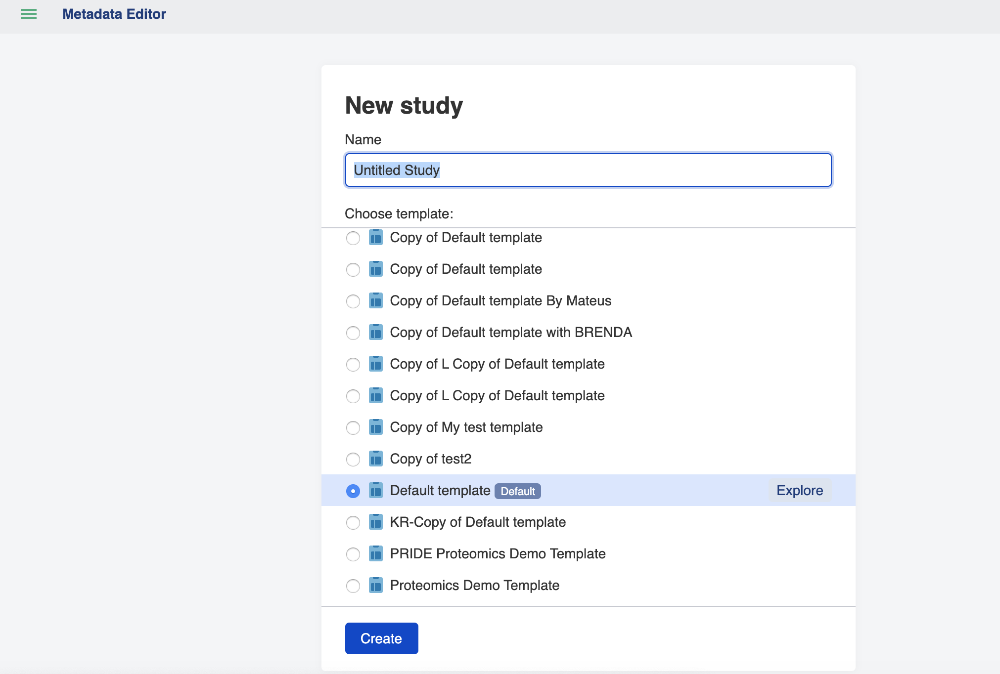

## Exploring the Metadata Editor

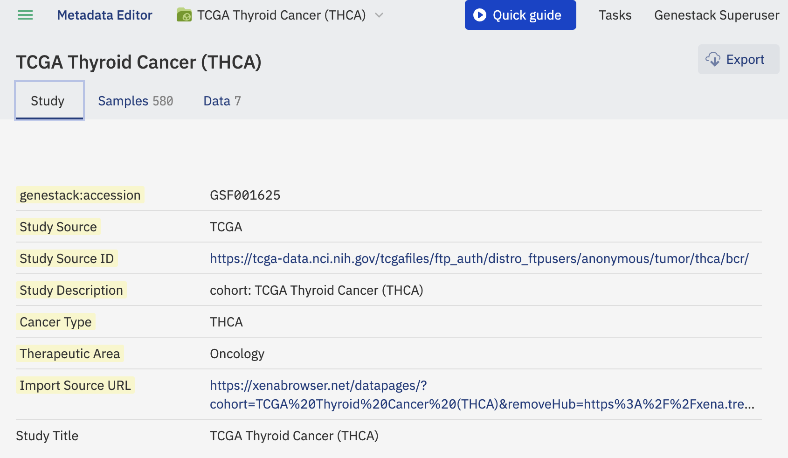

When you click on the study name, a drop-down menu appears allowing you to:

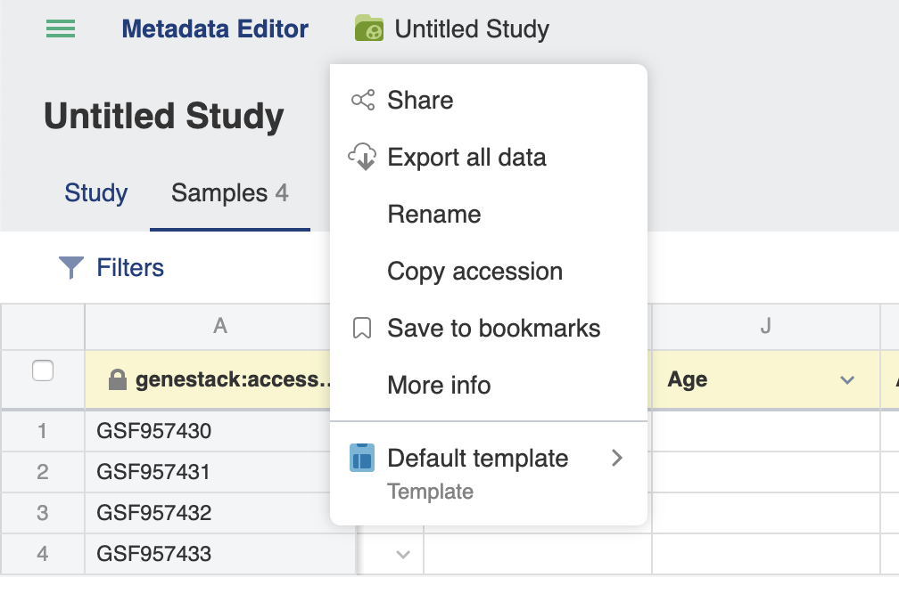

- **Share** data with your colleagues

- **Export** data by creating a link that can be used to download data and can be shared with your colleagues. You can also click the Export button near the top right of any Metadata Editor tab.

- **Rename** the study

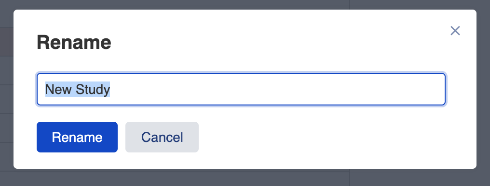

- **Copy accession** of the study

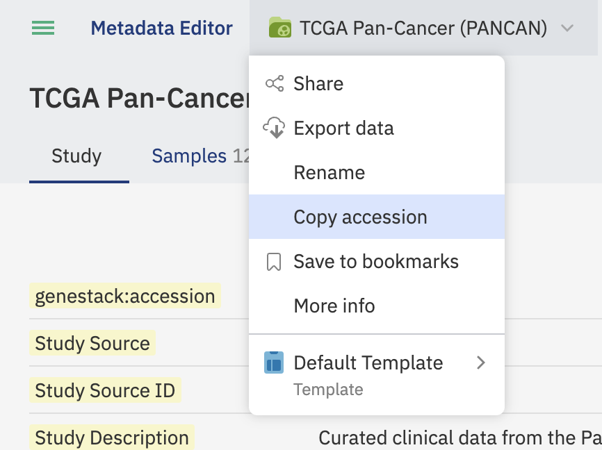

- **Get more information** about the study — for example, when it was created and last modified, who is the owner, and which groups it is shared with.

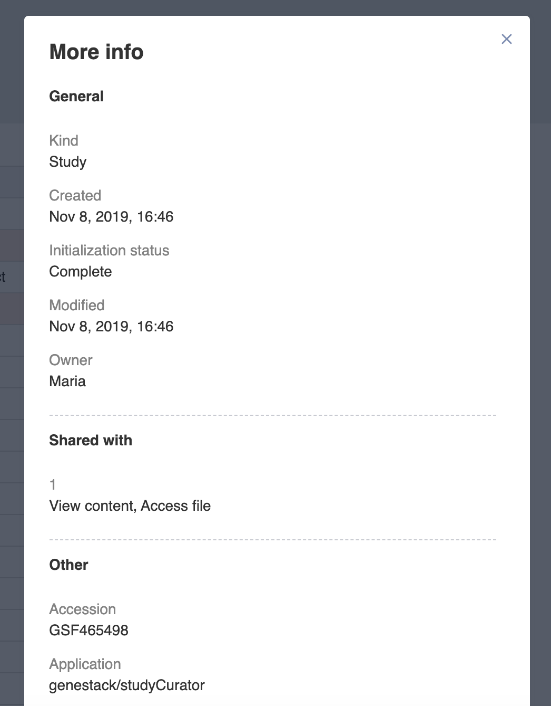

- **Explore and change metadata template** by clicking on "Explore" and "Apply another…" in the drop-down menu.

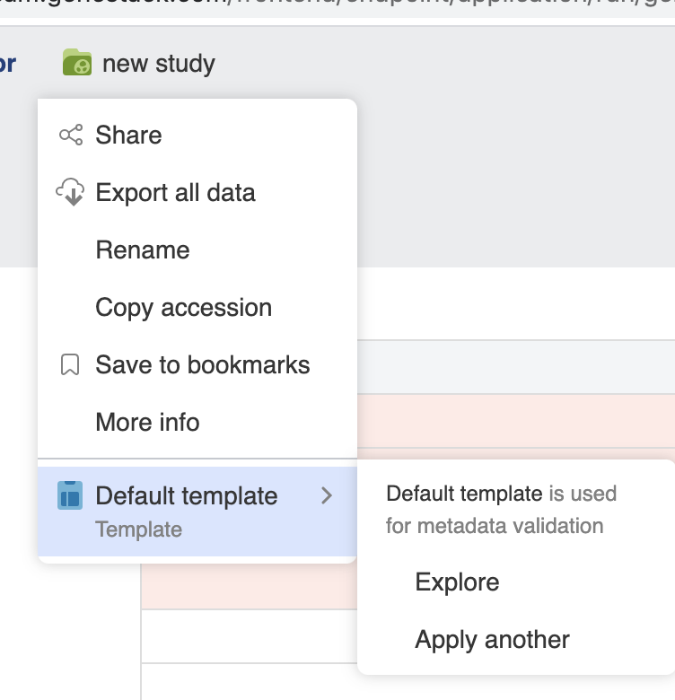

There are several tabs that can be shown on the Metadata Editor page: **Study**, **Samples**, **Expression** (optional), and **Variants** (optional). These represent metadata describing the experiment, samples, and processed files such as transcriptomics data (GCT) and genomics data (VCF).

### Study tab

The Study tab provides general information about the study, such as experiment description, contributors, and their contact details.

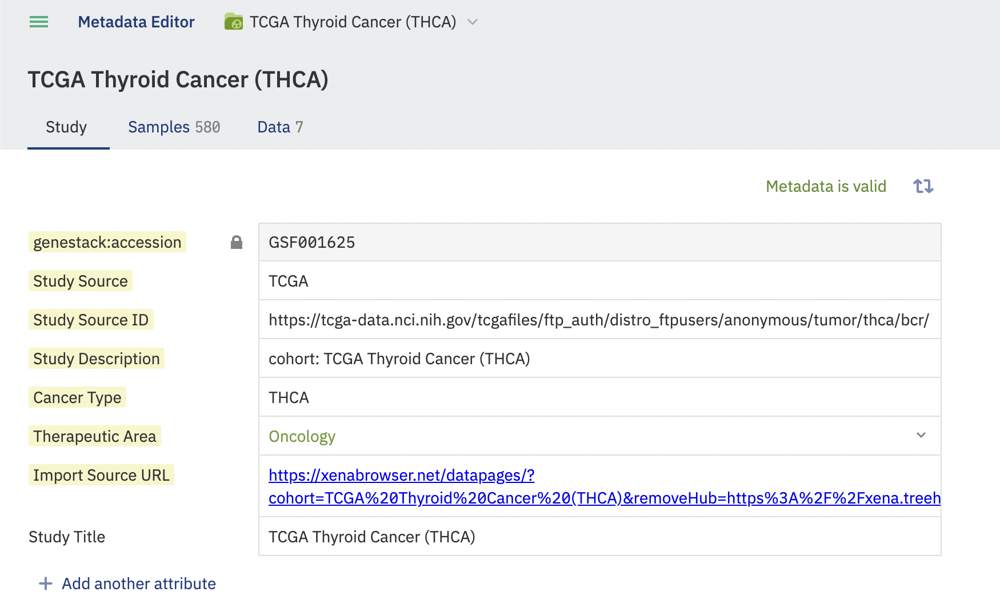

Columns containing invalid metadata are highlighted in red and an **Invalid metadata** flag is displayed.

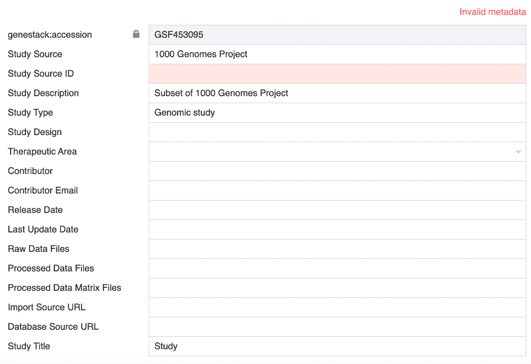

### Samples tab

The Samples tab displays metadata describing each sample in the study — for example, organism, cell line, and disease. Metadata columns defined by the applied template are highlighted in yellow.

**Filter samples by metadata**

To narrow the list of samples shown (for example, to show only samples from *H. sapiens*), click the **Filters** button in the upper-left corner. A metadata summary appears, listing each metadata field with its values and the number of samples per value.

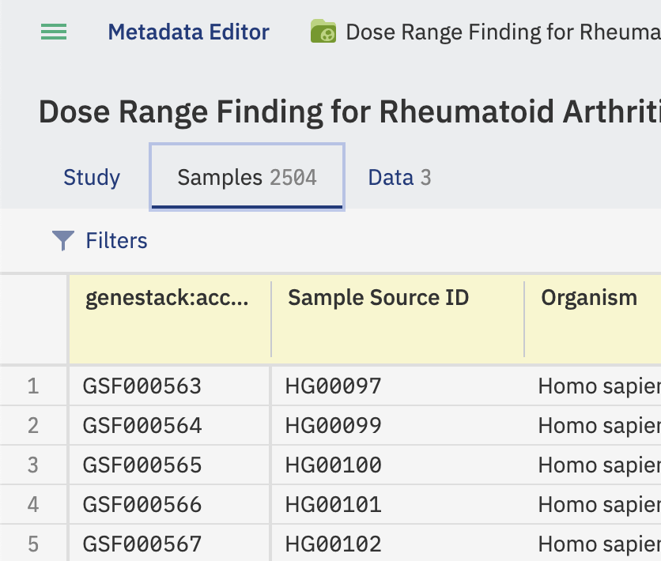

You can also type a metadata value to filter the checkbox list to matching options.

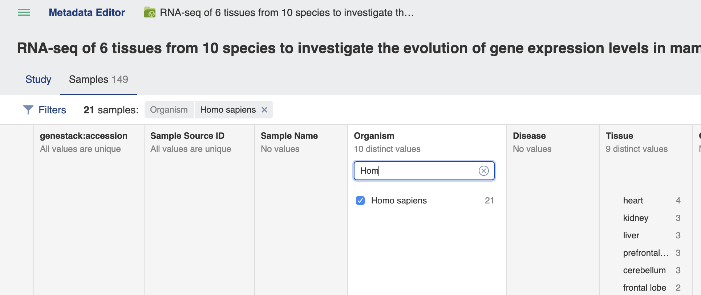

Click the **Apply** button to apply the filter.

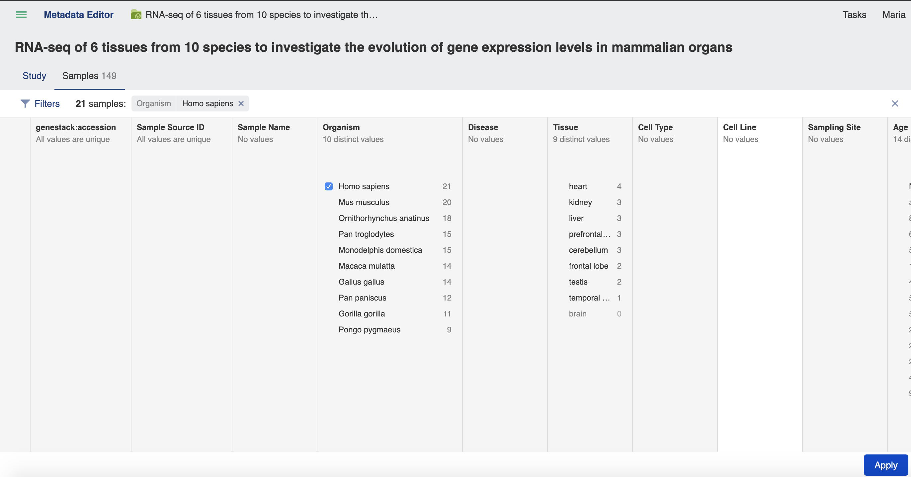

Only the samples that match the filter will be shown.

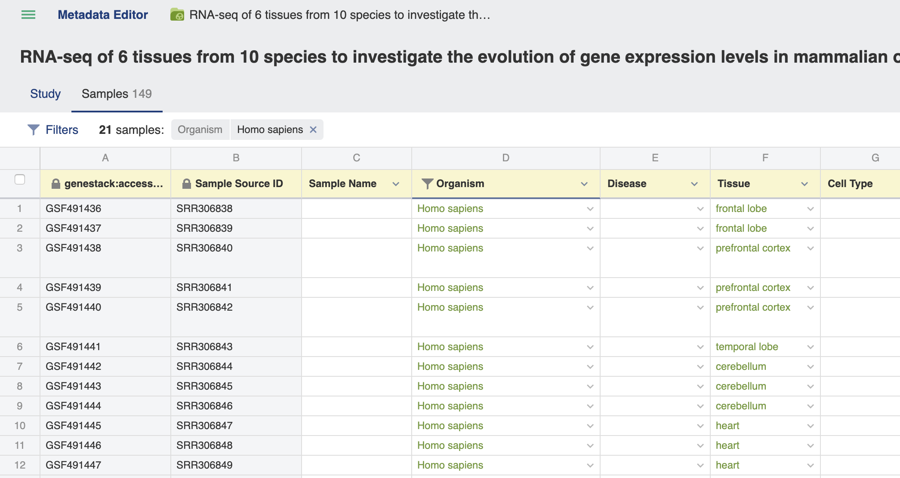

### Data tab

The Data tab displays metadata for the data files associated with a study. If more than one version of an omics file is available, the different versions can be toggled.

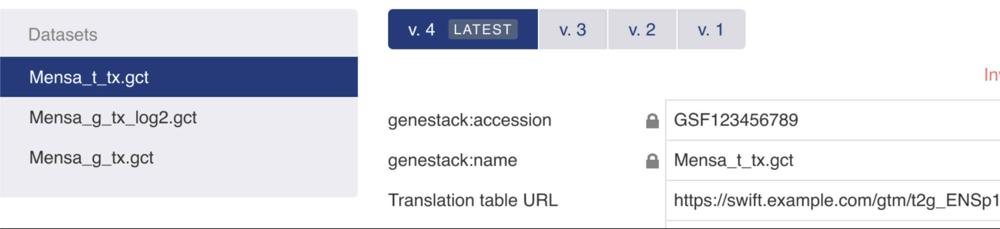

## See also

- [Edit study metadata](edit-metadata.md)
