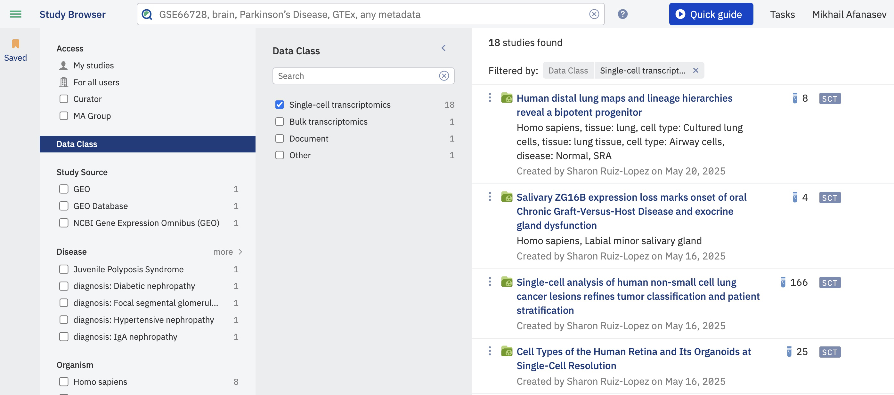
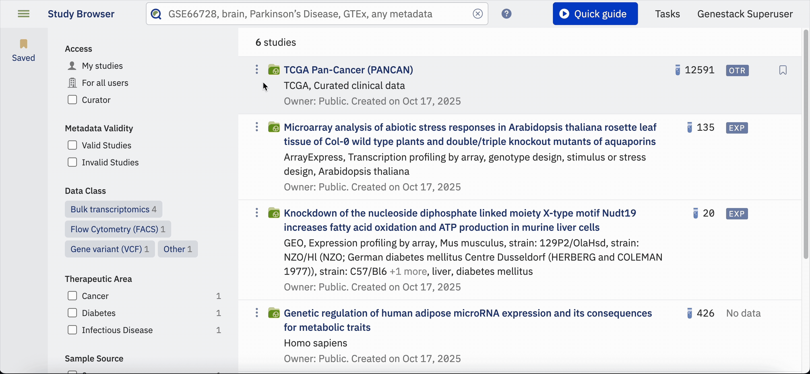
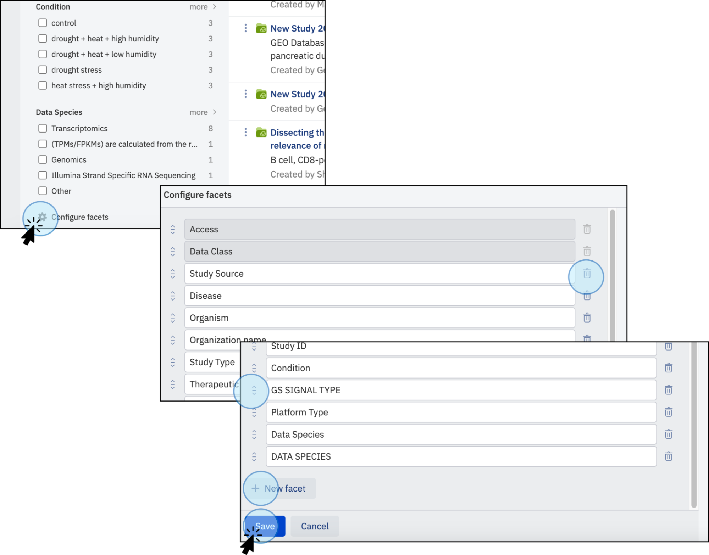

# Filter and facet search results

**Role:** Any authenticated user.

The left-hand filter panel in the Study Browser provides facets that let you narrow search results based on sample metadata fields.

## Filter Data

By default, all studies you have permission to access are displayed. Use the filter panel on the left side of the Study Browser to find specific studies of interest.

* You can search by study name, accession number, or any relevant metadata field.
* The facets beneath the search bar allow you to filter results based on sample metadata fields such as Data Class, organism, tissue, and so on.

<figcaption>Filter data. Use the filters to narrow the search of studies. For example, select <strong>Data Class</strong> and then tick the option <strong>Single-cell transcriptomics</strong> to find exclusively studies containing single-cell data</figcaption>

### Metadata validity status

To filter studies that contain invalid metadata (e.g. Study metadata, Sample metadata), use the **Metadata validity** facet. This facet displays both fully valid studies and those with invalid metadata fields.

Note that any changes made to a study can affect its metadata validity status — for example, changing the study template, updating validation rules in the current template, or adding or removing metadata groups (Samples, Libraries, Preparations, Data).

## Configuring the filter panel

!!! Important
    You can only access the **Configure facets** option if you have the **Configure facets** permission. For access, an admin must edit the settings. Refer to the [Roles and Permissions](../../reference/roles-permissions.md) section for more information.

Users with the **Configure facets** permission can customise which metadata fields are available as search facets.

To configure facets:

1. Click the cog icon at the bottom of the filter panel.
2. Click the **New Facet** button to add a facet.
3. Type the exact name of the metadata field (names are case-sensitive).

You can reorder facets by dragging the icon next to the facet name, and delete them by clicking the bin icon. Click the **Save** button to apply changes. The panel will not save if a facet is empty or a duplicate.

<figcaption>Configure facets. Reorder the facets to display for searching studies. Click on <strong>Configure facets</strong> at the bottom left of the page. A new window will open where you can add, rename, delete or drag facets. The changes will apply after clicking on <strong>Save</strong></figcaption>
