# Search for studies and data

**Role:** Any authenticated user (primarily Consumer).

The Study Browser is the main interface for quickly searching and discovering studies of interest.

!!! Important
    Without **Access all data** permission you can only access studies created by you or shared with a group you belong to. With **Access all data** permission you can access all studies in ODM. Refer to [Roles and Permissions](../../reference/roles-permissions.md) to learn more about users and permissions.

## Getting to the Study Browser

Access the list of available studies by clicking **Browse Studies** from the Dashboard, or by clicking the top-left menu and selecting **Study Browser**.

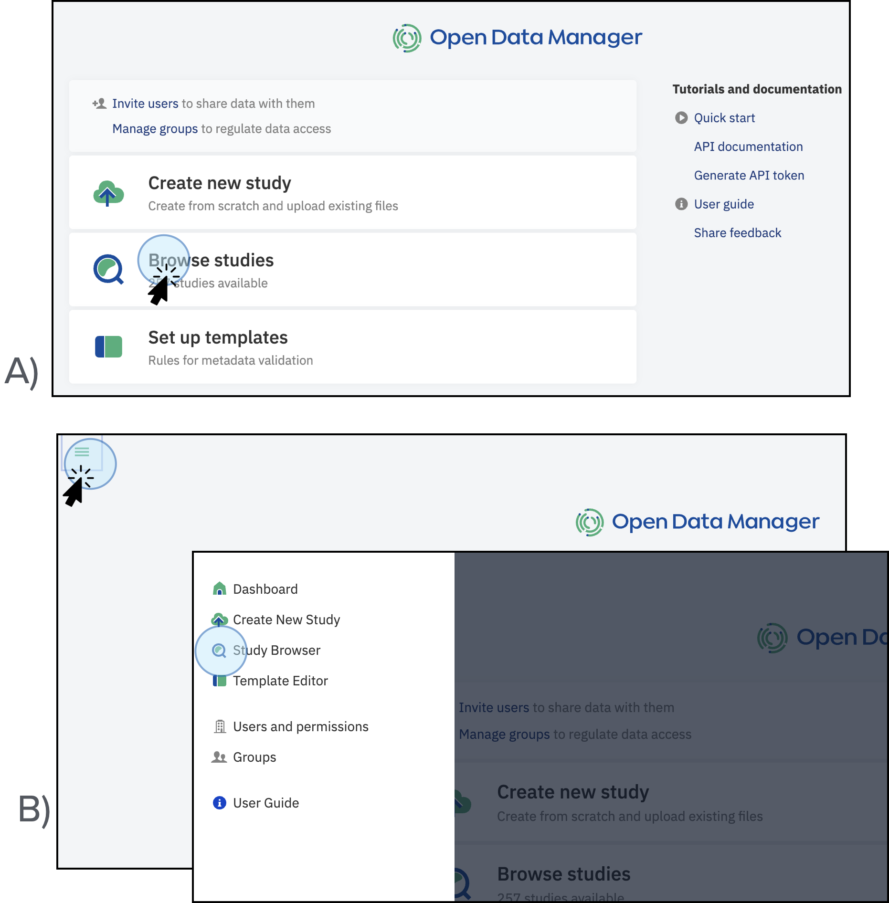
<figcaption>Access the available studies in ODM (based on your permissions) by clicking <strong>Browse studies</strong> on the main dashboard (A), or by clicking on the top left menu and selecting <strong>Study Browser</strong> (B).</figcaption>

* Under each study title there is a summary of the metadata associated with the study, including organism, tissue, cell type, disease, and so on, pulled directly from sample metadata fields.
* Hover over any name in the summary column to see the name of the metadata field it comes from.
* There is also information about who imported the study into ODM and when.
* To the right of the study title you can see the number of samples and the Data Classes associated with the study.

## Search for Data

The main search bar at the top of the window lets you search by study name, accession number, sample or signal object, or any text in any metadata field across all data visible to you.

* As you type, autocomplete suggestions based on dictionaries of terms present in ODM will appear.

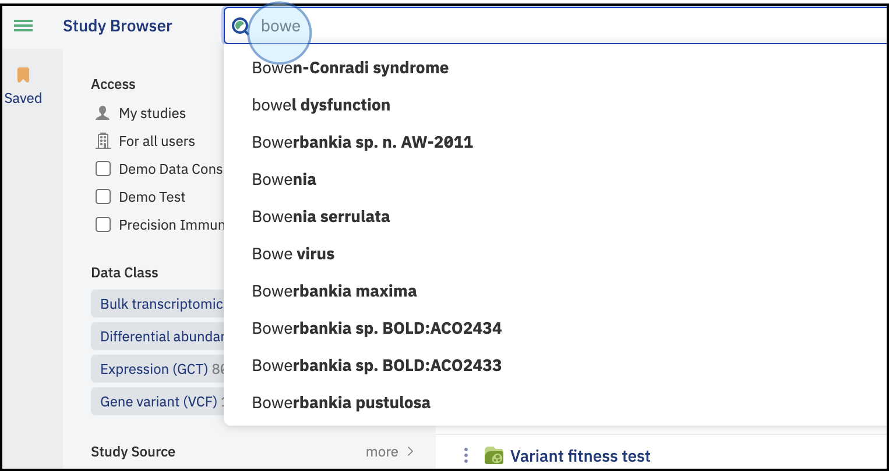
<figcaption>Search for data. The system provides an autocomplete feature that offers values for different ontologies in the search bar. For example, if you type <strong>bowe</strong>, the system will suggest autocompleting options containing the word <strong>bowe</strong></figcaption>

* The search is synonym-aware: typing **'human'** will suggest *Homo sapiens* and include synonym results.

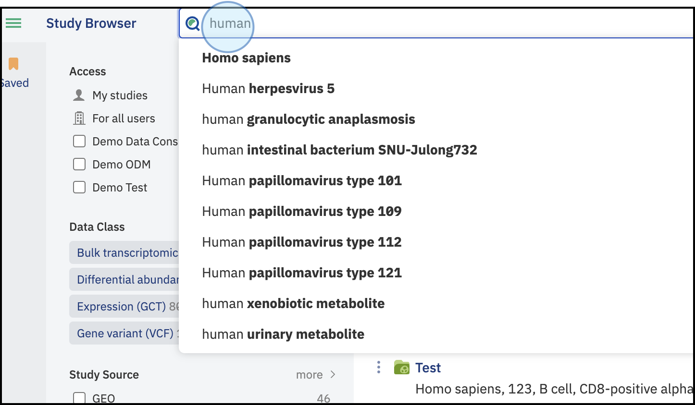
<figcaption>Search for data. The system will suggest autocomplete options based on preferred ontologies. For example, if you type <strong>human</strong>, the system will suggest the label <strong>"Homo sapiens"</strong></figcaption>

* Use question marks (?) to match any single character.

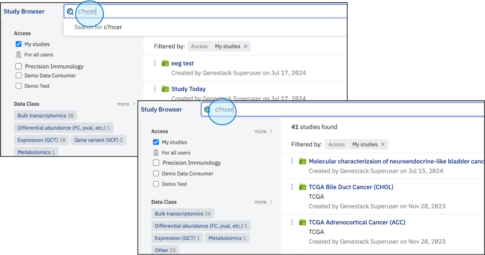
<figcaption>Search for data. Use question marks to match any missing characters. For example, if you type <strong>c?ncer</strong>, the system will suggest studies containing the word <strong>cancer</strong></figcaption>

* Use asterisks (\*) to match any number of wildcard characters.

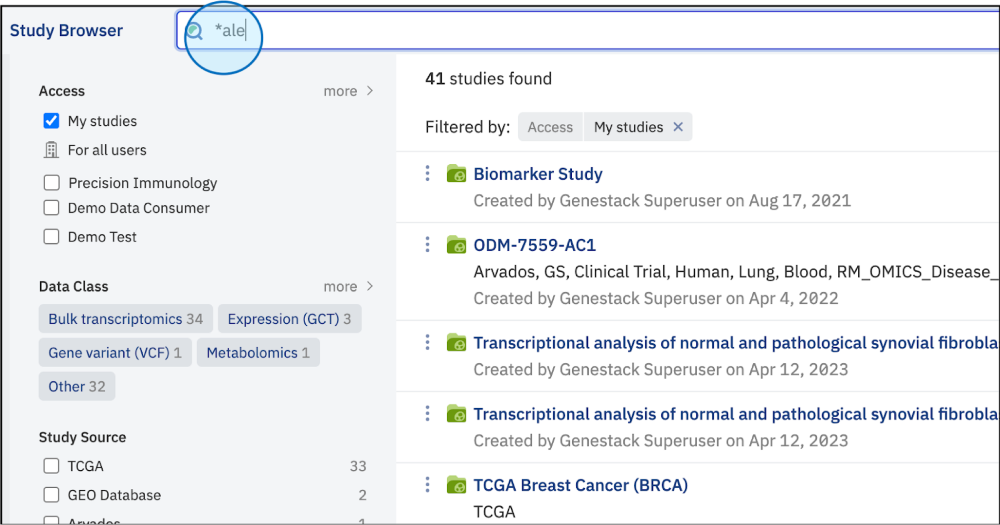
<figcaption>Search for data. Use asterisks to allow any number of wildcard characters. For example, if you type <strong>*ale</strong>, the system will display studies containing the words <strong>male</strong> and <strong>female</strong></figcaption>

* Use quotes (" ") to search for an exact phrase.

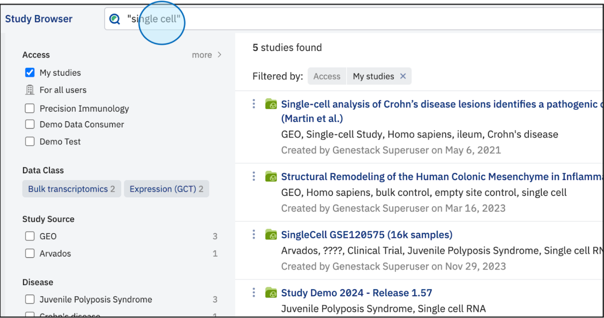
<figcaption>Search for data. Use quotes to search for an exact phrase or word. For example, if you type <strong>"single cell"</strong>, the system will display studies that contain the words single cell in metadata</figcaption>

* Terms can be joined with the **AND** operator (by default the OR operator is used), and excluded with a preceding **NOT**.

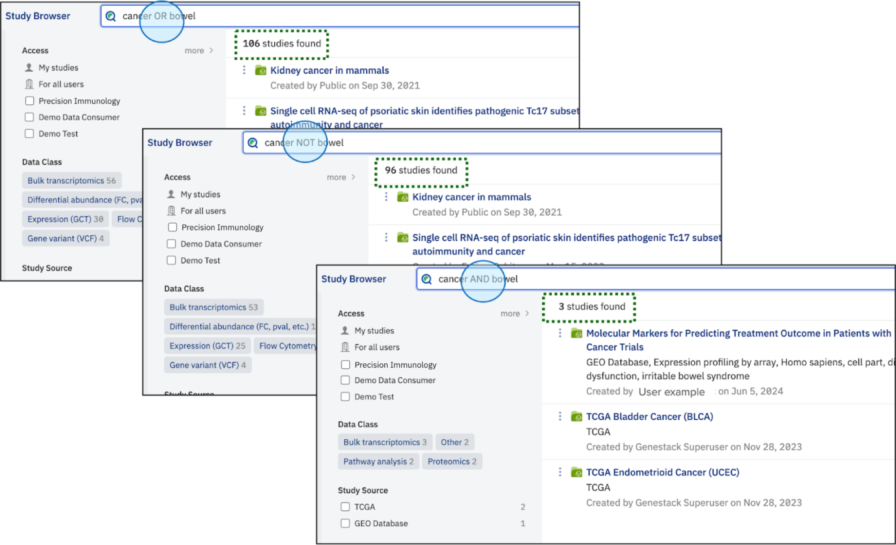
<figcaption>Search for data. The use of operators will display a different number of available studies: <strong>OR</strong> displays studies where one or the other condition is met; <strong>NOT</strong> excludes studies matching one condition; <strong>AND</strong> displays studies where both conditions are met</figcaption>

* If no search is performed, all studies accessible to your account are displayed, ordered by date with the newest at the top.

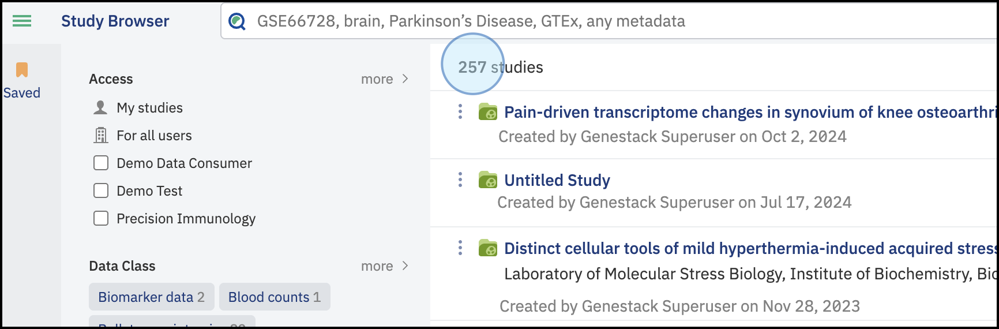
<figcaption>Search for data. If no filters are applied, the system displays the list of all the available studies within the ODM</figcaption>

* If your search term matches an ontology term with child terms, you can toggle **extend query** to include child terms in the results. This feature is available when the total number of terms (including synonyms) is fewer than 30,000.

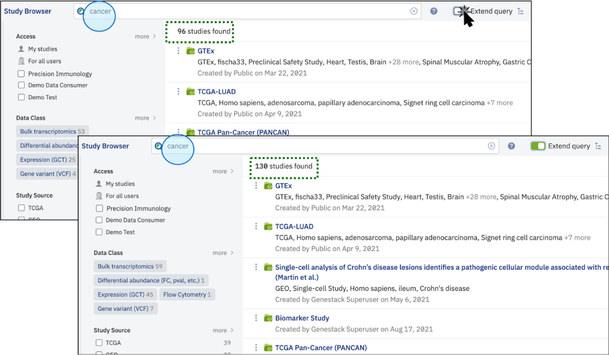
<figcaption>Search for data. Extend the query to include child terms in the search results. For example, the number of available studies with the word <strong>cancer</strong> increases when the option Extend query is selected</figcaption>

## Bookmark studies

* To save a study for easy access, click the three-dot link to the left of the study title and select **Save to bookmarks**.

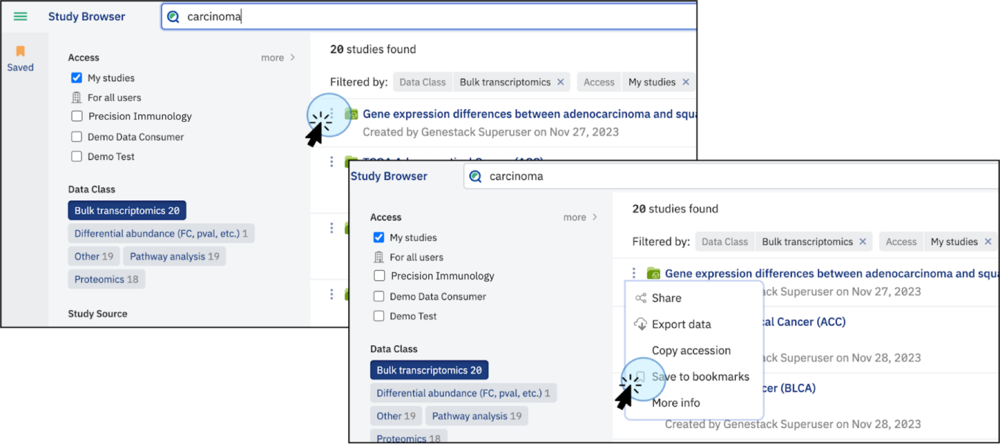
<figcaption>Bookmark studies. Save preferred studies to access them easily. To do so, click on the three-dot link next to the name of the study and click on <strong>Save to bookmarks</strong></figcaption>

* Bookmarked studies are accessible by clicking the **Bookmarks** icon. This section displays your studies and those shared within the groups you belong to.

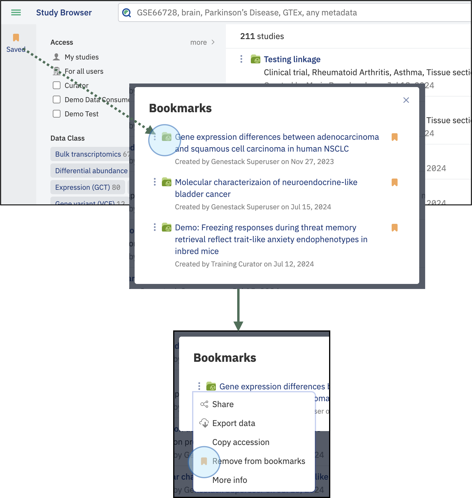
<figcaption>Bookmarked studies. Bookmarked studies are accessible by clicking on the button <strong>Saved</strong>. A new window will appear where you can access the saved studies or remove the bookmark if needed</figcaption>

## Navigation and Help

* Use the shortcut dock in the top-left corner of any window to return to the main Dashboard.
* Click **Quick Guide** in the top right of the window for reference guides and examples on how to use ODM.

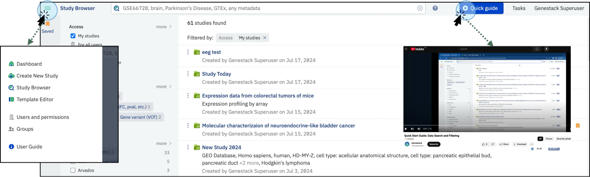
<figcaption>Navigation and help. Click on the left panel to return to the main dashboard. Click on the button to explore Quick Guide</figcaption>

* On the right side of the board, you can access account details and check the status of any running tasks.
* Click the question mark next to the search bar to open the search help section for more details about advanced search functionality.

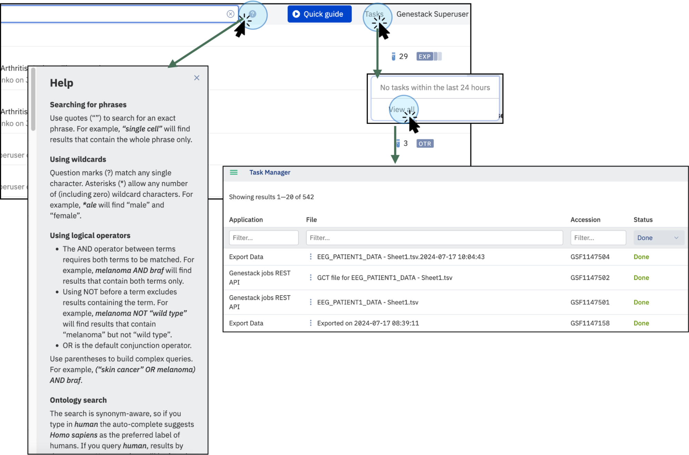
<figcaption>Navigation and help. Click on the question mark symbol <strong>(?)</strong> to open the search bar help section including operators, ontologies, and wildcards. Click on <strong>Tasks</strong> to view the status of any running tasks. Click on <strong>View all</strong> to see recent tasks and their status (running, done, failed, etc.).</figcaption>

## See also

- [Filter and facet search results](filter-facets.md)
- [Export data from a study](export-data.md)
