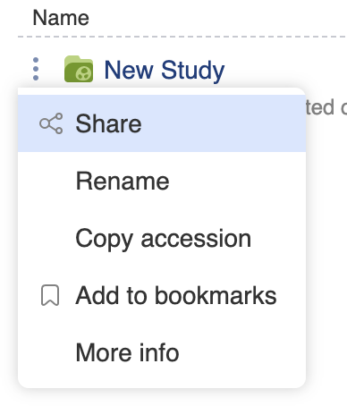
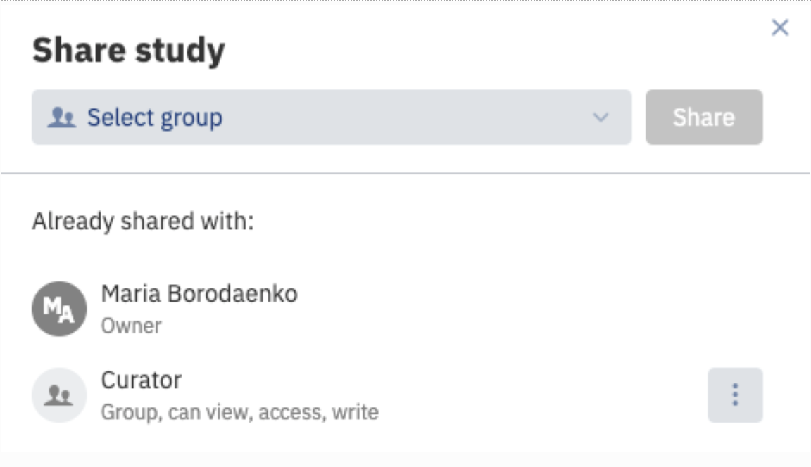
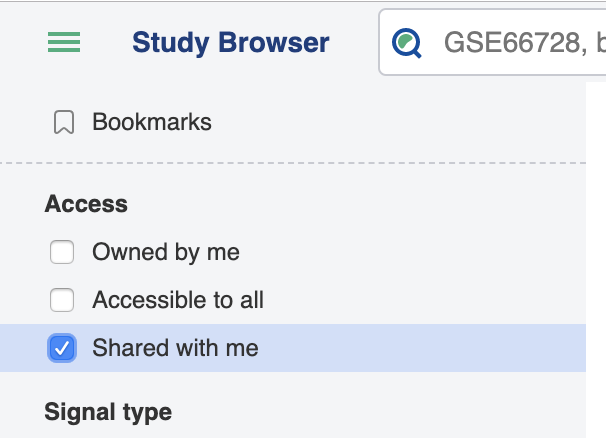
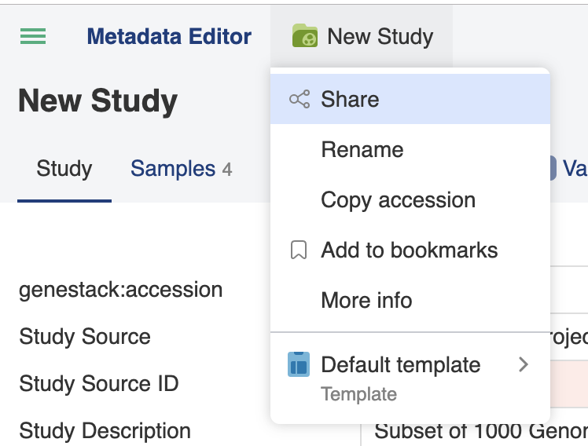

> 

# Share a study with a group

Sharing in ODM enables you to allow people in specific groups to view datasets that you upload (i.e. own), and is typically done once you have curated the study.

## Sharing from the Study Browser

The three-dot button next to any study name opens a menu that allows you to select **Share**.

You will see who already has access to the study and will be prompted to choose which group of users to share the study with. Click the **Share** button to confirm.

Members of this group will now be able to view the study using the **Shared with me** filter:

## Sharing from the Metadata Editor

Sharing from the Metadata Editor works the same way, except that to access the sharing menu you must click on the name of the study or folder icon at the top of the page:

## Changing Permissions Without Ownership

Only the **study owner** can share or unshare a study in ODM. At the moment, **changing the ownership of a study is not natively supported** through the user interface.

However, the following workaround is available using administrative access.

### Prerequisites

- An account with **"Manage Organization"** permissions (e.g., the `root` user).
- This account **must not** use **SSO** as the login method — ODM prompts for a password when resetting another user's password. If SSO is used, the account has no set password and **cannot** be used for this workaround. Use the root account instead.

### Step-by-Step Workaround

1. **Log in as an Admin**
   Sign in to ODM using an account with **"Manage Organization"** rights.

2. **Access User Management**
   Open the admin panel:
   `https://<HOST>/ui/admin/users`

3. **Reset the Study Owner's Password**
   - Find the user who owns the study.
   - Click the ⋮ menu next to their name.
   - Select **"Change password"** and set a temporary one.

4. **Ensure the Study Owner is Active**
   If the user is deactivated:
   - Open the ⋮ menu again.
   - Select **"Activate"**.

5. **Log in as the Study Owner**
   - Log out of the admin account.
   - Log in with the study owner's credentials using the temporary password.

6. **Access the Study**
   Open the study via the **Study Browser** or a **direct URL**, if known.

7. **Adjust Permissions**
   - Click the green folder and study name (top-left).
   - Select **"Share"**.
   - Share or unshare the study as needed in the pop-up window.

> *Note: Once sharing settings are updated, you may choose to inform the original owner or reset their password again.*

## See also

- [Manage groups](../users-access/manage-groups.md) — groups must exist before they can be assigned to a study.
- [Roles and permissions reference](../../reference/roles-permissions.md)
