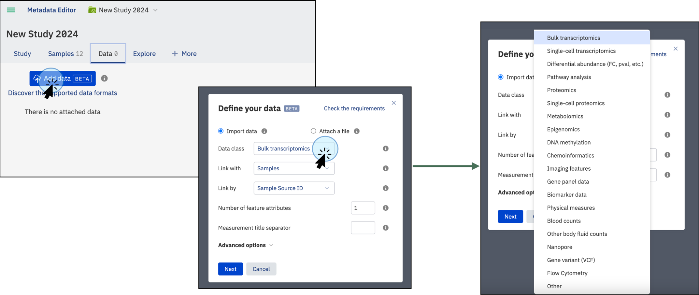
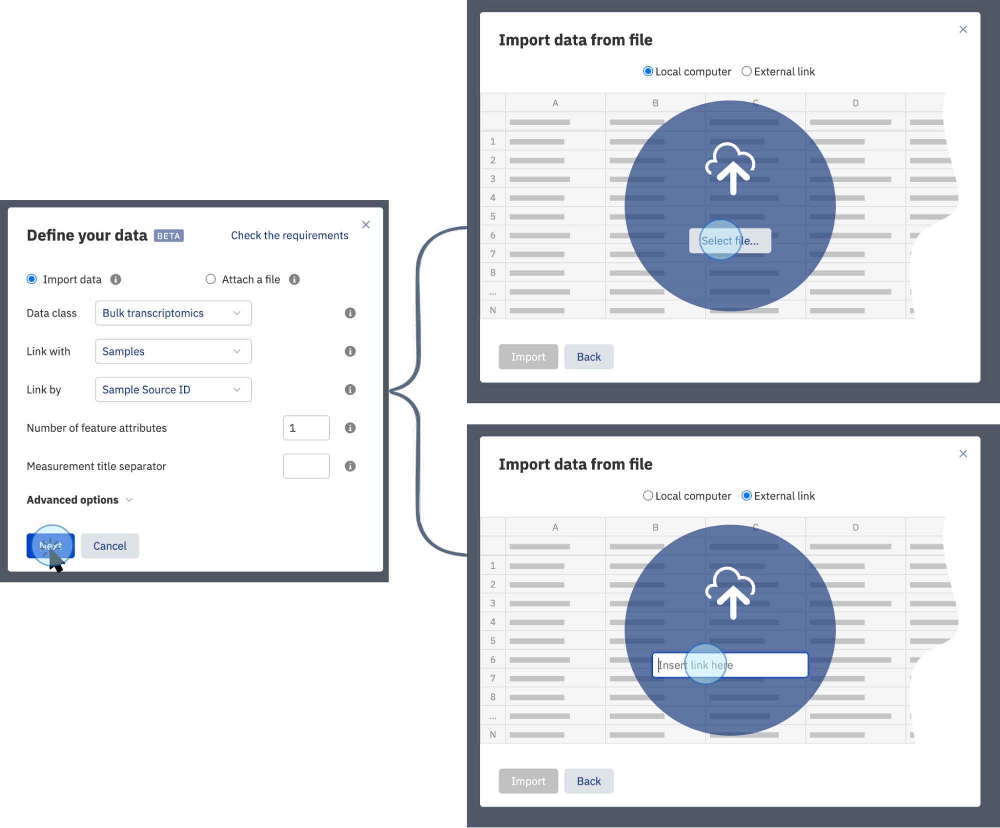
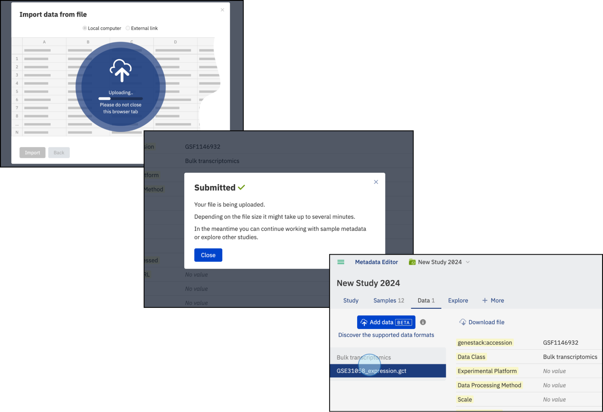
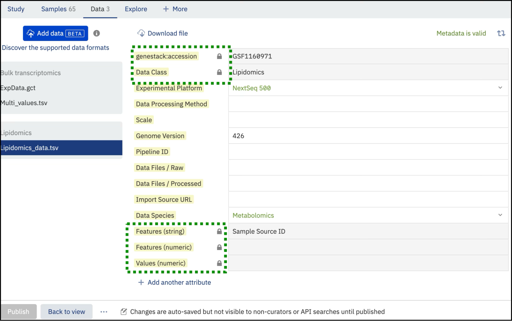

# Import omics data (interface)

**Role:** Contributor

## Import experimental Data and attach files

In addition to the samples, libraries, and preparations metadata described above, you can upload experimental data that is linked to your study via sample metadata and libraries/preparations. You can also supplement your study by attaching related research materials like PDFs, XLSX, DOCX, PPTX files, images, and more. Please note, the contents of these attached files won't be indexed or made searchable.

**Data Type (Data Class)**: Identify the data type you want to upload. Multiple types are supported:

- Bulk transcriptomics - Supports data provided in TSV or GCT 1.2 format.
- Single cell transcriptomics
- Differential abundance (FC, pval, etc.)
- Pathway analysis 
- Proteomics 
- Single cell proteomics 
- Metabolomics 
- Lipidomics 
- Epigenomics 
- DNA methylation
- Chemoinformatics 
- Imaging features
- Gene panel data 
- Biomarker data 
- Physical measures 
- Blood counts 
- Other body fluid counts 
- Long-read sequencing (Nanopore, PacBio) 
- Gene variant (VCF) - VCF format
- Flow Cytometry - FACS format
- Spatial transcriptomics
- Phenomics
- Copy number alterations
- Microbiome / Metagenomics
- Genetic screens (CRISPR / RNAi)
- Cell imaging
- Document
- Other

To upload experimental data or attach files, navigate to the **Data Tab**

* On the Data tab, click on the **Add data** button. This will open a new window where you can select the action to perform: import data or attach a file.

<figcaption>Click on the <strong>Add data</strong> button to choose between importing experimental data or attaching additional files to your study</figcaption>

### Import Experimental Data

You can upload your experimental data, such as bulk transcriptomics, proteomics, chemoinformatics, and more, in a supported tabular format like TSV, GCT, VCF, or FACS. The contents of the uploaded file will be indexed and searchable.

<figcaption>Import experimental data linked to your study by clicking on the <strong>Add data</strong> button, then selecting <strong>Data class</strong> to choose the type of data to import. If the type of data is not listed, select the <strong>Other</strong> option</figcaption>

* Click "Next." This will open a window where you can select a file containing experimental data from your local computer or external storage.

<figcaption>Select the source for the experimental data. Experimental data can be imported from your local computer or external storage</figcaption>

### Linking Data

* **Default Linking**: By default, the data is linked with the Samples file using the **Sample Source ID** column. To ensure proper linking, make sure your file includes a column called **Sample Source ID** with the same IDs used in the Sample Metadata table uploaded previously.
* **Custom Linking**: Alternatively you can select a different column to link the **experimental** data, such as **Sample Name**, **Date**, etc. This provides flexibility in how data is associated, but it is recommended to include the **Sample Source ID** column for consistent referencing and linking samples metadata files with additional data types like libraries and preparations. Read the [Supported File Formats](supported-formats.md) section for more information.

<figcaption>Select an experimental data file. The data must include a column to be linked to the sample metadata file (typically the <strong>Sample Source ID</strong>)</figcaption>

The selected files will be scanned to find an appropriate link (typically the **Sample Source ID** column) and the uploading will automatically begin.

<figcaption>The selected files will be scanned, and if the format is accepted and the columns contain the reference names to be linked, the files will be indexed and the experimental data will be searchable</figcaption>

After uploading, you can populate the corresponding file metadata, including the necessary details. Please note that each uploaded data file has five mandatory read-only fields:

- genestack:accession
- Data Class
- Features (string)
- Features (numeric)
- Value (numeric)

These fields are implemented to make the content of these files visible and searchable for data science users. We advise against editing these fields in the template editor as it could render these files inaccessible.

{width=800}
<figcaption>Mandatory fields are implemented to make the content of the experimental data files searchable</figcaption>

## Important Considerations for Data Import

* **Choose the Correct Data Class**: Ensure you select the appropriate data class for your dataset. The ability to add custom data classes and modify the selected data class after upload will be available in future releases.

* Select the entity to which your data will be linked. For example, when uploading a transcriptomics file with gene expression measurements for each sample, link the data to the relevant samples. Specify the ID column from the Samples (or Library, Preparation) tab that will be used to match the samples (or libraries, preparations) in the uploaded file.

!!! note
    You need to have Samples information (metadata) uploaded in the **Samples** tab to enable data import. If no libraries or preparations are associated with the study, **Samples** will be the only available option.

* **Libraries and Preparations**: Libraries and preparations are connected to the samples via the **Sample Source ID** column. Ensure this column is included in all relevant files to maintain the linkage between sample metadata, libraries, and preparations.

* **Number of Feature Attributes**: If your file includes more than one column describing features, specify the number of such columns. You can find more details on this in the format description page. Defining the correct number of feature attributes is essential to avoid upload issues.

* **Advanced Options** – **Allow Re-importing the Same File**: This option allows you to re-upload the same file from external storage platforms (e.g., AWS S3) using the same link. If uploading the file from a local computer, enabling this option is unnecessary.

* **Multiple Measurements per Sample**: If your file contains multiple measurements per sample (or library, preparation), such as fold change and p-value, the system will automatically recognize this based on the following criteria:

	•	**Measurement Separator Symbol in Column Name**: Each column name must contain a symbol (or symbol combination) that separates the sample (or library, preparation) name from the measurement type. For example, a dot in 'Sample1.p-value'. If there are multiple separators (e.g., 'Sample1.p.value'), the first one will be used for separation.

	•	**Measurement Separator Symbol on Upload Request**: This separator must be explicitly specified during the upload request, either via API or GUI.

	•	**Presence of the Separator Symbol**: All column names must include the measurement separator.

	•	**Consistency of Measurement Types**: Ensure all samples (or libraries, preparations) have consistent measurement types. For instance, if you have three samples and each has measurements for intensity and quality pass, your file should contain columns such as: 'Sample1.Intensity', 'Sample1.QualityPass', 'Sample2.Intensity', 'Sample2.QualityPass', etc.

* **File Upload Errors**: If the file contains issues preventing ODM from processing it correctly, an error message will provide details about the problem. These errors are often related to file format inconsistencies. For more assistance, refer to the [Supported File Formats](supported-formats.md) section or contact Genestack team. 
* Failed file uploads will remain visible for seven days before automatic deletion.

Following these guidelines will help ensure a smooth and error-free data import process. Pay careful attention to the data class, linking strategy, and file format requirements to avoid common issues.

If you encounter any problems or need additional support, don't hesitate to consult the relevant sections of the User Guide or reach out to Genestack team for assistance.

> For full import options including expression, variant, and FACS data via API, see [Import omics data (API)](import-omics-data-api.md).
