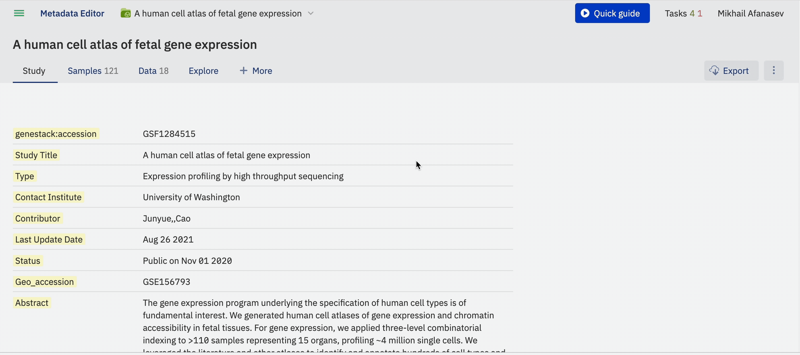

# Import samples and libraries (interface)

**Role:** Contributor

This guide covers importing sample metadata, libraries, and preparations via the ODM interface.

## What Can Be Imported?

ODM supports the import of the following entities, either as structured data or as attached files relevant to your study:

- **Study**: The foundational unit where you define the context, objectives, and statistical design of your experiment.
- **Sample** (Metadata): Detailed documentation of the biological attributes of your samples, such as tissue type, disease status, and treatment conditions.
- **Experimental Data Metadata**: Information about data processing, including normalization methods, instrumentation, and data formats (e.g., GCT, VCF).
- **Experimental Data**: The actual data generated from your study, typically provided in tabular formats.
- **Files**: You can attach any files related to your study, including reports, presentations, documents, images, or scientific publications.
- **Libraries** and **Preparations**: Information regarding the sample preparation methods and libraries used in your experiment, if applicable.

If you have created a new study that does not yet contain sample metadata or linked data, you can upload a spreadsheet of sample metadata via the user interface. This feature is accessible in the **Metadata Editor** under the **Samples** tab.

Data upload takes place within the Metadata Editor after you open or create a Study.

## Importing Sample Information (Metadata)

To import sample information, ensure the following:

* The study should not have any previously uploaded sample information linked to data.
* You will need a TSV format file (with a ".tsv" file extension) containing the sample information. The first row should list the metadata attribute names, ensuring that there are no duplicates. See the example below:

[Test_1000g.samples.tsv](https://s3.amazonaws.com/bio-test-data/odm/Test_1000g/Test_1000g.samples.tsv), a tab-delimited file of sample attributes.

| Sample Source        | Sample Source ID   | Species      | Sex   | Population   |
|----------------------|--------------------|--------------|-------|--------------|
| 1000 Genomes Project | HG00119            | Homo sapiens | M     | British      |
| 1001 Genomes Project | HG00121            | Homo sapiens | F     | British      |
| 1002 Genomes Project | HG00183            | Homo sapiens | M     | Finnish      |
| 1003 Genomes Project | HG00176            | Homo sapiens | F     | Finnish      |

**Import Samples Metadata**:

* To upload sample metadata, click on the **Samples** tab on the main screen of the study.
* Click on **Edit** at the bottom left of your sample table.
* Select the tabular files (TSV) by clicking on the cloud symbol in the top right of your sample table.

You can upload sample metadata from any experiment (e.g., flow cytometry, gene variant, transcriptomics) as long as the file is in a tabular format (TSV).

* A new window will pop up. Click **Select tsv file...** and choose your file.
* Once your file is recognized, click **Import**. Refer to the section [Supported File Formats](supported-formats.md) to explore details on metadata requirements (e.g., **Sample Source ID** is a mandatory column)
* Ensure the changes are saved by clicking **Publish**.
* In the resulting pop-up box, enter the preferred name, label, or description for the activity you just performed to add it to the version log, e.g., **Sample Metadata has been added**. Refer to the section [Metadata Versioning](versioning.md) to learn more about versioning.

## Import Libraries and Preparations

**Add Libraries and Preparations**:

In addition to sample metadata, you can also add Libraries and Preparations metadata. To do so, click on the tab **\+More** to display both options:

* To add libraries, click on **Libraries** and select the tabular file to import from your local computer.
* To add preparations, click on **Preparations** and select the tabular file to import from your local computer.

Both types of files are linked to the samples metadata file (from the Samples tab) via the **Sample Source ID** column. Ensure this column is included in all files to maintain the link between sample metadata, libraries, and preparations.

<figcaption>Click on <strong>+More</strong> to add additional metadata to your study, such as Libraries and Preparations metadata. This step is optional</figcaption>

**Link Metadata Files:**

* Ensure that the **Sample Source ID** column is included in all files to maintain the link between sample metadata, libraries, and preparations.
* Additionally, include the **Library ID** column for libraries and the **Preparation ID** column for preparations to ensure proper recognition and linking of the data.
* Once the data is recognized and linked via these columns, the new metadata tabs will display the recently added data

<figcaption>Additional experimental metadata, such as libraries and preparations, can be added and linked. Ensure the appropriate columns, besides <strong>Sample Source ID</strong>, are included to link the data. For libraries, add the <strong>Library ID</strong> column, and for preparations, add the <strong>Preparation ID</strong> column. The data will be shown on the study's main page</figcaption>

Learn more about data types in the [Supported File Formats](supported-formats.md) section.

> For larger imports or automation, see [Import samples (API)](import-samples-api.md).
