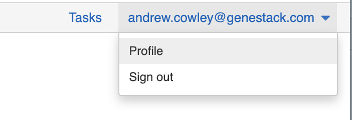
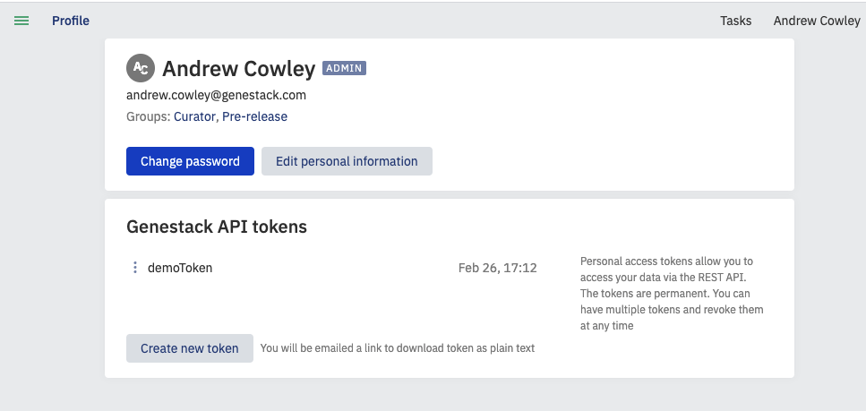

# Generate an API Token

**Role:** Any authenticated user.

## Why API Tokens Matter

An API token is a unique identifier used to authenticate requests made to the ODM API.
It ensures that only authorized users can access and interact with the data and functionalities provided by the ODM.
API tokens are essential for maintaining the security and integrity of the data management system.

* **Security**: API tokens provide a secure method for authenticating users, ensuring that only those with
valid credentials can access sensitive data and perform operations.
* **Access Control**: They help in managing and controlling access to different parts of the ODM,
allowing administrators to specify which users or applications can interact with specific data or functionalities.
* **Auditability**: Using API tokens allows for detailed logging of API interactions, which is crucial for
auditing purposes and for tracking who accessed or modified data.
* **Efficiency**: They enable seamless and efficient interaction with the ODM API, as they eliminate the need
for repetitive manual authentication, streamlining automated workflows and integrations.

By understanding and utilizing API tokens, you can enhance the security, control, and efficiency of your
interactions with the Open Data Manager API.

## Generate API Token via Genestack Software

To obtain a token, sign in to the Genestack software (i.e. ODM) via a web browser, click on your email address in the top right and select "Profile".

Then click the "Create new token" button under API tokens:

You will then be emailed a link to download your token as plain text. The API token is permanent — there is no expiration date. However, you can revoke it at any time and have multiple tokens.

## See also

- [Authenticate with Azure AD](azure-authentication.md)
