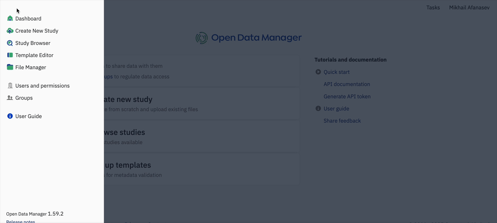

# Manage Users

**Role:** Administrator.

> Need to understand what each permission grants? See [Roles & Permissions](../../reference/roles-permissions.md).

This page covers the full user lifecycle in ODM: creating new users, assigning or revoking permissions, and deactivating users.

## Create a User

1. Proceed to **Users and permissions** page. Here you can observe the list of all users and their permissions.
2. Click on the option **+ New User**.
3. Fill in the empty fields and click **Add**. The new user will be added.

## Deactivate a User

In the ODM it is not possible to delete users, however, you can deactivate them from the menu by clicking on the three dots button to the left of the user icon.

## Users and Permissions

Understanding the roles, capabilities, and permissions within ODM is crucial for effective data management and
collaboration. Each permission defines specific actions users can perform, such as creating, editing, or deleting
groups, and managing templates. Users must have the appropriate permissions to carry out these actions, ensuring a
secure and well-organized data environment.

### Available Permissions

There are five permissions available in the system. Descriptions of the permissions are displayed when you
hover over the mouse.

1. **Manage organization**: Create and deactivate users, change their passwords, and grant permissions.
2. **Manage groups**: Access and manage all existing groups, even if you are neither an admin nor a member of the group.
This permission is particularly recommended for integration purposes, where centralized management of group
permissions across systems is required.
3. **Set up templates**: Create and modify templates.
4. **Access all data**: Access all studies in the system. This permission is recommended for integration purposes,
enabling comprehensive data access for system-wide operations and integrations.
5. **Configure facets**: Set the desired list and order of filtering facets in the Study Browser for all users
on the instance.

### Setting and Managing User Permissions

To set or change user permissions, you need to have the **Manage organization** permission:

1. **Accessing the Permissions Menu:**
    * On the main dashboard, click on the three-line menu button at the top left.

    !!! warning "Permissions required"
        If you have the **Manage organization**
        permission, this menu will display the option **Users and Permissions**. If you do not have this permission,
        the option will not be available.

2. **Managing Permissions:**
    * If you have access, click on **Users and Permissions**. This option will open a new window where you can see all
the users within your organization. You can grant or revoke permissions by ticking the corresponding boxes for
options such as **Manage groups**, **Set up templates**, **Access all data**, and **Configure facets**.
    * Use the search bar to find users you want to grant or revoke permissions to.
    * Hover over the permissions to view a brief description of the permissions capabilities.

## See also

- [Manage Groups](manage-groups.md)
