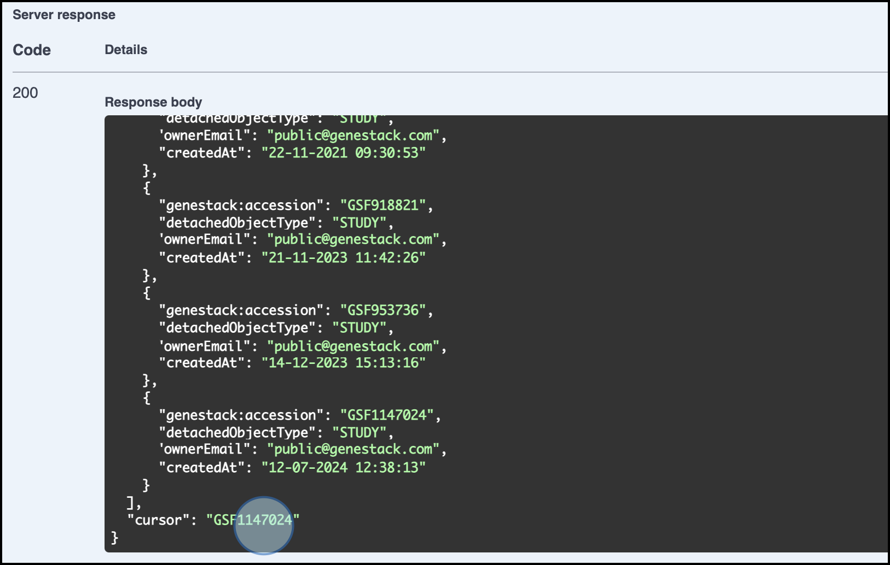

# Administrators using API

!!! abstract "About this guide"
    This guide provides a basic overview of API documentation in Swagger for non-technical users.
    It is not intended as a detailed guide for daily API usage, but rather as an introduction to understanding the
    documentation.

    We are currently working on an advanced guide that covers all use cases to provide you with the best 
    experience using the ODM REST API.

As an administrator, as well as all of the data contributor and consumer functions, you can add, update, 
and delete users via the API.

!!! warning "In order to add, update, and delete Groups, "Manage groups" permission is required."

## Access the API Endpoints

Follow these steps to get started on using the ODM’s API Endpoints :

1. **Log into the ODM**
    * Navigate to the ODM homepage.
    * Click on **API Documentation** on the homepage.
    
    <figcaption>Main dashboard of the ODM. Click on API documentation to explore the available resources</figcaption>

2. **Explore the API Documentation**
      * This action will display the API Documentation window, where you can explore how the data model in ODM is structured.
      * In this window, you will also see how the endpoints are grouped based on general use cases.

!!! question "Endpoint groups explanation"
      * "Query/retrieve data" with the list of user endpoints - only these endpoints can be used by users who are not included in the group Curator, also these endpoints can be used by users from the Curator group also.
      * "Import/curate data" with the list of curator endpoints - can be used only by users from the group Curator.
      * "Data sources" - some endpoints can be used by curators only, others by curators and researchers.
      * "Manage organisation" - this section is actual only for users with the permission to manage organization.

## Using Swagger for API Interaction

Swagger is an API documentation tool which provides an interactive interface for exploring and
interacting with the API endpoints. Its` main goal is to familiarise users with the available endpoints,
parameters, structure of response, etc. Note that it is not for day-to-day usage or integrations.

Follow these steps to use Swagger effectively, based on your role and permissions:

1. **Select the Endpoints for Specific Actions:** Depending on your role (Data Consumer, Data Contributor, or Data Admin)
   and your goal, select the appropriate endpoints. For Data Consumers, the available options are retrieving and
   exporting data and metadata.
2. **Explore the Swagger Interface:**
      * When you select an endpoint of interest and click on it, a new window will display the Swagger interface.
      * This interface allows you to explore available endpoints for querying and retrieving data.
3. **Accessing Endpoints:** Use the top right button to select specific functions. For example,
   the `studyUser` definition contains API endpoints specifically for retrieving study metadata.
   
   <figcaption>Swagger page interface. You can access the endpoints by selecting specific functions on the button on the top right, e.g., the definition <strong>studyUser</strong> contains the API endpoints for retrieving only study metadata</figcaption>

### API token

An access token is required to work with the API endpoints. Follow these steps to create and use an API token:

### Generate a Token

1. **Access Your Profile**
      * Navigate to your profile by clicking your username at the top right corner of the User Interface or from the Dashboard
2. **Create a New Token**
      * On the profile page, click on **Create a New Token.**
      * This action will automatically send a link to your email address with instructions to access the new token
3. **Follow the link on your email**.
      * Click on the link received on your email. This action will open a new window where you can enter a unique name for the new token in the prompt that appears.
4. **Download the Token**
      * Click on **Download Generated Token**.
      * A plain text (TXT) file containing your new token will be automatically downloaded to your local computer.
5. **Store the Token**
      * Save the token in an easily accessible location for future use.

<figcaption>Steps to create a new API token: 1) Access your profile window, 2) click on Create new token, and a link will be sent to your email address (the user who is logged in). 3) Access the link, 4) assign a name to the token and 5) download the plain text format file</figcaption>

### Authorize with the Token
1. Once the token is generated, you need to authorize the use of the endpoints.
2. Direct to the endpoint of interest depending on the action to run (retrieve data, stream data, upload entities, etc.)
3. Click on **Authorize**, select the type of token (Access Token or Genestack API token),
   and navigate to the specific endpoint.
   
   <figcaption>Use your token to authorize access to the endpoints</figcaption>

4. Click on **Try it out** to activate it. The **Try it out** step is required for every single endpoint.

<figcaption>Once the token has been added, select the Endpoint of interest and click on <strong>Try it out</strong> to activate it</figcaption>

## Use Case Example: Find detached data in ODM

**Endpoint**: GET `/api/v1/manage-data/detached-objects`

!!! Warning ""Manage organisation" and "Access all data" permissions are required for working with detached objects."

A data object is considered "detached" if it lacks any direct or indirect link to a root-level object, referred to 
as a "study." A study itself is classified as detached if it has no links to lower-level objects.

1. To locate orphaned data (detached objects), you can use the "Retrieve a list of detached objects" endpoint.
    
    <figcaption>Use the endpoint {==/api/v1/manage-data/detached-objects==} to find detached data</figcaption>

2. You can apply filters to specify the type of data you wish to retrieve and limit the number of results displayed 
(up to 2,000). If no filters are applied, the endpoint will return a list of all available detached objects. 
In the example below, the results are limited to the first 5 available objects.
   
   <figcaption>Apply filters to limit the number of results</figcaption>

3. The results display the first 5 detached objects in the system, including detailed information for each object, 
such as the Genestack accession number, the type of detached object, the owner's email, and the date of creation. 
The "cursor" at the end indicates the last object retrieved from the list, which allows you to continue the 
search from where it left off.
   
   <figcaption>Response from the previous query. The window shows the number of results, the accession number. The last value "cursor" indicates the last retrieved object</figcaption>

4. You can apply filters to search for specific types of detached objects, 
such as `STUDY`, `SAMPLE_GROUP`, `LIBRARY_GROUP`, `PREPARATION_GROUP`, `TABULAR_DATA`, `GENE_VARIANT`, and 
`FLOW_CYTOMETRY`. For instance, you can filter by LIBRARY_GROUP to retrieve the first 10 detached library group objects.
   
   <figcaption>Apply filter to customize the search for specific data, such as <cursor>Library Group</cursor></figcaption>

Identifying detached objects can help you recognize data that may no longer be relevant in the system. 
You can use the Genestack accession number to delete data that is no longer required. For more information on 
deleting data, refer to the next section "Delete Data in ODM".

## Use Case Example: Delete data in ODM

**Endpoint:** DELETE `/api/v1/manage-data/data`
!!! warning "The deletion of data is an irreversible action and it is only available for users with "Manage organization" and "Access all data" permissions."

1. To delete a data object or a data group, use the `/api/v1/manage-data/data` endpoint
    
    <figcaption>Use the endpoint {==/api/v1/manage-data/data==} to delete data from  ODM</figcaption>

2. Enter the data object or the data group accession of the data you intend to delete. 
For this example, we will delete the study GSF1147012, named “Demo version 2”.
     
    <figcaption>Use the endpoint {==/api/v1/manage-data/data==} to delete specific data. For example, to remove the study  <strong>Demo version 2</strong>, add the ID details (GSF1147012) and click on <strong>Execute</strong></figcaption>

3. The response indicates that the deletion of the following files and all linked data has been started. 
You can verify the deletion by checking the Groups section in the 
ODM interface; the "Demo version 2" group should no longer be listed.
  
<figcaption>The outcome 202 indicates that the operation to remove the study <strong>Demo version 2</strong> (ID GSF1147012) has been successful. You can corroborate the action by logging into ODM and searching for the specific study.</figcaption>

By following these steps, Data Administrators can efficiently manage users and groups within the **ODM** using the API endpoints. 
