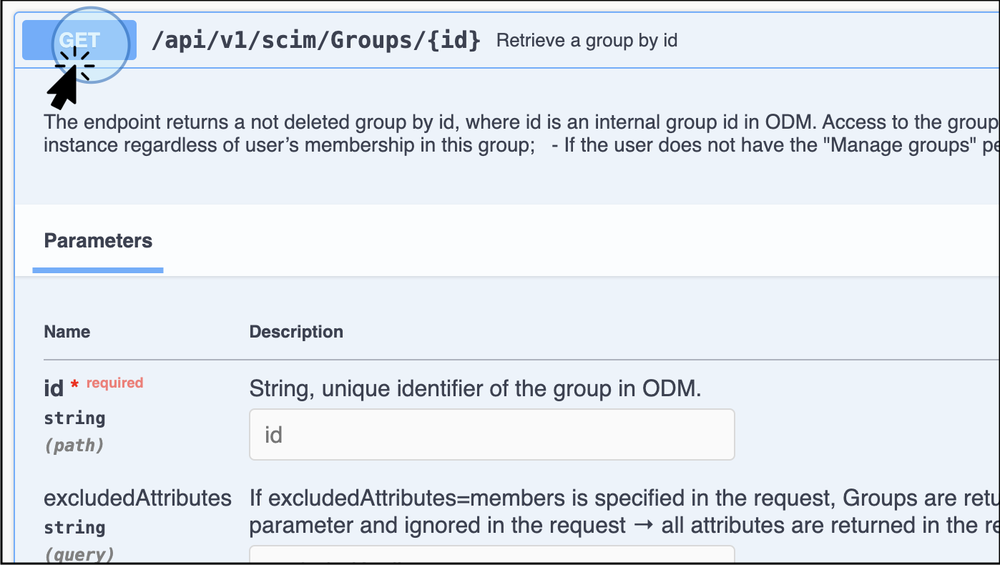
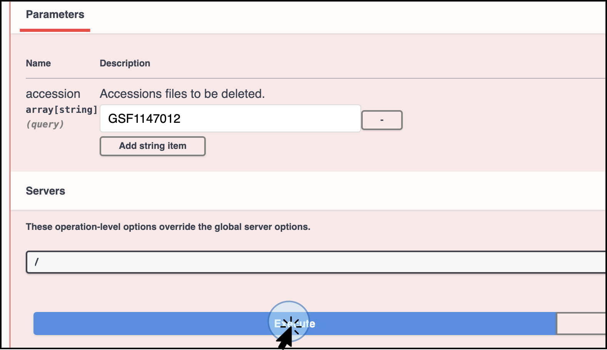

# Administrators using API
As an administrator, as well as all of the data contributor and consumer functions, you can add, update, 
and delete users via the API.

!!! warning "In order to add, update, and delete Groups, "Manage groups" permission is required."

## Access the API Endpoints

Follow these steps to get started on using the ODM’s API Endpoints :

1. **Log into the ODM**
    * Navigate to the ODM homepage.
    * Click on **API Documentation** on the homepage.
    

2. **Explore the API Documentation**
      * This action will display the API Documentation window, where you can explore how the data model in ODM is structured.
      * In this window, you will also see how the endpoints are grouped based on your user permissions.
        

## Using Swagger for API Interaction

Swagger is an API documentation tool which provides an interactive interface for exploring and
interacting with the API endpoints. Its` main goal is to familiarise users with the available endpoints,
parameters, structure of response, etc. Note that it is not for day-to-day usage or integrations.

Follow these steps to use Swagger effectively, based on your role and permissions:

1. **Select the Endpoints for Specific Actions:** Depending on your role (Data Consumer, Data Contributor, or Data Admin)
   and your goal, select the appropriate endpoints. For Data Consumers, the available options are retrieving and
   exporting data and metadata.
2. **Explore the Swagger Interface:**
      * When you select an endpoint of interest and click on it, a new window will display the Swagger interface.
      * This interface allows you to explore available endpoints for querying and retrieving data.
3. **Accessing Endpoints:** Use the top right button to select specific functions. For example,
   the `studyUser` definition contains API endpoints specifically for retrieving study metadata.
   

### API token

An access token is required to work with the API endpoints. Follow these steps to create and use an API token:

### Generate a Token

1. **Access Your Profile**
      * Navigate to your profile by clicking your username at the top right corner of the User Interface or from the Dashboard
2. **Create a New Token**
      * On the profile page, click on **Create a New Token.**
      * This action will automatically send a link to your email address with instructions to access the new token
3. **Follow the link on your email**.
      * Click on the link received on your email. This action will open a new window where you can enter a unique name for the new token in the prompt that appears.
4. **Download the Token**
      * Click on **Download Generated Token**.
      * A plain text (TXT) file containing your new token will be automatically downloaded to your local computer.
5. **Store the Token**
      * Save the token in an easily accessible location for future use.

### Authorize with the Token
1. Once the token is generated, you need to authorize the use of the endpoints.
2. Direct to the endpoint of interest depending on the action to run (retrieve data, stream data, upload entities, etc.)
3. Click on **Authorize**, select the type of token (Access Token or Genestack API token),
   and navigate to the specific endpoint.
   

4. Click on **Try it out** to activate it. The **Try it out** step is required for every single endpoint.

## Use Case Example: Retrieve, update, and delete a group

!!! warning "In order to add, update, and delete Groups, "Manage groups" permission is required."

Let's go through a practical example using the group "**Demo 2024**"

### Accessing Group Endpoints

To manage groups, navigate to the **scimGroups** section.

A new Swagger window will display with the endpoints to add, edit and delete groups.

### Retrieve a List of Groups

Endpoint: `/api/v1/scim/Groups`

1. Click on **Retrieve a list of available groups**.

2. Without filters, this endpoint will return a list of all available groups, including accession IDs, members,
and creation/modification dates

3. To filter for a specific group, use the `filter` field. For example, to find the group "**Demo 2024**", use the 
filter `displayName eq "Demo 2024"`. 
!!! note "Note the name is case-sensitive."

4. The response will display the details for the group of interest. For the specific example, the ID for the 
“Demo 2024” Group is `GSG000035`.

### Retrieve a Group by ID

**Endpoint:** `/api/v1/scim/Groups/{id}`

1. To get information about a specific group using **Group ID**, use the "Retrieve a group by ID" endpoint.

2. Enter the group ID, such as `GSG000035` for "**Demo 2024**".

3. The response will include details about the group called. In contrast to the previous endpoint /api/v1/scim/Groups, 
the endpoint `/api/v1/scim/Groups/{id}` will display details of the creation and modification of the group indicated 
by the assigned ID. The information can be downloaded in a JSON file format.

### Update a group

To modify a group's structure by adding or removing users:

Use the **Endpoint:** `/api/v1/scim/Groups/{id}`

#### Add a new user

1. You will need the ID of the User you want to add and the ID of the Group where the user will be added.
2. Retrieve the User ID by selecting the appropriate endpoint. 
3. For this example, the details were obtained from the previous steps. For the Group name “**Demo 2024**”, 
and the User name “**New User 2024**”, the details are as follows:
    * **ID Group**: `GSG000035`
    * **User ID**: `63`
4. Add the parameters for **Group ID** and the request body to include the User ID.
 

5. The response (code 200\) will confirm the successful operation. You can verify the addition of the new member, 
**New User 2024**, by retrieving the group by ID or searching for the group in the ODM interface.
 

#### Remove a user

Similarly, use the same endpoint, `/api/v1/scim/Groups/{id},` to remove a user from the group.

For this example:

* **Group ID**: `GSG000035`
* **User ID**: `63`

* The response (code 200\) will confirm the successful operation. You can verify the removal of the member 
**New User 2024** by retrieving the group by ID or searching for the group in the ODM interface.
 

### Delete a Group

**Endpoint:** `/api/v1/scim/Groups/{id}`
!!! warning "The deletion of a group is an irreversible action and it is only available for administrators."

1. To delete a group, use the "Delete a group" endpoint

2. Enter the group ID of the group you intend to delete, such as `GSG000035` for "Demo 2024".

3. The response will confirm the deletion. You can verify the deletion by checking the Groups section 
in the ODM interface; the "Demo 2024" group should no longer be listed.

The outcome 204 indicates that the operation to remove the group **Demo 2024** (ID GSG000035) has been successful. 
You can corroborate the action by logging into ODM and searching for the existing groups.

### Delete data in ODM

**Endpoint:** `/api/v1/manage-data/data`
!!! warning "The deletion of data is an irreversible action and it is only available for administrators."

1. To delete a group, use the "Delete objects from ODM" endpoint

2. Enter the group ID of the data you intend to delete. For this example, we will delete the study GSF1147012, 
named “Demo version 2”
 

3. The response will confirm the deletion. You can verify the deletion by checking the Groups section in the 
ODM interface; the "Demo version 2" group should no longer be listed.
  

By following these steps, Data Administrators can efficiently manage users and groups within the ODM using the API. 
