# Administrator in the User Interface

If you have **Manage organization** permission, your user account will be marked with **Admin** label. 
As an Admin, you have the ability to create and deactivate users, change users' passwords, and manage user 
permissions within the Open Data Manager (ODM). 

To add, update, and delete groups **Manage groups** permission is required.
This guide will help you navigate these features efficiently.

## Accessing Your Profile and Permissions

* Click on Profile to access information regarding your user permissions.

    <figure markdown="span">
    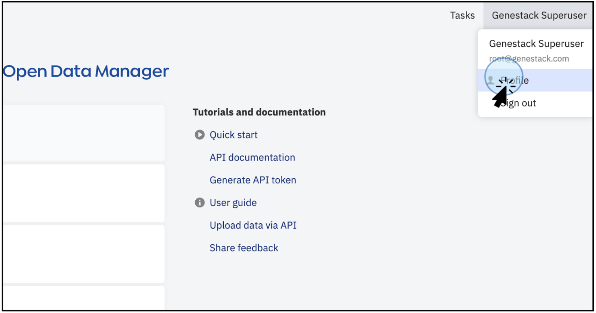
    <figcaption>Main dashboard of the ODM. Click on your profile to access detailed information about your user capabilities</figcaption>
    </figure>

* Admin user will be marked with **Admin** label.

<figure markdown="span">
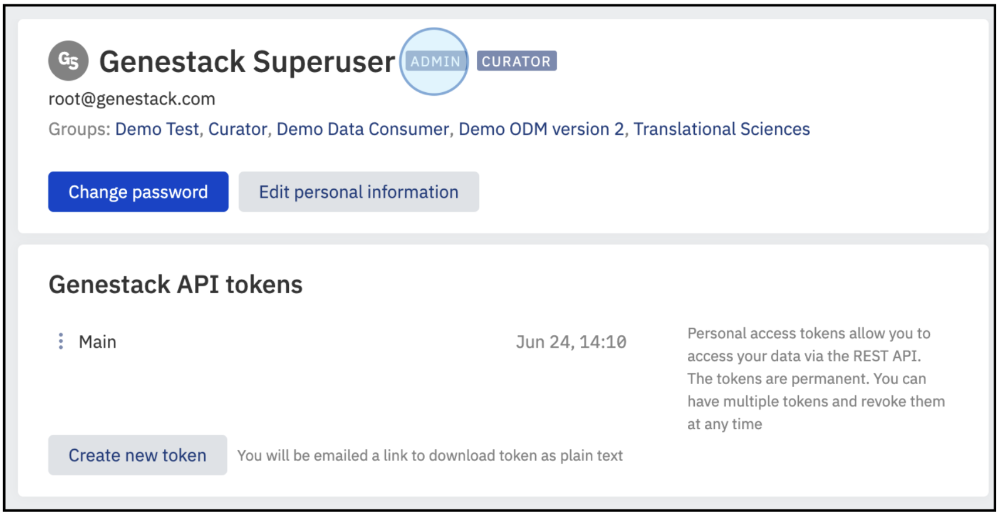
<figcaption>View of the users' profile. This window contains detailed information about the groups you are part of, the capabilities (Admin and Curator), and the active API tokens</figcaption>
</figure>

## Use Case Example: Add and Update Users
As an administrator, you can add, edit and delete groups, as well as deactivate users. 

!!! info "Important"
    In order to be able to remove groups, the user should have the **Manage organization** permission

### Add New Users:
Follow these steps to add and edit users, as well as groups

1. **Access the Users and Permissions**
    * Click on the three-line menu button at the top left of the dashboard to access the **Users and permissions** section.
   
     <figure markdown="span">
     
     <figcaption>To access User and permissions, click on the three-line menu at the top left of the dashboard. This will display a menu where you can access **Users and permissions**</figcaption>
     </figure>

2. **Add new users**
    * A new window will appear listing all the users.
    * Click on **+New user**.

    <figure markdown="span">
    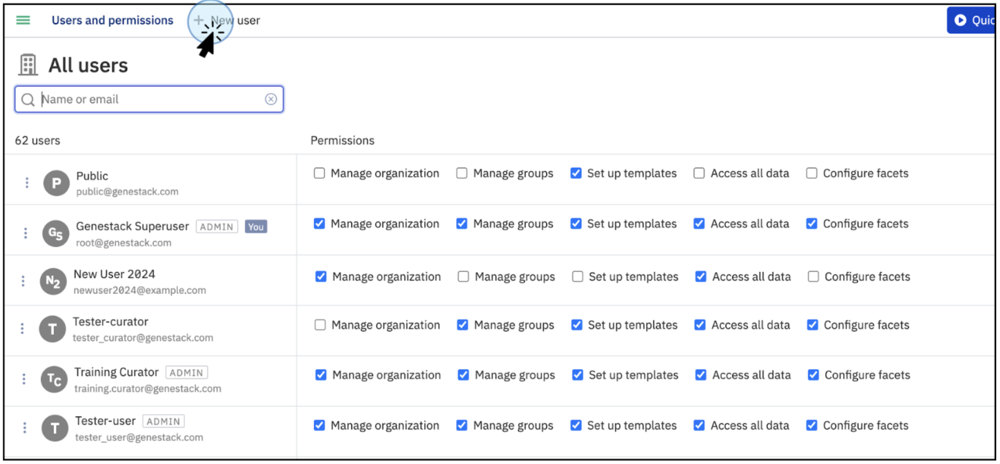 
    <figcaption>The section **Users and Permissions** shows the list of all users in the ODM instance. Click on **+New user** to add a new user</figcaption>
    </figure>

    * This action will open a new window where you can type the details for the new user: New User 2024
    
    <figure markdown="span">
    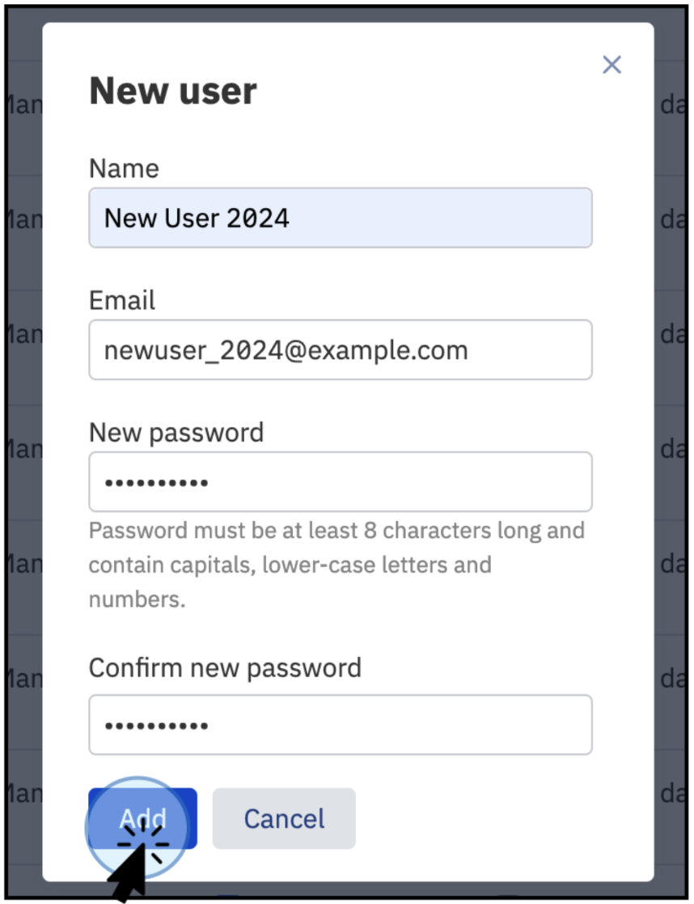{ width="400" }
    <figcaption>Type the details of the new user and click Add. The system will detect if a user has been previously added (by the email address)</figcaption>
    </figure>
    
3. **Confirm New Members:**
    * After adding the details, click **Add** to confirm. The new member will be part of the ODM.

<figure markdown="span">
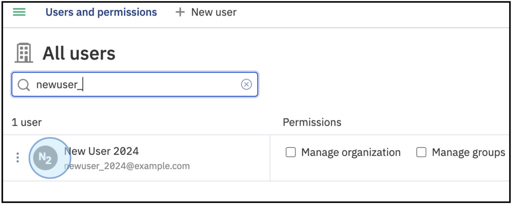
<figcaption>Confirmation the recently added user, New User 2024, is now part of ODM</figcaption>
</figure>

### Edit and update Permissions

Each permission defines specific actions users can perform, such as creating, editing, or deleting groups, and managing templates.

To set or change user permissions, you need to have the **Manage organization** permission:

1. **Accessing the Permissions Menu:**
    * On the main dashboard, click on the three-line menu button at the top left.

    <figure markdown="span">
    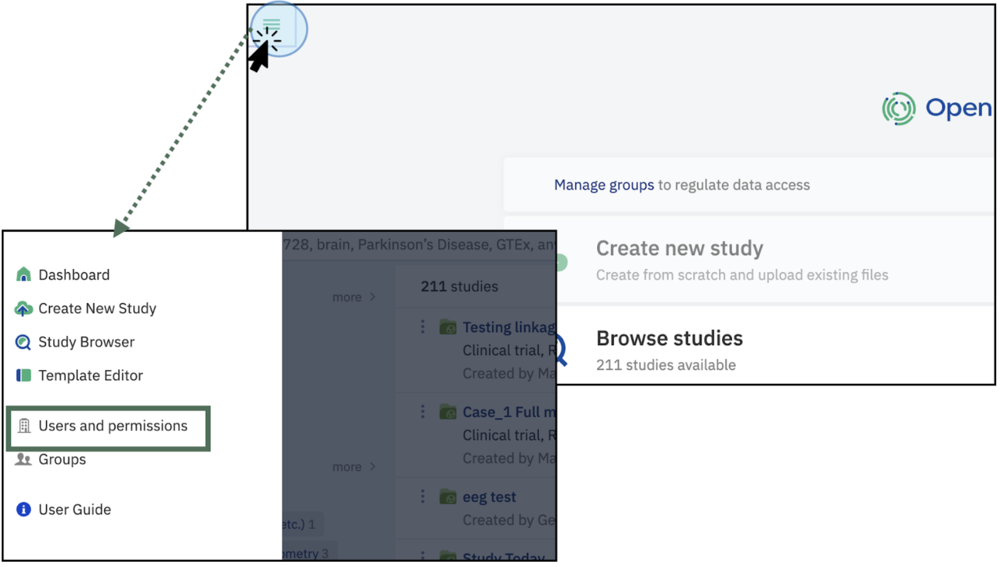
    <figcaption>Access the <strong>Users and Permissions</strong> section by clicking on the three-line menu at the top left of the dashboard</figcaption>
    </figure>

2. **Managing Permissions**
    * A new window will open you can see all the users within your organization. You can grant or revoke permissions by ticking the corresponding boxes for options such as **Manage groups**, **Set up templates**, **Access all data**, and **Configure facets**
    * Use the search bar to find users you want to grant or revoke permissions to

    <figure markdown="span">
    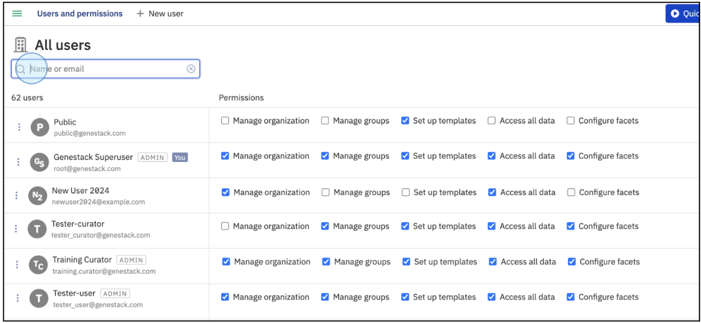
    <figcaption>View of the Users and Permissions panel. Tick the boxes to grant or revoke permissions: Manage organization, manage groups, set up templates, access all data, and configure facets. To manage individual permissions, find the user with the search bar</figcaption>
    </figure>

3. Hover over the permissions to view a brief description of the permissions capabilities.

<figure markdown="span">
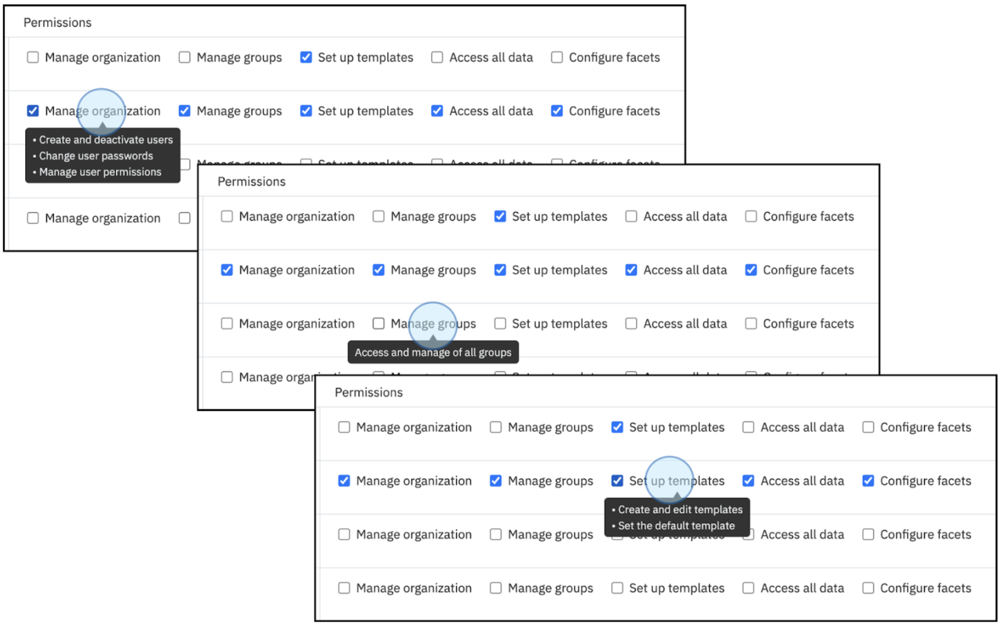
<figcaption>Hover over the permissions to view their description. For example, hovering over <strong>Manage groups</strong> shows that the permission allows the user: Access and manage of all groups</figcaption>
</figure>

### Edit User status

As an administrator, you have the ability to manage users' permissions, statuses (active or inactive), and passwords.

To edit a user's status, follow these steps:

1. **Edit User Status:**
    * To change a user's status to active or inactive, click on the three dots on the left side of the user's name.
    * Select **Deactivate** to turn the user inactive immediately. To reactivate a deactivated user, select **Activate**.

    <figure markdown="span">
    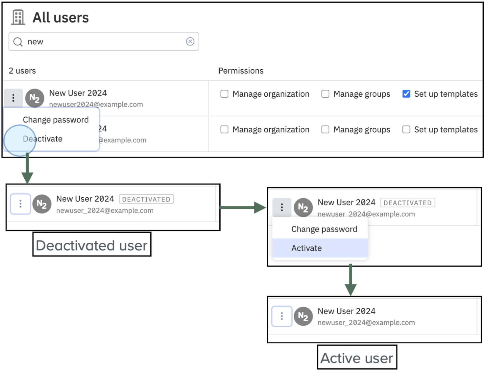
    <figcaption>Edit user status. To activate or deactivate a user, click on the three dots next to the user’s name and select either **Activate** or **Deactivate**. This change will take effect immediately</figcaption>
    </figure>

2. **Change User Password:**
    * To change a user's password, click on the three dots next to the user's name.
    * Select **Change Password**. A new window will appear, prompting you to authenticate yourself as an administrator.
    * After authenticating, enter and confirm the new password for the selected user. Ensure that the new password meets the required security criteria.
    * A confirmation window will notify you that the password has been successfully changed.
   
    <figure markdown="span">
    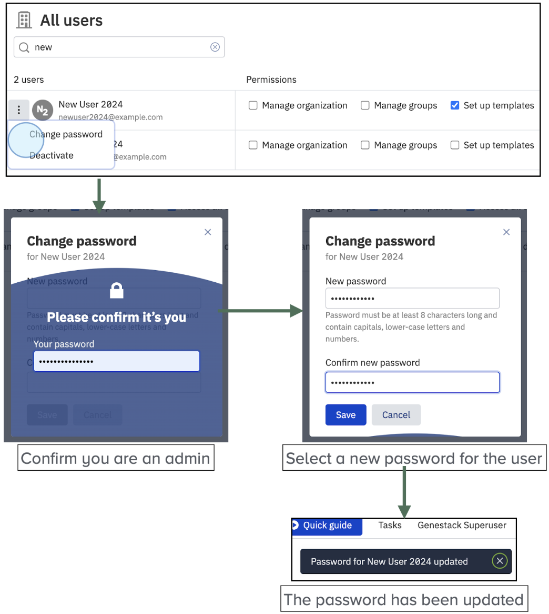
    <figcaption>Change a user’s password. Click on the menu next to the user's name, authenticate yourself as an admin (e.g. Genestack Superuser), and then set a new password for the user (e.g. New User 2024). Ensure the new password complies with security guidelines</figcaption>
    </figure>

## Add, update, and delete Groups

#### **Creating a Group**

To create a new group manually, follow these steps:

1. **Access the Groups Section**
   * Click on the three-line menu button at the top left of the dashboard to access the **Groups** section.

    !!! info "Important"
        In order to be able to remove groups, the user should have the **Manage organization** permission.

    <figure markdown="span">
    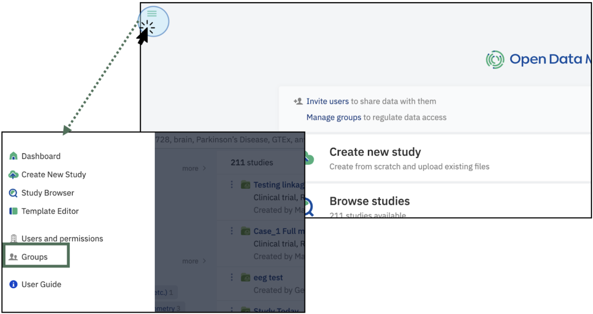
    <figcaption>To access Groups, click on the three-line menu at the top left of the dashboard. This will display a menu where you can access **Groups**.</figcaption>
    </figure>

2. **Create a New Group:**
    * In the Groups window, click on the **+New Group** button at the top of the window.
    * Enter a name for the new group in the new window that appears.
    * Click "Create" to finalize the creation of the group.
    * A new window will be displayed showing the new group has been created. By default, the user who creates the new group is assigned as the **Group Admin**. It is important to notice that each group requires at least one group admin.

    <figure markdown="span">
    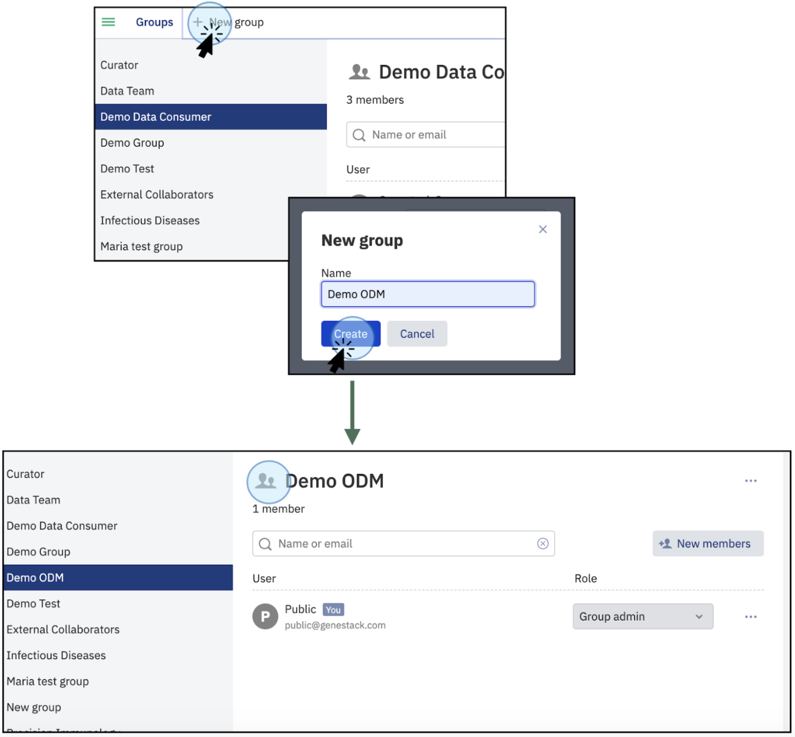
    <figcaption>Create a new group. Access the Groups section. A list of the available groups will be displayed. Click on **+New Group** to create a new group. Select a name for the new group, for example, **Demo ODM**. Click on Create. This action will create a new group named **Demo ODM**. The user who creates the group is automatically assigned as the Group Administrator.
    </figcaption>
    </figure>

Following these instructions will allow you to create a group using the GUI. There is no limit to the number of groups you can create, although it is not advisable to create multiple groups with the same name for clarity and management purposes.

#### Managing groups

To manage groups in the interface, navigate to the section Groups (instructions described above) and select the group you want to manage.

##### Add New Members:

   * Click on the **\+New members** button to add members to the group.
   * In the new window, you can select members from the list or use the search bar to find specific users.

    <figure markdown="span">
    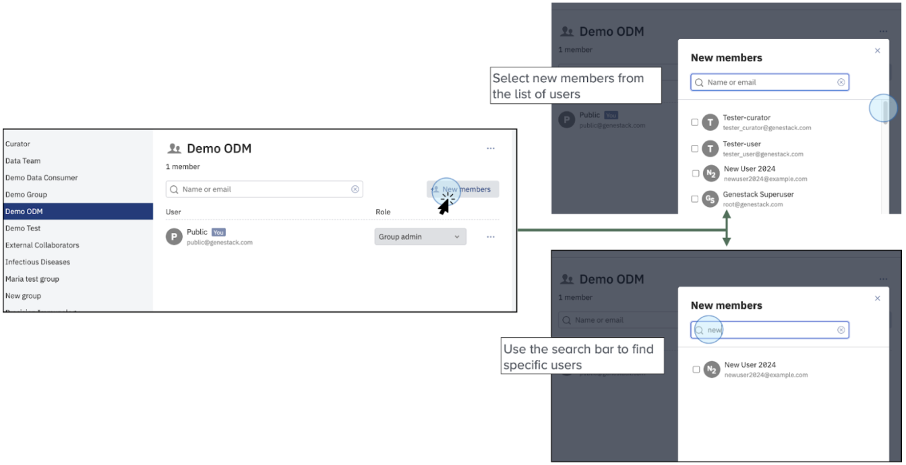
    <figcaption>Add new members to the group by clicking on **+New members**. A new window will appear where you can select users from the list or you can use the search bar to find specific users, e.g., **New User 2024**</figcaption>
    </figure>

##### **Confirm New Members:**

   * After selecting the members, click **Add member** to confirm. The group will now display the recently added members.

    <figure markdown="span">
    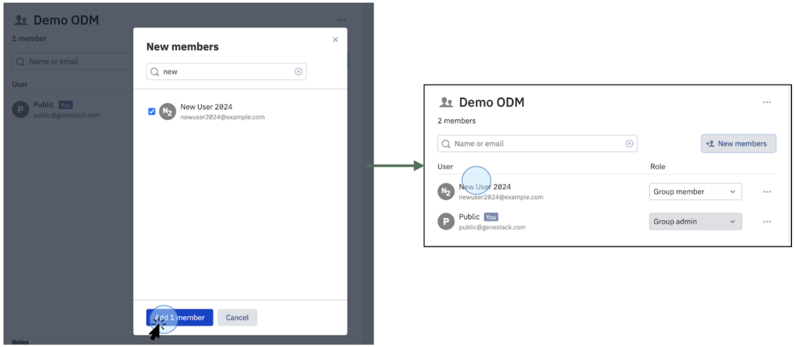
    <figcaption>Confirm the new members to add by clicking **Add member**. The recently created group, **Demo ODM** for this example, will now show the recently added member, **New User 2024**</figcaption>
    </figure>

##### Remove members

To remove a member from a group, follow these steps:

1. **Select the Group:**
    * Navigate to the group from which you intend to remove a user.
    * In the new window, either scroll through the list of members or use the search bar to find specific users.
2. **Remove the Member:**
    * Click on the three dots next to the member's name and select **Remove member**.

!!! info "Important Note"
    Only members designated as **Group members** can be removed. If the user you intend to remove is an administrator, you must first ensure that another member is assigned as the group administrator, as each group must have at least one administrator. If you want to remove a user with the role of admin, you need to assign another administrator within the group.

<figure markdown="span">
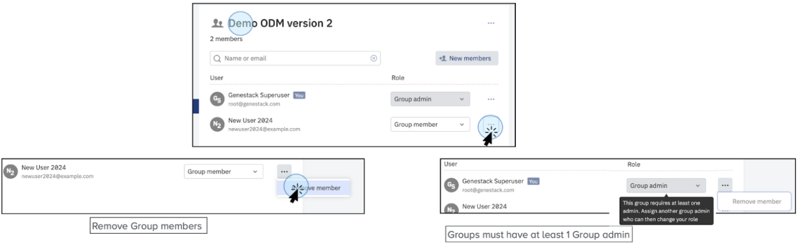
<figcaption>Remove members. Select the group, such as <strong>Demo ODM version 2</strong>, from which you want to remove members. Click on the three dots next to the member's name and select <strong>Remove member</strong>. Remember, every group requires at least one group administrator. If removing an admin, ensure another administrator is assigned beforehand</figcaption>
</figure>

## Edit and Update Permissions

* Click the icon to be redirected to the **Users and Permissions** section.

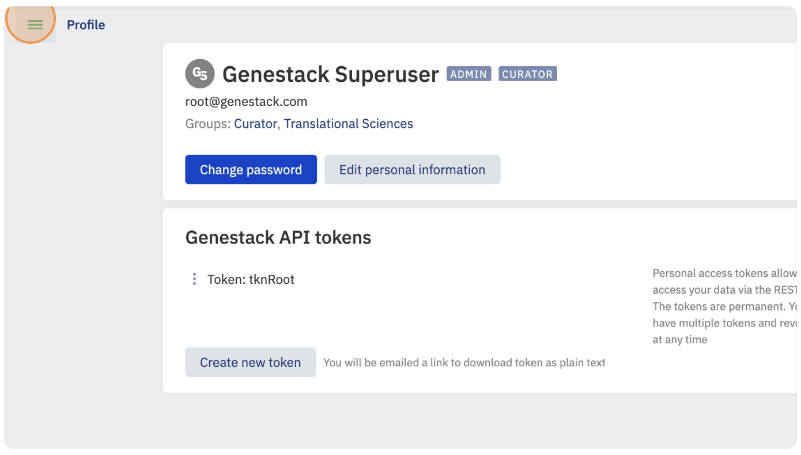

* Click **Users and Permissions**.

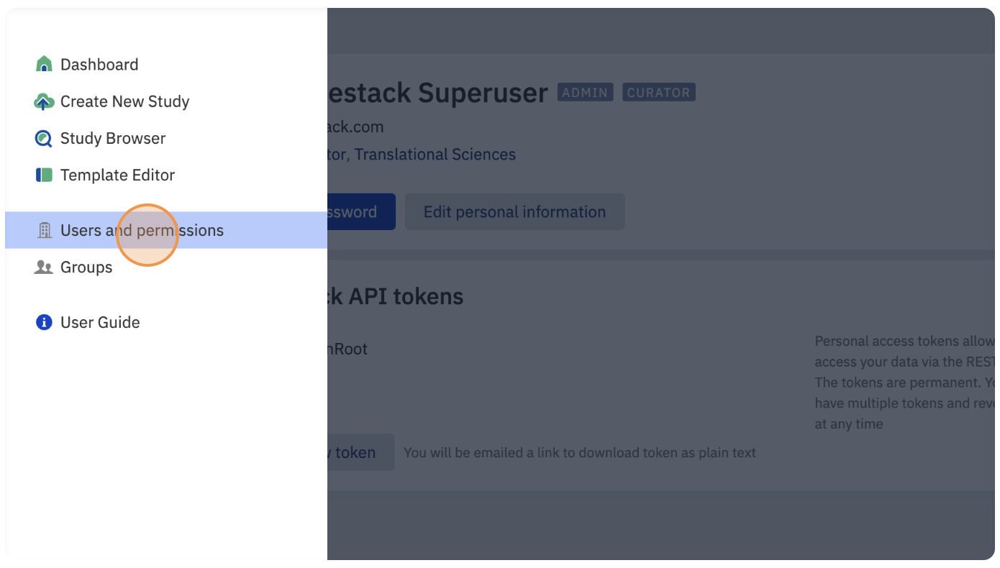

* Hover over sections such as Manage Groups, Set up Templates, Access all data, 
and Configure Facets to see a brief description of each permission.
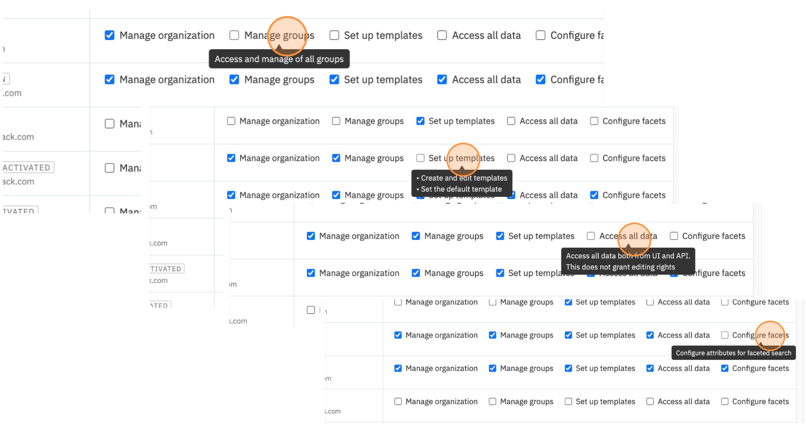

* Assign specific permissions or all permissions to users.
* Change passwords or deactivate users as needed.

## Add, Update, and Delete Groups

* To add, update, and delete groups **Manage groups** permission is required.
* Click on Groups to explore existing groups and their members.

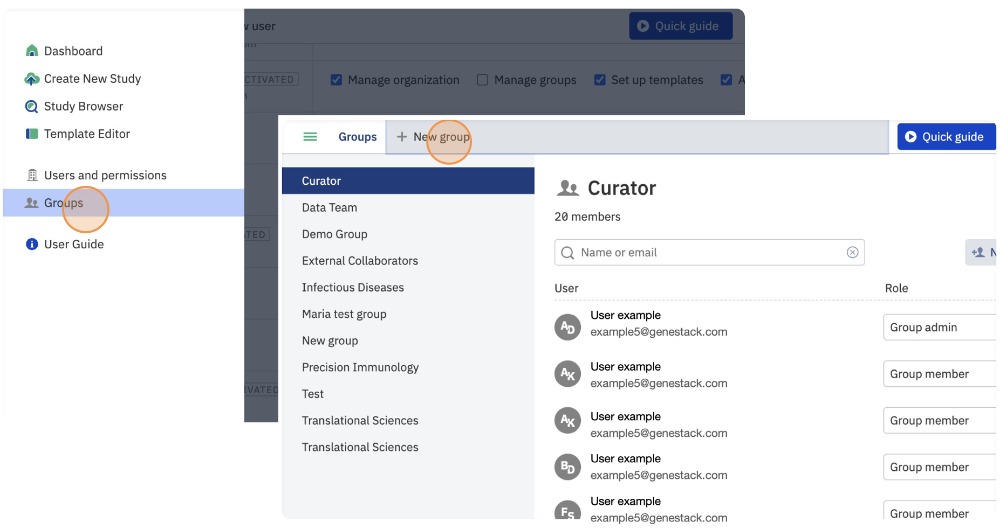

### Create new Groups

* Click on **New Group** to create a new group.

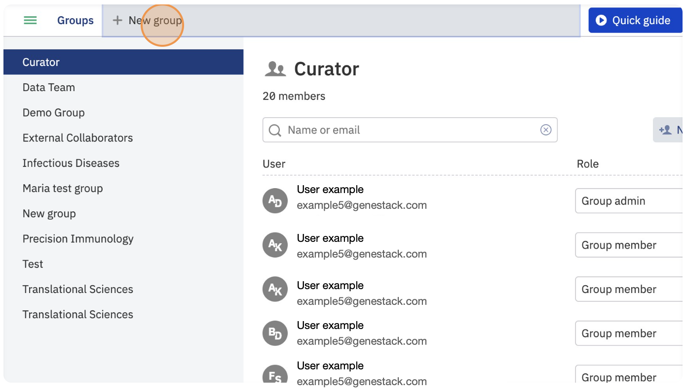

* Choose a name for the group and click **Create**.

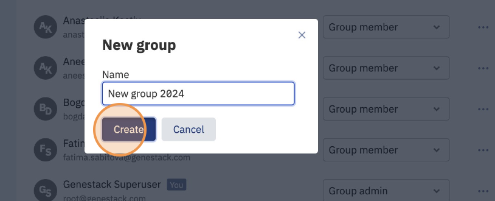

### Edit and Add Members to the Groups

* Add new members to your group by selecting from the list of users or using the search bar to find specific members. 
* Click Add member to add the selected user to the group.

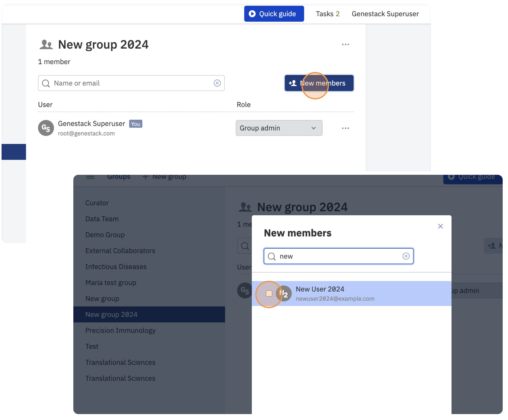

### Delete Groups
!!! warning "To add, update, and delete groups "Manage groups" permission is required."

* To delete a group, navigate to three dots icon :material-dots-horizontal: and select the option to delete. 
Note that deleting groups is a permanent action.

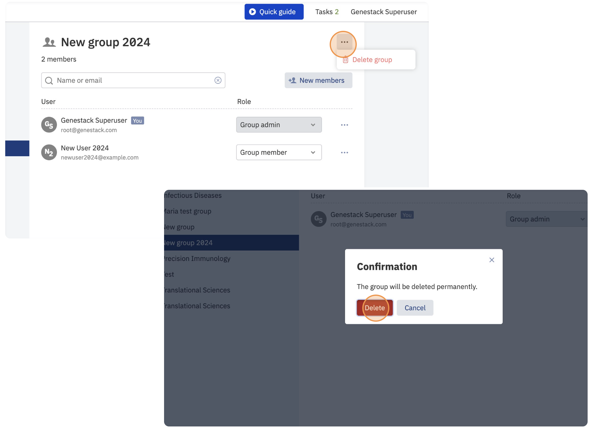

* Remove members that are no longer active in the group by selecting them and confirming their removal.

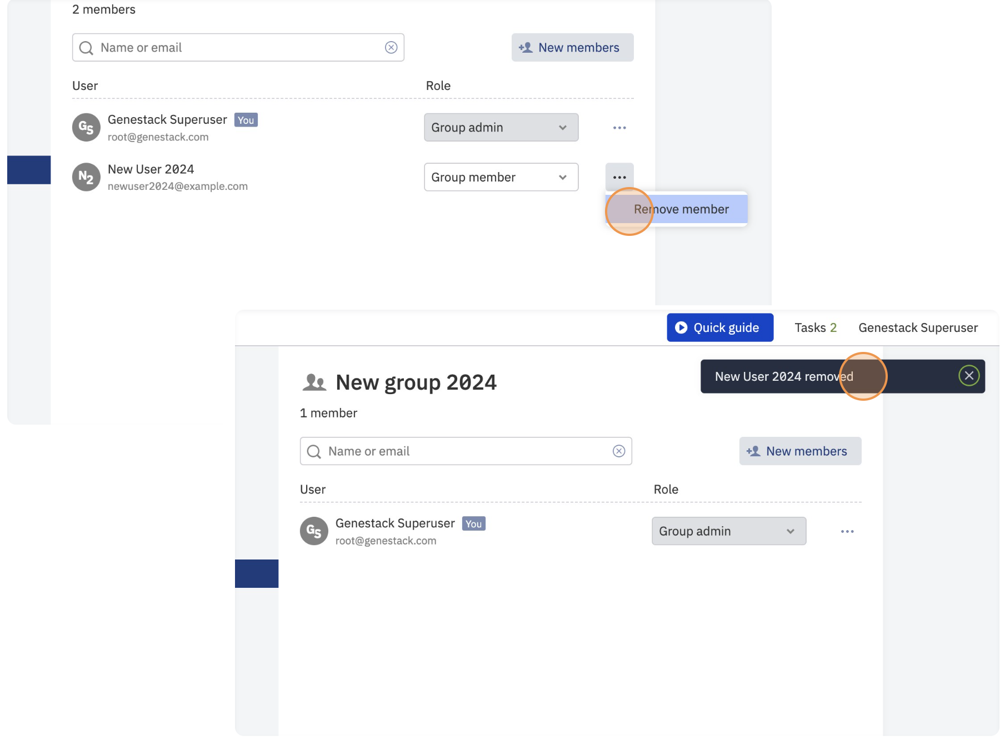

By following these steps, you can effectively manage users, permissions, 
and groups as an Admin using the GUI of the Open Data Manager.
