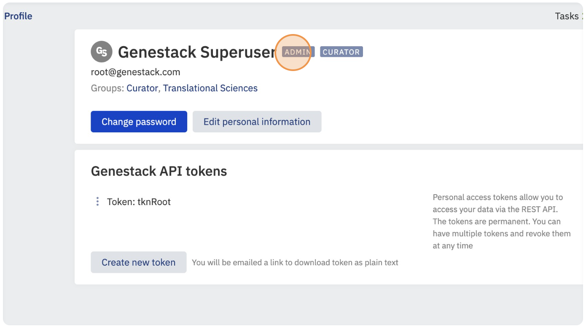
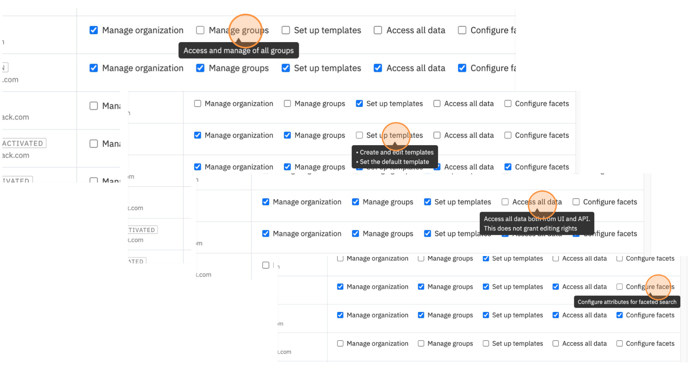

# Administrator in GUI

If you have **Manage organization** permission, your user account will be marked with **Admin** label. As an Admin, you have the ability to create and deactivate users, change users' passwords, and manage user permissions within the Open Data Manager (ODM). To add, update, and delete groups **Manage groups** permission is required.
This guide will help you navigate these features efficiently.

## Accessing Your Profile and Permissions

* Click on Profile to access information regarding your user permissions.

* Admin user will be marked with **Admin** label.

## Add New Users:

* Click on the option **+ New User**.

* Fill in the empty fields and click **Add**. The new user will be added.

## Edit and Update Permissions

* Click the icon to be redirected to the **Users and Permissions** section.

* Click **Users and Permissions**.

* Hover over sections such as Manage Groups, Set up Templates, Access all data, 
and Configure Facets to see a brief description of each permission.

* Assign specific permissions or all permissions to users.
* Change passwords or deactivate users as needed.

## Add, Update, and Delete Groups

* To add, update, and delete groups **Manage groups** permission is required.
* Click on Groups to explore existing groups and their members.

### Create new Groups

* Click on **New Group** to create a new group.

* Choose a name for the group and click **Create**.

### Edit and Add Members to the Groups

* Add new members to your group by selecting from the list of users or using the search bar to find specific members. 
* Click Add member to add the selected user to the group.

### Delete Groups

* To delete a group, click on the group and select the option to delete. Note that deleting groups is a permanent action.

* Remove members that are no longer active in the group by selecting them and confirming their removal.

By following these steps, you can effectively manage users, permissions, 
and groups as an Admin using the GUI of the Open Data Manager.
