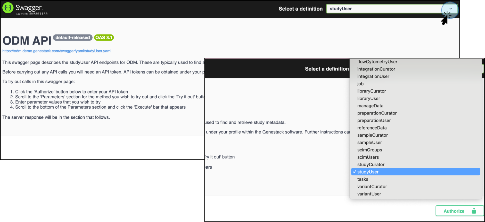
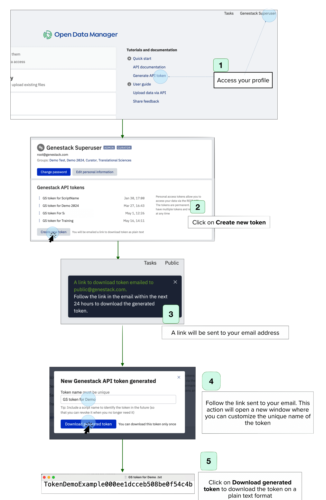
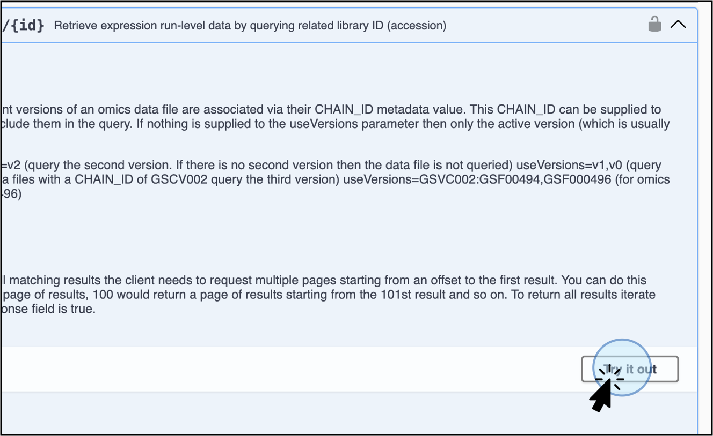

# Data consumers using the API

!!! abstract "About this guide"
    This guide provides a basic overview of API documentation in Swagger for non-technical users. 
    It is not intended as a detailed guide for daily API usage, but rather as an introduction to understanding the 
    documentation.
      
    We are currently working on an advanced guide that covers all use cases to provide you with the best 
    experience using the ODM REST API.

As a **Data Consumer** user type, you can explore and retrieve data from the ODM using the API endpoints.

## Access the API Endpoints for Data Consumer

Follow these steps to get started on using the ODM’s API Endpoints:

1. **Log into the ODM**:
    * Navigate to the ODM homepage.
    * Click on **API Documentation** on the homepage.
   

2. **Explore the API Documentation:**
      * This action will display the API Documentation window, where you can explore how the data model 
   in ODM is structured.
      * In this window, you will also see how the endpoints are grouped based on general use cases.
      

!!! question "Endpoint groups explanation"
      * "Query/retrieve data" with the list of user endpoints - only these endpoints can be used by users who are not included in the group Curator, also these endpoints can be used by users from the Curator group also.
      * "Import/curate data" with the list of curator endpoints - can be used only by users from the group Curator.
      * "Data sources" - some endpoints can be used by curators only, others by curators and researchers.
      * "Manage organization" - this section is actual only for users with the permission to manage organization.

## Using Swagger for API Interaction

Swagger is an API documentation tool which provides an interactive interface for exploring and 
interacting with the API endpoints. Its` main goal is to familiarise users with the available endpoints, 
parameters, structure of response, etc. Note that it is not for day-to-day usage or integrations.

Follow these steps to use Swagger effectively, based on your role and permissions:

1. **Select the Endpoints for Specific Actions:** Depending on your role (Data Consumer, Data Contributor, or Data Admin) 
and your goal, select the appropriate endpoints. For Data Consumers, the available options are retrieving and 
exporting data and metadata.
2. **Explore the Swagger Interface:**
      * When you select an endpoint of interest and click on it, a new window will display the Swagger interface.
      * This interface allows you to explore available endpoints for querying and retrieving data.
3. **Accessing Endpoints:** Use the top right button to select specific functions. For example, 
the `studyUser` definition contains API endpoints specifically for retrieving study metadata.

## API token

!!! warning "Depending on the ODM configuration some users can use their access tokens. If you follow this instruction in case of another configuration, you will get an authorisation error."

An access token is required to work with the API endpoints. Follow these steps to create and use an API token:

### Generate a Token

1. **Access Your Profile**
    * Navigate to your profile by clicking your username at the top right corner of the User Interface or from the Dashboard
2. **Create a New Token**
    * On the profile page, click on **Create a New Token.**
    * This action will automatically send a link to your email address with instructions to access the new token
3. **Follow the link on your email**.
    * Click on the link received on your email. This action will open a new window where you can enter a unique name for the new token in the prompt that appears.
4. **Download the Token**
    * Click on **Download Generated Token**.
    * A plain text (TXT) file containing your new token will be automatically downloaded to your local computer.
5. **Store the Token**
    * Save the token in an easily accessible location for future use.

### Authorize with the Token
1. Once the token is generated, you need to authorize the use of the endpoints. 
2. Direct to the endpoint of interest depending on the action to run (retrieve data or stream data)
3. Click on **Authorize**, select the type of token (Access Token or Genestack API token), 
and navigate to the specific endpoint.
   

4. Click on **Try it out** to activate it. The **Try it out** step is required for every single endpoint.

## Use Case Example for Data Consumer: Retrieve study metadata

For this particular example, the API endpoints to retrieve study metadata are displayed and tested. 
Follow the instructions to retrieve only study metadata, endpoint `/api/v1/as-user/studies`:

### Search for the Endpoint

Click on the section of interest. The section for this example, click on **studyUser** to retrieve only study metadata.

A new Swagger window will display important information regarding the token parameters.

### Explore the Study User definition

The **studyUser** definition contains several endpoints to retrieve data, such as 
*List or search for study metadata objects,* `GET /api/as-user/studies` 
and *Retrieve a single study object by ID (accession)* `GET /api/as-user/studies/{id}`, among others.

### Select the endpoint of interest

* For this particular example, where the objective is to retrieve study metadata from a particular study, 
select the endpoint **List or search for study metadata objects** (`GET /api/v1/as-user/studies/{id}`).
* When clicking on an endpoint, a dropdown menu will show insights regarding the endpoint, 
including definitions and requirements.
* You can select specific filters and features to include for the endpoint
**List or search for study metadata objects.**

### Add the Accession Number

* Retrieve the accession number (automatically generated by the ODM starting with "GSF"). 
To access the accession number, click on the top bar of the study in ODM 
(see section [Accession number](../quick-start/consumer-gui.md/#accession-number) 
from the Quick start: Data Consumers in the User Interface
for details on how to obtain a study’s accession number).
* For this particular study, we will use the study **Study for Demo 2024**.

* Go to your Study menu on the User Interface.
* Click **Copy accession** and paste the accession number into the "query" field. 
For this example, use **GSF1102568**, and click **Execute**.

### Example Response

A response will be generated. You can download the created file (JSON file) if needed.

The downloaded file with the study metadata will look like this:

By following these steps, you can efficiently interact with the API endpoints via the Swagger interface,
tailored to your role and permissions.
