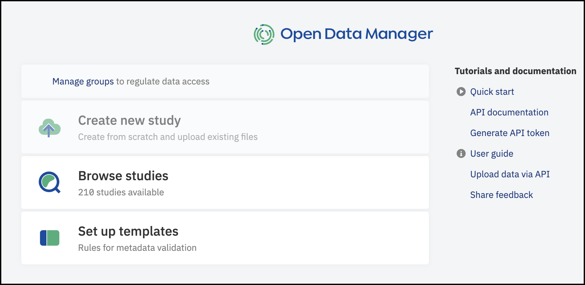
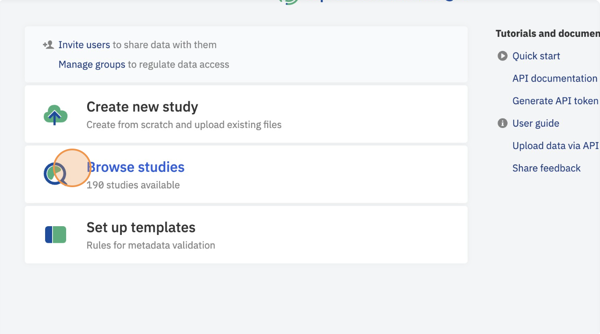
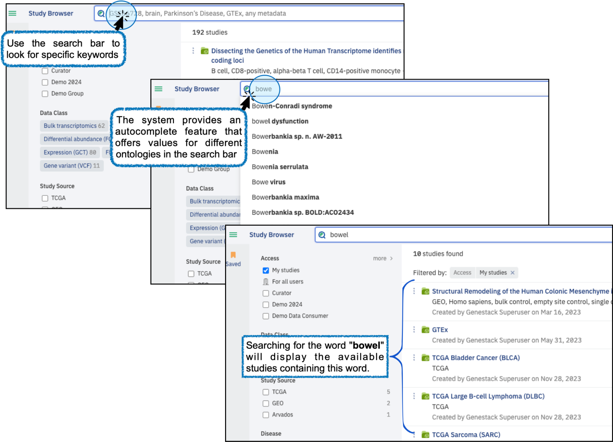
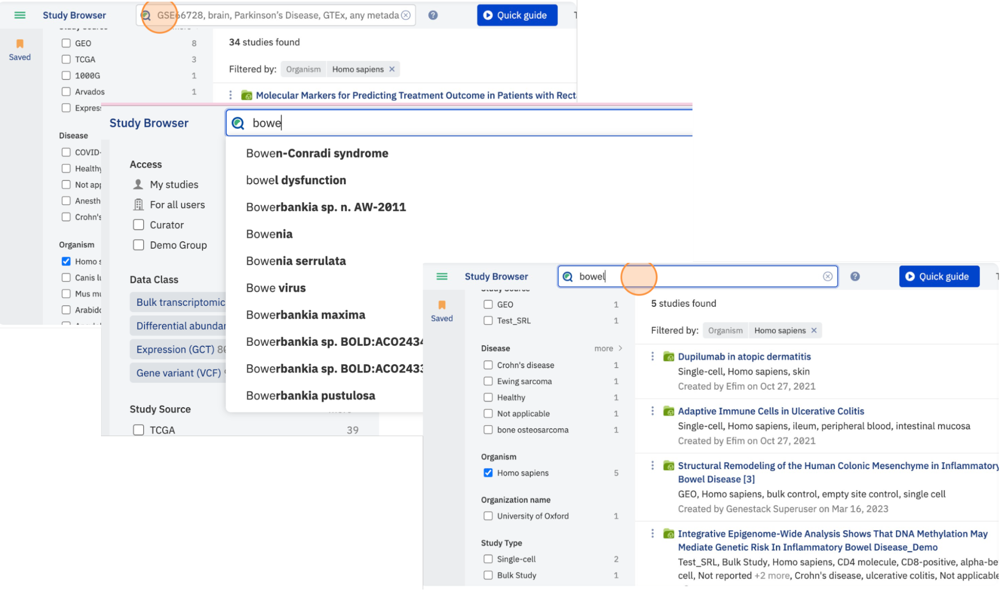
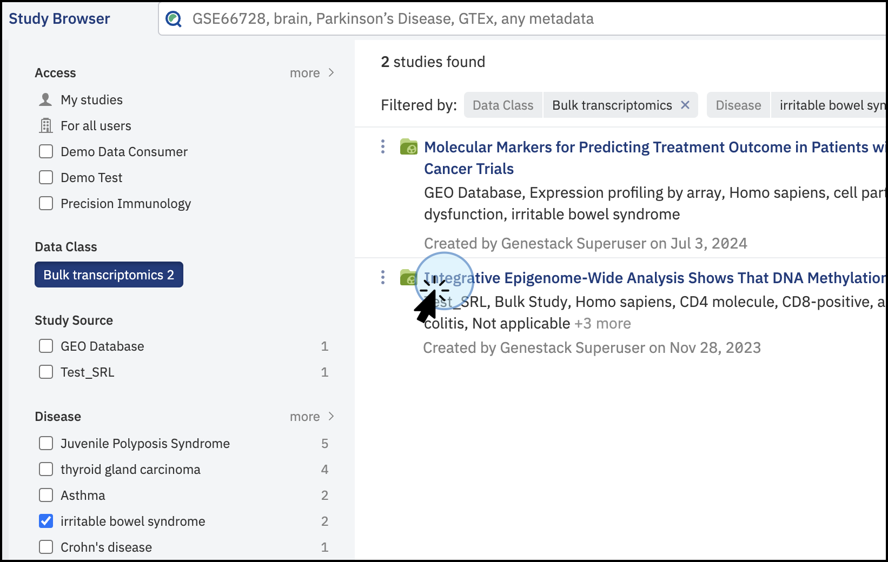
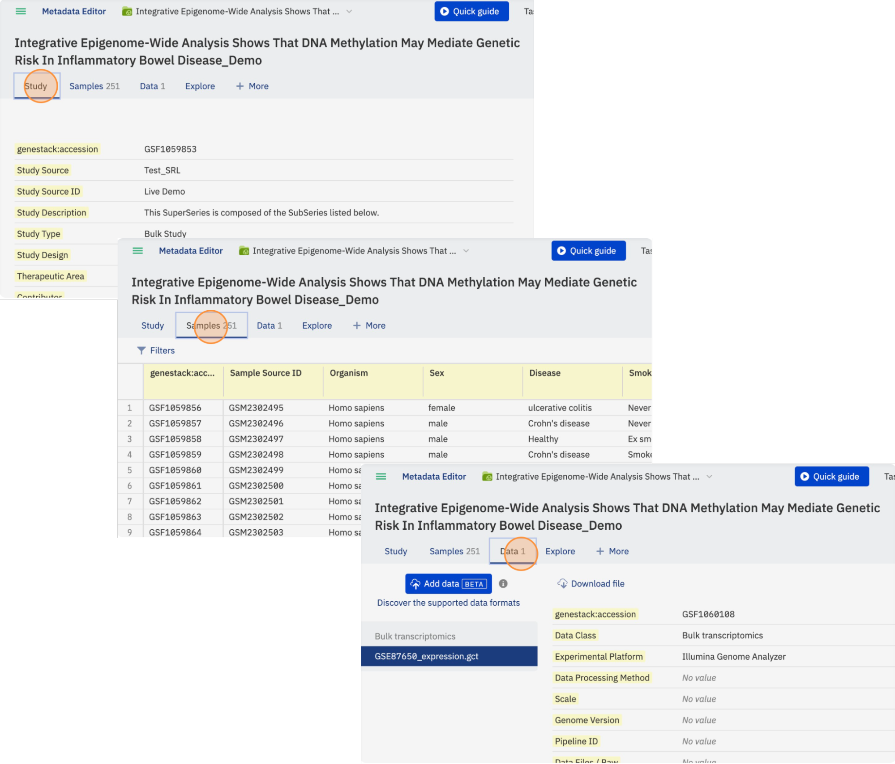
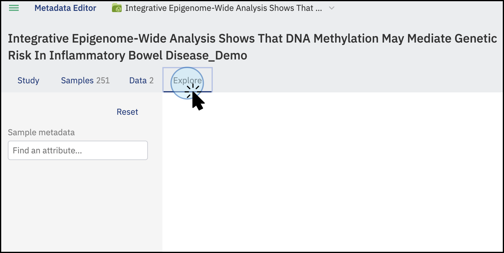
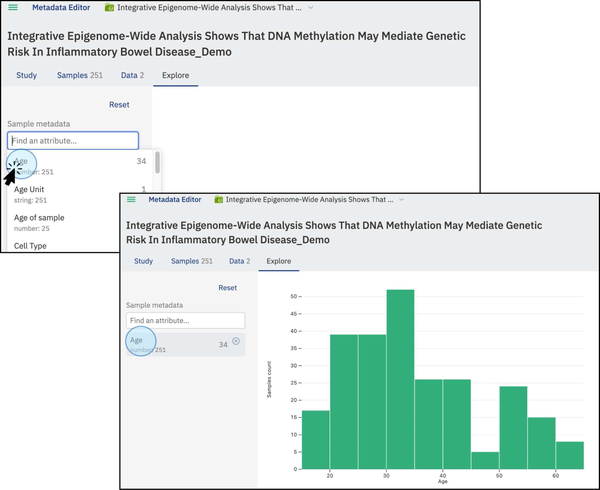
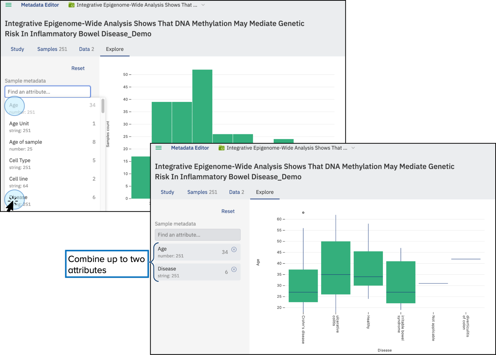
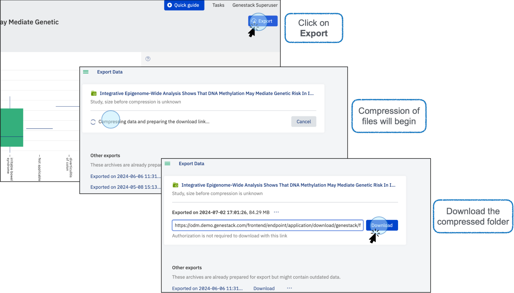

# Data Consumer in the User Interface

This guide will help you navigate the main features of the Open Data Manager as a Data Consumer.

## Main Page

This is how the main page of the Open Data Manager looks:

## Browse Studies

As a Data Consumer, you can browse and explore various studies.

## Search for Data

Apply filters to search for specific studies. For example, select filters such as Data Class, Organism, etc.

Use the search bar to look for specific keywords. For example, searching for the word "bowel" will display 
the available studies containing this word. In addition, the system provides an autocomplete feature 
that offers values for different ontologies in the search bar.

## Select a Study

Once you find a study of interest, click on it to open it.

The study will open in a new tab, where the following tabs can be explored:
**Study:** Shows the study metadata.
**Samples:** Contains all the samples' metadata.
**Data:** Details of the files linked or attached to the study.

## Visualize Data

To visualize the study data:

1. Click on **Explore**.
2. Select an attribute to display. For example, "Age".
3. A plot will be created showing the values for the attribute "Age".

* Combine up to two attributes, such as "Age" and "Disease".

* Explore statistical data and export the plot in SVG or PNG formats.

## Export Data

Export all the information contained in the study. Note that some studies may have restrictions.

1. Click on **Export**.
2. A window will open, and the file will be compressed.
3. Once compressed, you can download the folder containing all the data and metadata from the study.

By following these steps, you can efficiently browse, visualize, 
and export data as a Data Consumer using the GUI of the Open Data Manager.
