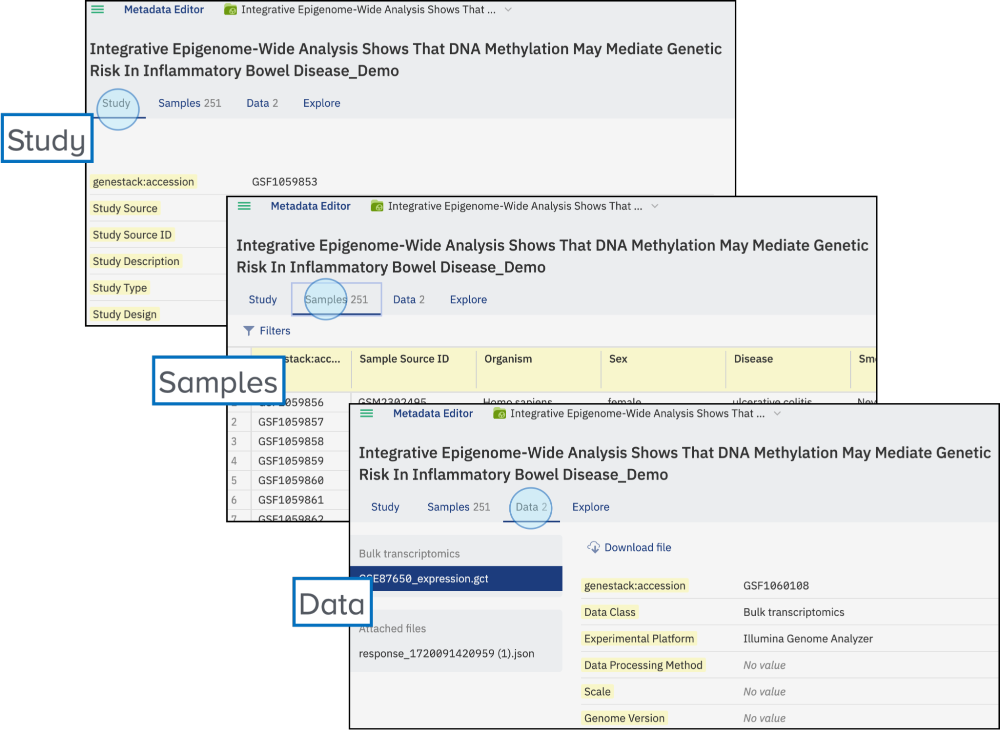
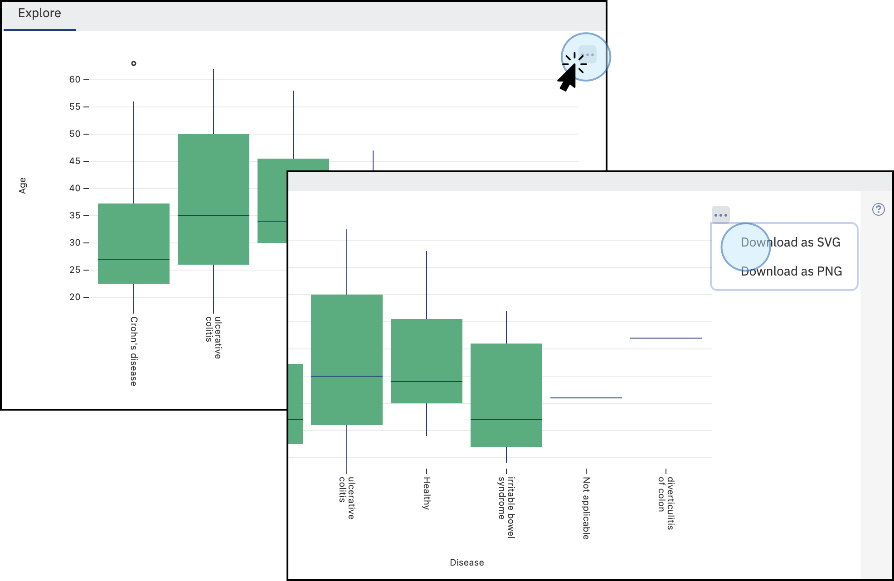

# Data Consumer in the User Interface

This guide will help you navigate the main features of the Open Data Manager as a Data Consumer. Please note that all users are Consumers by default

## Main Page

When you open ODM you will be taken to the start page or “Dashboard” as shown below:

<figure markdown="span">

<figcaption>View of the ODM main dashboard</figcaption>
</figure>

Here you can access important links to the Quick Start guide, the User Guides, and documentation for the API, and share your feedback.

<figure markdown="span">

<figcaption>The main dashboard contains access to useful information, including Quick Start examples, User Guides, and API endpoints documentation</figcaption>
</figure>

## Browse Studies

As a Data Consumer, you can browse and explore various studies. 

To search and browse studies, click on the **“Browse studies”** button on the dashboard/start page.

<figure markdown="span">

<figcaption>Browse studies: to search and browse studies, click on the <strong>Browse studies</strong> button on the dashboard/start page</figcaption>
</figure>

## Search for Data

Apply filters to search for specific studies. For example, select filters using the criteria in the panel on the left, 
such as Data Class, Organism, etc.

!!! info "The exact filters you see may vary depending on the data contained within your ODM. Administrators can lock which facets are available for all users."

<figure markdown="span">
  { width="700" }
  <figcaption>Users can apply filters to refine their search, including Organism, Data Class, Organization Name, Study Type, Study Source, etc.</figcaption>
</figure>

The system's search functionality is designed to enhance user experience and efficiency by allowing users 
to look up specific keywords effortlessly. By entering terms such as **"bowel"**, users can quickly access a range 
of relevant studies. 

Additionally, the search bar is equipped with an intuitive autocomplete feature, 
which not only predicts and suggests potential search terms but also provides values from various ontologies. 
This ensures a more streamlined and accurate search process, making it easier to navigate through the available 
data and find pertinent information swiftly.

<figure markdown="span">

<figcaption>Use the search bar to find specific keywords, such as <strong>bowel</strong> to display relevant studies. The autocomplete feature also suggests values from various ontologies</figcaption>
</figure>

## Select a Study

After applying the desired filters to narrow down your search results, you will see a list of studies 
that match your criteria. To delve deeper into a specific study, simply click on the corresponding icon. 
This action will open the study, allowing you to review its details and findings comprehensively.

<figure markdown="span">

<figcaption>Once the filters have been applied, and you find a study of interest, click on it to open it.</figcaption>
</figure>

The study will open in a new tab, where the following tabs can be explored:

- **Study:** Shows the study metadata.
- **Samples:** Contains all the samples' metadata.
- **Data:** Details of the files linked or attached to the study.

<figure markdown="span">

<figcaption>The selected study displays three main tabs: <strong>Study, Samples, and Data</strong>, each offering different sets of information related to the study</figcaption>
</figure>

### Accession number

In addition, a unique accession number is automatically generated for each study in the ODM. 
The accession number allows you to identify the specific study and to further work with the study via API endpoints. 
Learn more about API endpoints and functionalities in the API User Guide.

<figure markdown="span">

<figcaption>Every study imported to the ODM contains a unique identifier named accession number. You can visualize the accession number on the <strong>Study</strong> tab, or you can copy the accession number by clicking on the top bar of the main page and selecting <strong>Copy accession</strong></figcaption>
</figure>

Every study imported to the ODM contains a unique identifier named accession number. 
You can visualize the accession number on the Study tab, or you can copy the accession number 
by clicking on the top bar of the main page and selecting “copy accession”

## Visualize Data

To visualize the study data:

1. Click on **Explore**.

    <figure markdown="span">  
    
    <figcaption>Click on the tab **Explore** to visualize the study details</figcaption>
    </figure>

2. Select an attribute to display. For example, **Age**.
3. A plot will be created showing the values for the attribute **Age**.

    <figure markdown="span">
    
    <figcaption>Select an attribute (numerical or string) to generate a plot displaying its values</figcaption>
    </figure>

4. To combine up to two attributes, such as **Age** and **Disease** simply select another attribute from the menu.

    <figure markdown="span">   
    
    <figcaption>Combine up to two attributes to create various types of plots</figcaption>
    </figure>

5. To remove an attribute from your comparison click the :material-window-close: at the top right corner 
of the attribute in the list or use **Reset** option to remove all the attributes.

    <figure markdown="span">
    
    <figcaption>Remove attributes by clicking the **X** symbol</figcaption>
    </figure>

6. The plot combining two attributes displays informative data, such as sample count, and minimal and maximum values.

    <figure markdown="span">
    
    <figcaption>Explore numerical data associated with the combined plot</figcaption>
    </figure>

7. To export the plot in SVG or PNG formats, simply hover over the top right corner of the plot. A menu with three dots :material-dots-horizontal: will appear, allowing you to select the desired format for download. The available formats for downloading the plot are SVG and PNG.

    <figure markdown="span">  
    
    <figcaption>Export combined and single attribute plots in SVG and PNG formats</figcaption>
    </figure>

## Export Data

Export all the information contained in the study. Note that some studies may have restrictions.

1. Click on **Export**.
2. A window will open, and the file will be compressed.
3. Once compressed, you can download the folder containing all the data and metadata from the study.

!!! warning "If some externally stored data is inaccessible due to its removal from the original external storage (the link to the storage is invalid), the study cannot be exported."

<figure markdown="span">

<figcaption>Export the data by clicking on the <strong>Export</strong> option in the top right corner of the screen. Files will be compressed, and once ready, the folder can be downloaded to the user’s local computer</figcaption>
</figure>

By following these steps, you can efficiently browse, visualize, and export data as a Data Consumer using 
the Interface of the Open Data Manager.
