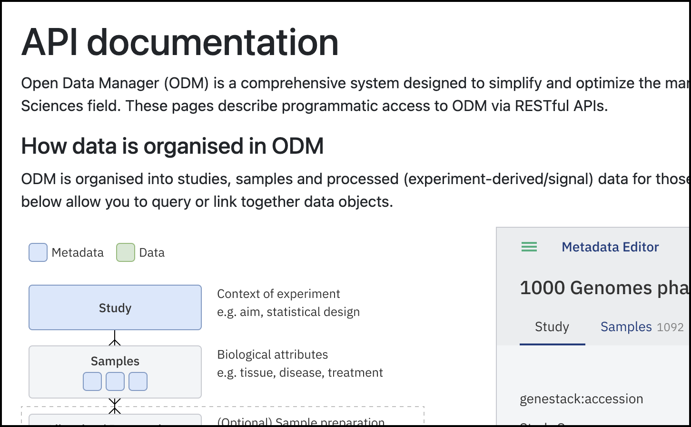

# Data Contributors using the API

!!! abstract "About this guide"
    This guide provides a basic overview of API documentation in Swagger for non-technical users.
    It is not intended as a detailed guide for daily API usage, but rather as an introduction to understanding the
    documentation.

    We are currently working on an advanced guide that covers all use cases to provide you with the best 
    experience using the ODM REST API.

In addition to the options available to Data Consumers (retrieving data), **Data Contributors** can
also create studies and curate data (see the Figure below). The main functions available are Create
a new study and Curate Data.

## Access the API Endpoints

Follow these steps to get started on using the ODM’s API Endpoints : 

1. **Log into the ODM**:
    * Navigate to the ODM homepage.
    * Click on **API Documentation** on the homepage.
   
      <figure markdown="span">
      
      <figcaption>Main dashboard of the ODM. Click on API documentation to explore the available resources</figcaption>
      </figure>
    
2. **Explore the API Documentation:**
    * This action will display the API Documentation window, where you can explore how the data model in ODM is structured.
    * In this window, you will also see how the endpoints are grouped based on general use cases.
   
   <figcaption>API Documentation dashboard. This window shows the data model structure and where the specific endpoints are located</figcaption>

!!! question "Endpoint groups explanation"
      * **Query/retrieve data** with the list of user endpoints - only these endpoints can be used by users who are not included in the group Curator, also these endpoints can be used by users from the Curator group also.
      * **Import/curate data** with the list of curator endpoints - can be used only by users from the group Curator.
      * **Data sources** - some endpoints can be used by curators only, others by curators and researchers.
      * **Manage organisation** - this section is actual only for users with the permission to manage organisation.

## Using Swagger for API Interaction

Swagger is an API documentation tool which provides an interactive interface for exploring and
interacting with the API endpoints. Its main goal is to familiarise users with the available endpoints,
parameters, structure of response, etc. Note that it is not for day-to-day usage or integrations.

Follow these steps to use Swagger effectively, based on your role and permissions:

1. **Select the Endpoints for Specific Actions:**
      * Depending on your role (Data Consumer, Data Contributor, or Data Admin) and your goal, select 
the appropriate endpoints. Examples include retrieving sample metadata, updating a study, or adding new groups.
2. **Explore the Swagger Interface:**
      * When you select an endpoint of interest and click on it, a new window will display the Swagger interface.
      * This interface allows you to explore available endpoints for querying and retrieving data.
3. **Accessing Endpoints:**
      * Use the top right button to select specific functions. For example, the `studyCurator` definition contains API 
   endpoints specifically for retrieving study metadata.

<figcaption>Swagger page interface. You can access the endpoints by selecting specific functions on the button on the top right, e.g., the definition <strong>studyCurator</strong> contains the API endpoints for retrieving study metadata</figcaption>

## API token

An access token is required to work with the API endpoints. Follow these steps to create and use an API token:

### Generate a Token
* **Access Your Profile**
      * Navigate to your profile by clicking your username in the top right corner of the User Interface or from the Dashboard.
* **Create a New Token**
     * On the profile page, you’ll see previously created tokens. Click on **Create a New Token**.
  * **Follow the link on your email**.
       * This action will open a new window where you can enter a unique name for the new token in the prompt that appears.
* **Download the Token**
     * Click on **Download Generated Token**.
     * A plain text (TXT) file containing your new token will be automatically downloaded to your local computer.
* **Store the Token**
     * Save the token in an easily accessible location for future use.

<figcaption>Steps to create a new API token: 1) Access your profile window, 2) click on Create new token, and a link will be sent to your email address (user who is logged in). 3) Access the link, 4) assign a unique name to the token and 5) download the plain text format file</figcaption>

### Authorize with the Token
1. Once the token is generated, you need to authorize the use of the endpoints.
2. Direct to the endpoint of interest depending on the action to run (retrieve data, stream data, upload entities, etc.)
3. Click on **Authorize**, select the type of token (Access Token or Genestack API token),
   and navigate to the specific endpoint.
   
   <figcaption>Use your token to authorize access to the endpoints</figcaption>

4. Click on **Try it out** to activate it. The **Try it out** step is required for every single endpoint.

<figcaption>Once the token has been added, select the Endpoint of interest and click on <strong>Try it out</strong> to activate it</figcaption>

## The ODM Data Model

To create a study, you need to perform two main steps:

1. **Upload your data files**, such as study metadata, sample metadata, and experimental data, corresponding to 
an entity (e.g., TSV file with sample attributes).
2. **Link the corresponding entities together** (e.g., link sample data to the corresponding study).
    * !!! warning "If you upload your file without linking it, it won’t appear in the ODM interface but will be accessible via API."
3. The ODM Model includes two additional entities to describe experimental design: **Libraries and Preparations**. 
Both Libraries and Preparations can be linked to Samples and can be utilized as sample grouping entities. 
**DataFrames**, which contain experimental data such as gene expression and flow cytometry, can be linked to Samples, 
but only expression data can be linked to Preparations and Libraries.
4. Additionally, the ODM provides the capability to import and link a **cross-reference (xref) mapping file**. 
This allows you to look up genes for a given set of transcripts and vice versa. Mappings are associated with 
expression data files, but if desired all mapping files can be queried to return all mappings. 
Currently, all mapping file operations are carried out via API. For more information please check [Cross-reference Mapping page](../doc-odm-user-guide/xref-mapping.md).

<figcaption><strong>Uploading and linking data entities in ODM</strong>. The ODM data model includes Libraries and Preparations, which can be linked to <strong>Samples</strong> and used as grouping entities. DataFrames can be linked to Samples, Preparations, or Libraries. Upload your data file and link the corresponding entities to create a study. Samples are the only entity that connects directly to a Study, making the data searchable within the ODM</figcaption>

## Use Case Example: How to create a Study

Let's reproduce the most frequent use case by creating an entire study using the Swagger interface. 
Swagger provides a user-friendly interface for interacting with APIs. For this example, 
we will use the following files:

* [GSE60871_Study metadata](https://bio-test-data.s3.amazonaws.com/GSE60871/GSE60871_study.tsv) (TSV file)
* [GSE60871_Sample metadata](https://bio-test-data.s3.amazonaws.com/GSE60871/GSE60871_samples.tsv) (TSV file)
* [GSE60871_Experimental data](https://bio-test-data.s3.amazonaws.com/GSE60871/GSE60871_expression.gct) (gene expression in GCT format)

### API Token

An access token is required to work with the API endpoints. 
Review [the section above](../quick-start/contributor-api.md/#api-token) to get a token and activate it.

### Uploading Study Metadata

1. **Access API Endpoints**
    * Navigate to the API documentation from the main dashboard by clicking on **"API Documentation"**. This opens a 
   new window displaying the data model and specific endpoints for each action.
2. **Select the Job Endpoint**
    * Locate and select the appropriate endpoint for the action you want to perform.
    
    <figcaption>Select the **Job** endpoint to upload a study.</figcaption>

3. Click on **Import study metadata from a TSV file** (`/api/v1/jobs/import/study`) and click on **Try it out**.

    
    <figcaption>Click **Import study metadata from a TSV file** to upload the study metadata file and activate it by clicking <strong>Try it out</strong></figcaption>

4. **Enter Parameters**: In the parameters section, enter the link where the TSV file is stored (e.g., AWS) and 
click **Execute**.

    
    <figcaption>Enter the link for the study metadata file and click Execute</figcaption>
   
    !!! warning "The template accession number should either be replaced with the desired template accession number or skipped entirely. If it is skipped, the default template will be applied."

5. **Check the Response**: The response will show that the study import has started. An execution job ID will be 
assigned to the import process, **1268** in this particular example. Use the ID to track the status of the import.

    {width=600}
    <figcaption>The response confirms the study upload has started and the ID for the Job has been assigned (**1268** for this example)</figcaption>

6. **Track the Import Status**: You can track the status of the import with the endpoint  
`/api/v1/jobs/{jobExecId}/output` to corroborate the import process is successful and no errors were detected.

    
    <figcaption>Use the endpoint ==/api/v1/jobs/{jobExecId}/output== to review the status of the job import. An accession number will be assigned to the study if the import was successful. Accession number: **GSF1147033**</figcaption>

7. **Explore the Study in the ODM**: You can explore the ODM dashboard to see your study. Notice that no samples 
or data are associated with it yet.

    
    <figcaption>Once the study metadata has been uploaded, it can be explored in the ODM</figcaption>

!!! tip "Notice that an accession number was automatically assigned to the newly uploaded study. This accession number will be relevant to link entities later."

**Study Accession ID: `GSF1147033`**

### Uploading Sample Metadata

Upload the sample metadata TSV file that contains the list of experimental samples and corresponding attributes.

1. **Access API Endpoints**
    * Navigate to the API documentation from the main dashboard by clicking on **"API Documentation"**. 
   This opens a new window displaying the data model and specific endpoints for each action.
2. Find the **Job** endpoint to upload samples. 
3. **Import Sample Metadata**: Select the endpoint **Import a group of sample metadata objects from a 
TSV file** (`/api/v1/jobs/import/samples`). Review the requirements for the file to be recognized and uploaded.

    
    <figcaption>Click Import a group of sample metadata objects from a TSV file to upload a sample metadata file and activate it by clicking <strong>Try it out</strong></figcaption>

4. **Enter Parameters**: Add the link to where the file is stored (e.g., AWS) and click **Execute**.

    
    <figcaption>Enter the storage link for the sample metadata file and click **Execute**</figcaption>

    !!! warning "The template accession number should be replaced with the desired template accession number."

5. **Check the Response**: The response will show that the sample metadata import has started. 
An execution job ID will be assigned to the import process, **1269** in this particular example. 
Use the ID to track the status of the import.

    
    <figcaption>The response confirms the upload of the study has started and and ID for the Job has been assigned (1269 for this example)</figcaption>

6. **Track the Import Status**: You can track the status of the import with the endpoint `/api/v1/jobs/{jobExecId}/output` 
to ensure the import process is successful and no errors are detected.

    {width=600}
    <figcaption>Use the endpoint ==/api/v1/jobs/{jobExecId}/output== to review the status of the job import. An accession number will be assigned to the study if the import is successful</figcaption>

!!! tip "Here you can see Sample Group Accession ID. This accession number will be relevant to link entities later."

**Sample Group Accession ID**: `GSF1147034`

### Uploading Experimental data: Expression in GCT format

Upload the experimental data file that is part of your research (part of the sample metadata and study 
metadata previously uploaded).

1. **Access API Endpoints**
    * Navigate to the API documentation from the main dashboard by clicking on "**API Documentation**."
   This opens a new window displaying the data model and specific endpoints for each action.
2. **Select the Job Endpoint**
    * Locate and select the appropriate endpoint for the action you want to perform.
3. **Import Experimental Data**: Select the endpoint **Import any tabular data or GCT files**. 
The **Job** endpoint displays a list of options to upload data. You can select the endpoint based on the 
type of files to upload including experimental data such as flow cytometry, gene variant, etc.
For expression data, as well as any type of tabular experimental data not listed, select the endpoint 
**Import any tabular data or GCT files** (`/api/v1/jobs/import/expression`) and click on **Try it out**

    
    <figcaption>Click **Import any tabular data from a TSV file or GCT files** to import expression experimental data and activate it by clicking **Try it out**</figcaption>

4. **Enter Parameters**: Indicate the required parameters: link to the data file, template, data class, etc.
Optionally you can specify a link to metadata.
   
    
    <figcaption>Enter the link for the experimental data file and details, then click Execute</figcaption>

5. **Check the Response**: The response will show that the experimental data, gene expression in this example, 
import has started. An execution job ID will be assigned to the import process, **1271** in this particular example. 
Use the ID to track the status of the import

    
    <figcaption>The response confirms the upload of the study has started and an ID for the Job has been assigned (1271 for this example)</figcaption>

6. **Track the Import Status**: You can track the status of the import with the endpoint  
`/api/v1/jobs/{jobExecId}/output` to corroborate the import process is successful and no errors were detected

    
    <figcaption>Use the endpoint ==/api/v1/jobs/{jobExecId}/output== to review the status of the job import. An accession number will be assigned to the study if the import is successful</figcaption>

!!! tip "Notice that an accession number was automatically assigned to the newly uploaded experimental data. This accession number will be relevant to link entities later."

**Experimental Data Group Accession ID**: `GSF1147049`

## Linking your entities

!!! tip "For the ODM proper work the linkage should be done in the specified order: Samples to Studies and then Data to Samples."

1. **Redirect to the Integration Curator Page**: To link entities (e.g., samples and data) with the study, 
provide your token and authorize the execution of the selected endpoint. Identify the ID accession from 
the uploaded study. Note the Genestack accession values shown in the response (e.g., for sample metadata, 
the accession number is GSF1147034).
    For this particular example, these are the accession IDs:
    * **Study Accession ID: GSF1147033**
    * **Sample Group Accession ID: GSF1147034**
    * **Experimental Data Accession ID: GSF1147049**

2. **Integration Endpoints**: Click on the integration endpoints, shown as integrationCurator. These endpoints will 
allow you to link data and metadata to samples and samples to studies.
   
   <figcaption>The integrationCurator definition contains the integration endpoints to perform several functions as a curator, including linking entities</figcaption>    

### Link Samples and Study

1. **Link Samples to Study**: Once the samples and study are uploaded to the ODM, the next step is to link samples 
to study and link data to samples.

2. **Identify the GroupId** from the response obtained after uploading the samples (e.g., **GSF1147034**)

3. Select the section **Sample Integration as Curator** to link samples with a study. Select the endpoint 
**Create a Link Between a Group of Sample Objects and a Study** 

    `/api/v1/as-curator/integration/link/sample/group/{sourceId}/to/study/{targetId}`.
  
    
    <figcaption>Select the Sample integration as Curator section to find the endpoint to link sample metadata with study ==/api/v1/as-curator/integration/link/sample/group/{sourceId}/to/study/{targetId}==</figcaption>

4. **Enter Accession Details:** Add the required values (ID accession) for the study and samples, and click **Execute**.
    * **Study Accession ID: GSF1147033**
    * **Sample Group Accession ID: GSF1147034**
   
   <figcaption>Add the details of the accession numbers from the sample group object (sourceId: <strong>GSF1147034</strong>) and the study object (targetId: <strong>GSF1147033</strong>), then click on <strong>Execute</strong> to create the link between the entities</figcaption>

5. **Check the Response**: A response will show that the link was successful.   
   
   <figcaption>If the link is successful, a response with the code 204 will be generated</figcaption>  
      
6. **Confirm in ODM**: You can open the study in the ODM interface to see that the data is now linked.
   
   <figcaption>The study in ODM will now include the sample metadata that has just been linked to the study target.</figcaption>

### Link Experimental Data and Sample Group

1. Identify the **groupID** number for the Data. For this particular example, the Data accession number is **GSF1147049**
    * **Sample Group Accession ID: GSF1147034**
    * **Experimental Data Accession ID: GSF1147049**

2. To link experimental data with samples (and the study), click on the "Expression integration as Curator" endpoints.
    1. Select the endpoint to create a link between data (for this specific example expression in GCT format 
   previously uploaded) with a group of samples.
    2. Click on the endpoint  to **Create a link between a group of expression objects and a group of 
   samples objects**: 
   `/api/v1/as-curator/integration/link/expression/group/{sourceId}/to/sample/group/{targetId}`
  
    
    <figcaption>Click on Expression integration as Curator to find the endpoints to link experimental data with samples (and the study). Select the endpoint ==/api/v1/as-curator/integration/link/expression/group/{sourceId}/to/sample/group/{targetId}==</figcaption>

3. **Enter Accession Details:** Add the relevant information, including the data accession number and sample group accession
number, and click **Execute.**
   
   <figcaption>Add the details of the accession numbers corresponding to the experimental data (<strong>GSF1147049</strong>) and the sample group object (<strong>GSF1147034</strong>). By default, the linking attribute will be the column <strong>Sample source ID</strong>, but you can customize it </figcaption>

4. **Check the Response**: The response will show that the link has been created between the group of samples and 
the experimental data
   
   <figcaption>If the link is successful, a response with the code 200 will be generated</figcaption>  

5. **Confirm in ODM**: You can open the ODM interface to confirm that samples and experimental data are now 
linked to the study.
   
   <figcaption>View of the study with sample metadata and experimental data (gene expression) linked</figcaption>

By following these steps, you can efficiently interact with the API endpoints via the Swagger interface,
tailored to your role and permissions.
