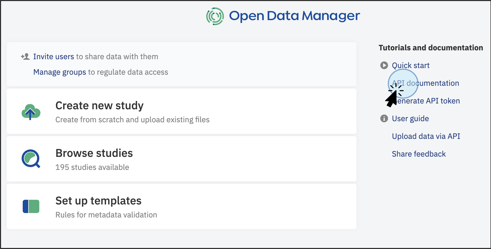
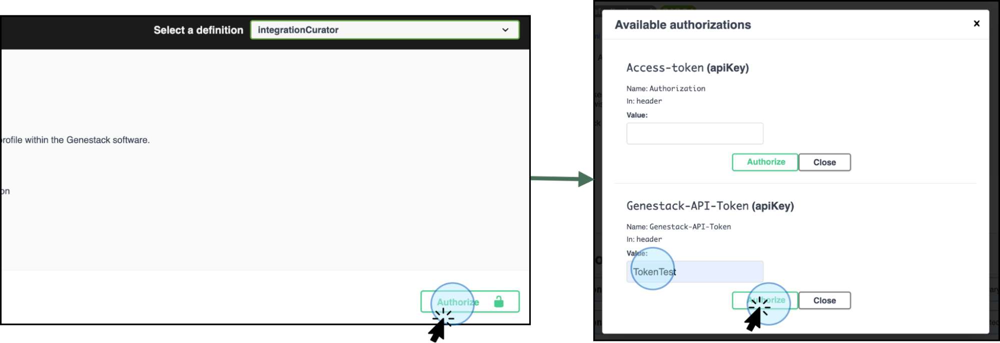
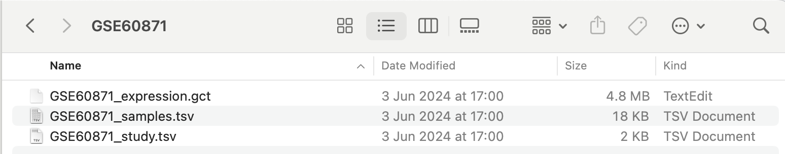

# Data Contributors using the API

In addition to the options available to Data Consumers (retrieving data), **Data Contributors** can
also create studies and curate data (see the Figure below). The main functions available are Create
a new study and Curate Data.

## Access the API Endpoints

Follow these steps to get started on using the ODM’s API Endpoints :

1. **Log into the ODM**:
    * Navigate to the ODM homepage.
    * Click on **API Documentation** on the homepage.
      

2. **Explore the API Documentation:**
    * This action will display the API Documentation window, where you can explore how the data model in ODM is structured.
    * In this window, you will also see how the endpoints are grouped based on your user permissions.
   

## Using Swagger for API Interaction

Swagger provides an interactive interface for exploring and interacting with the API endpoints. 
Follow these steps to use Swagger effectively, based on your role and permissions:

1. **Select the Endpoints for Specific Actions:**
      * Depending on your role (Data Consumer, Data Contributor, or Data Admin) and your goal, select 
the appropriate endpoints. Examples include retrieving sample metadata, updating a study, or adding new groups.
2. **Explore the Swagger Interface:**
      * When you select an endpoint of interest and click on it, a new window will display the Swagger interface.
      * This interface allows you to explore available endpoints for querying and retrieving data.
3. **Accessing Endpoints:**
      * Use the top right button to select specific functions. For example, the `studyUser` definition contains API 
   endpoints specifically for retrieving study metadata.

[Swagger](quick-start-images/swagger-groups.png)

## API token

An access token is required to work with the API endpoints. Follow these steps to create and use an API token:

### Generate a Token
* **Access Your Profile**
      * Navigate to your profile by clicking your username at the top right corner of the User Interface or from the Dashboard.
* **Create a New Token**
     * On the profile page, you’ll see previously created tokens. Click on **Create a New Token**.
  * **Follow the link on your email**.
       * This action will open a new window where you can enter a unique name for the new token in the prompt that appears.
* **Download the Token**
     * Click on **Download Generated Token**.
     * A plain text (TXT) file containing your new token will be automatically downloaded to your local computer.
* **Store the Token**
     * Save the token in an easily accessible location for future use.

### Authorize with the Token
1. Once the token is generated, you need to authorize the use of the endpoints.
2. Direct to the endpoint of interest depending on the action to run (retrieve data, export data, upload entities, etc.)
3. Click on **Authorize**, select the type of token (Access Token or Genestack API token),
   and navigate to the specific endpoint.
   

4. Click on **Try it out** to activate it. The **Try it out** step is required for every single endpoint.

## The ODM Data Model

To create a study, you need to perform two main steps:

1. **Upload your data files**, such as study metadata, sample metadata, and experimental data, corresponding to 
an entity (e.g., TSV file with sample attributes).
2. **Link the corresponding entities together** (e.g., link sample data to the corresponding study).

!!! warning "If you upload your file without linking it, it won’t be searchable and will not appear in the ODM interface."

The ODM Model includes two additional entities to describe experimental design: **Libraries and Preparations**. 
Both Libraries and Preparations can be linked to Samples and can be utilized as sample grouping entities. 
**DataFrames**, which contain experimental data such as gene expression and flow cytometry, can be linked to Samples, 
Preparations, or Libraries.

## Use Case Example: How to create a Study

Let's reproduce the most frequent use case by creating an entire study using the Swagger interface. 
Swagger provides a user-friendly interface for interacting with APIs. For this example, 
we will use the file [GSE60871](https://drive.google.com/drive/folders/1CDBIK4oOeXtbTDsi5P5jqvPkI2xH66ET?usp=drive\_link), which contains the main entities: study, samples, and experimental 
data (in this case gene expression):

### API Token

An access token is required to work with the API endpoints. 
Review [the section above](../quick-start/contributor-api.md/#api-token) to get a token and activate it.

### Uploading Study Metadata

1. **Access API Endpoints**
    * Navigate to the API documentation from the main dashboard by clicking on **"API Documentation"**. This opens a 
   new window displaying the data model and specific endpoints for each action.
2. **Select the Job Endpoint**
    * Locate and select the appropriate endpoint for the action you want to perform.
    

3. Click on **Import study metadata from a TSV file** (`/api/v1/jobs/import/study`) and click on **Try it out**.

4. **Enter Parameters**: In the parameters section, enter the link where the TSV file is stored (e.g., AWS) and 
click **Execute**.

5. **Check the Response**: The response will show that the study import has started. An execution job ID will be 
assigned to the import process, **1268** in this particular example. Use the ID to track the status of the import.

6. **Track the Import Status**: You can track the status of the import with the endpoint  
`/api/v1/jobs/{jobExecId}/output` to corroborate the import process is successful and no errors were detected.

7. **Explore the Study in the ODM**: You can explore the ODM dashboard to see your study. Notice that no samples 
or data are associated with it yet.

!!! tip "Notice that an accession number was automatically assigned to the newly uploaded study. This accession number will be relevant to link entities later."

**Study Accession ID: `GSF1147033`**

### Uploading Sample Metadata

Upload the sample metadata TSV file that contains the list of experimental samples and corresponding attributes.

1. **Access API Endpoints**
    * Navigate to the API documentation from the main dashboard by clicking on **"API Documentation"**. 
   This opens a new window displaying the data model and specific endpoints for each action.
2. Find the **Job**  Endpoint Endpoint to upload samples. 
3. **Import Sample Metadata**: Select the endpoint **Import a group of sample metadata objects from a 
TSV file** (`/api/v1/jobs/import/samples`). Review the requirements for the file to be recognized and uploaded. 
You will need to authorize the steps with your token (see section **API Token** above for more details on how 
to authorize tokens).

4. **Enter Parameters**: Add the link to where the file is stored (e.g., AWS) and click **Execute**.

5. **Check the Response**: The response will show that the sample metadata import has started. 
An execution job ID will be assigned to the import process, **1269** in this particular example. 
Use the ID to track the status of the import.

6. **Track the Import Status**: You can track the status of the import with the endpoint `/api/v1/jobs/{jobExecId}/output` 
to ensure the import process is successful and no errors are detected.

!!! tip "Notice that an accession number was automatically assigned to the newly uploaded samples. This accession number will be relevant to link entities later."

**Samples Accession ID**: `GSF1147034`

### Uploading Experimental data: Expression in GCT format

Upload the experimental data file that is part of your research (part of the sample metadata and study 
metadata previously uploaded).

1. **Access API Endpoints**
    * Navigate to the API documentation from the main dashboard by clicking on "**API Documentation**."
   This opens a new window displaying the data model and specific endpoints for each action.
2. **Select the Job Endpoint**
   * Locate and select the appropriate endpoint for the action you want to perform.
3. **Import Experimental Data**: Select the endpoint **Import any tabular data or GCT files**. 
The **Job** endpoint displays a list of options to upload data. You can select the endpoint based on the 
type of files to upload including experimental data such as flow cytometry, gene variant, etc.
For expression data, as well as any type of tabular experimental data not listed, select the endpoint 
**Import any tabular data or GCT files** (`/api/v1/jobs/import/expression`) and click on **Try it out**

4. **Enter Parameters**: Indicate the required parameters: link to the storage space, template, data class, etc.

5. **Check the Response**: The response will show that the experimental data, gene expression in this example, 
import has started. An execution job ID will be assigned to the import process, **1271** in this particular example. 
Use the ID to track the status of the import

6. **Track the Import Status**: You can track the status of the import with the endpoint  
`/api/v1/jobs/{jobExecId}/output` to corroborate the import process is successful and no errors were detected

!!! tip "Notice that an accession number was automatically assigned to the newly uploaded experimental data. This accession number will be relevant to link entities later."

## Linking your entities

1. **Redirect to the Integration Curator Page**: To link entities (e.g., samples and data) with the study, 
provide your token and authorize the execution of the selected endpoint. Identify the ID accession from the uploaded study. 
Note the Genestack accession values shown in the response (e.g., for sample metadata, the accession number is GSF1147034).

For this particular example, these are the accession IDs:

* **Study Accession ID: GSF1147033**
* **Samples Accession ID: GSF1147034**
* **Experimental Data Accession ID: GSF1147049**

1. **Integration Endpoints**: Click on the integration endpoints, shown as integrationCurator. These endpoints will 
allow you to link data and metadata to samples and samples to studies.

### Link Samples and Study

1. **Link Samples to Study**: Once the samples and study are uploaded to the ODM, the next step is to link the 
samples to the study. Important: At least one parameter has to match with the Study file, e.g., **Sample Source ID**.

1. **Identify the GroupId** from the response obtained after uploading the samples (e.g., **GSF1147034**)

1. Select the section **Sample Integration as a Curator** to link samples with a study. Select the endpoint 
**Create a Link Between a Group of Sample Objects and a Study** 
/api/v1/as-curator/integration/link/sample/group/{sourceId}/to/study/{targetId}

1. **Enter Accession Details:** Add the required values (ID accession) for the study and samples, and click **Execute**.

* **Study Accession ID: GSF1147033**
* **Samples Accession ID: GSF1147034**

1. **Check the Response**: A response will show that the link was successful.   
   

1. **Confirm in ODM**: You can open the study in the ODM interface to see that the data is now linked.

### Link Experimental Data and Samples

1. Identify the **groupID** number for the Data. For this particular example, the Data accession number is **GSF1147049**

* **Samples Accession ID: GSF1147034**
* **Experimental Data Accession ID: GSF1147049**

1. To link experimental data with samples (and the study), click on the "Expression integration as Curator" endpoints.
    1. Select the endpoint to create a link between data (for this specific example expression in GCT format 
   previously uploaded) with a group of samples.
    1. Click on the endpoint  to **Create a link between a group of expression objects and a group of 
   samples objects**: /api/v1/as-curator/integration/link/expression/group/{sourceId}/to/sample/group/{targetId}

1. **Enter Accession Details:** Add the relevant information, including the data accession number and samples accession
number, and click **Execute.**

1. **Check the Response**: The response will show that the link has been created between the group of samples and 
the experimental data

1. **Confirm in ODM**: You can open the ODM interface to confirm that samples and experimental data are now 
linked to the study.

By following these steps, you can efficiently interact with the API endpoints via the Swagger interface,
tailored to your role and permissions.
