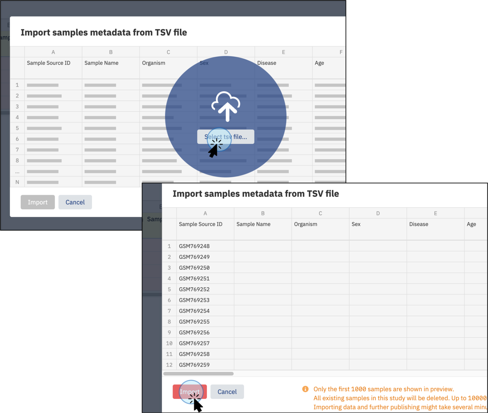
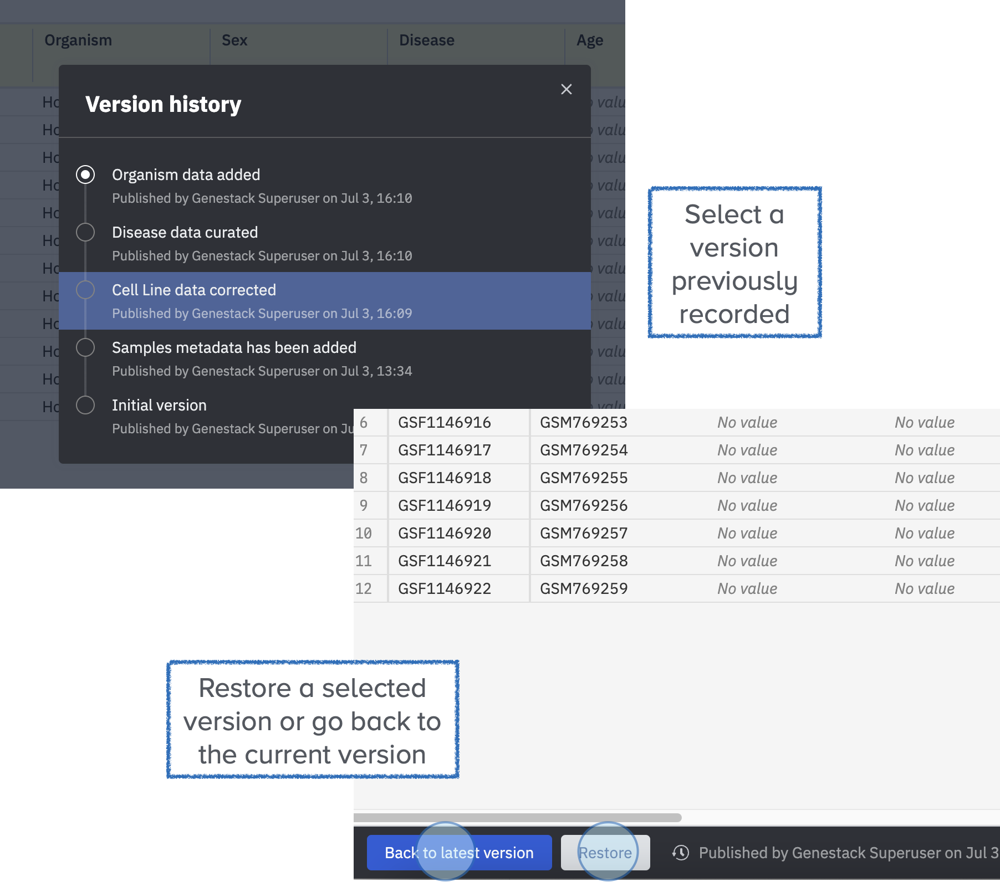
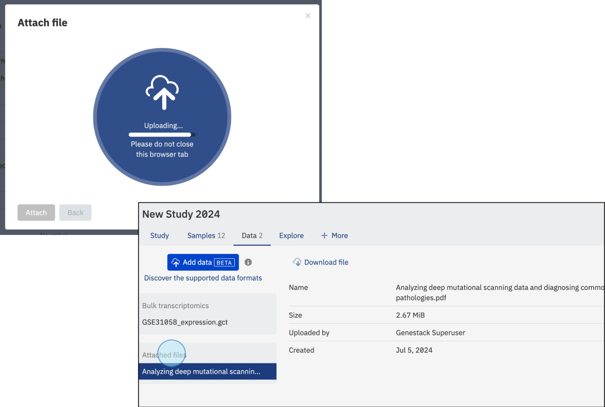

# Data Contributor in the User Interface

As a **Data Contributor**, you can create new studies and manage data efficiently 
through the Open Data Manager interface. Follow these steps to get started.

## Create a New Study

### Understanding the Data Model in ODM

The organization of data and metadata in ODM ensures thorough documentation and seamless 
integration from study design to data analysis.

* **Study**: Defines the context, aims, and statistical design. 
* **Samples Metadata**: Documents biological attributes like tissue type, disease status, and treatment conditions.
* **Libraries/Preparations**: Details sample preparation methods and libraries used, if applicable. 
* **Experimental Data Metadata**: Describes data processing techniques, including normalization, instrumentation, 
and data types (e.g., GCT, VCF). 
* **Experimental Data**: The actual data generated from the study (e.g. bulk transcriptomics, gen variant, etc.).

The diagram below outlines the flow of data in a biological study, highlighting key stages:

### Create a Study

To create a new study in the Open Data Manager, follow these steps:

1. **Click on 'Create new study'**: Start by selecting the option to create a New Study on the main dashboard 
(a) or from the menu in the top left corner, then click on “Create a New Study” (b).
  

2. **Assign a Name**: Give your study a descriptive name to identify it easily.
3. **Select the Template**: Choose the template you want to use for your study. 
Templates define the metadata structure and validation rules for your study. 
You can create your own template, and there is no limit on the number of templates you can use.

!!! tip "Understanding Templates"
    For more information about what a template is and how it works, refer 
    to the [Key Concepts](../key-concepts/key-concepts.md){:target="_blank"} section. 
    This section provides definitions and details about templates, including how to create 
    and edit them. If you require more information or need detailed guidance, 
    explore the [Templates section](../doc-odm-user-guide/template-editor.md){:target="_blank"}.

## Explore and Edit Study Details

Once you click on “Create,” a new study will be automatically created, and you will be redirected to it. 
Here, you can explore the various tabs and features that are available.

### Accession number
In addition, a unique accession number is automatically generated for each study in the ODM. 
The accession number allows you to identify the specific study and to further work with the study via API endpoints.

### Edit details
1. To edit the details of your study, select a tab and click on **Edit** (at the bottom of the page).
  

2. Select the feature you want to edit, for example, **Study Source**. Type the new value for the field.
  

3. Click **Publish** to save the changes. You can customize the name for the version you are updating by clicking 
the **Publish** button at the bottom of the screen. A new window will pop up, allowing you to customize the version name.
  

## Upload Samples Metadata
1. To upload sample metadata, click on the **Samples** tab on the main screen of the study.
   

2. Click on **Edit** at the bottom left of your sample table.
3. Select tabular files **(TSV)** by clicking on the cloud symbol in the top right of your sample table. 
You can upload sample metadata from any experiment (e.g., flow cytometry, gene variant, transcriptomics) as 
long as the file is in a tabular format (TSV).
   

4. A new window will pop up. Click **Select tsv file...** and choose your file. 
5. Once your file is recognized, click **Import**.
   

6. Ensure the changes are saved by clicking **Publish**.
7. In the resulting pop-up box, enter the preferred name, label, or description for
the activity you just performed to add it to the version log, e.g., *“Sample Metadata has been added.”* 
For more information on versioning, see the Data Versioning section below.
   

## Data Versioning

1. To see all the versions of your metadata previously published, click on the clock icon at the bottom of the page.
   

2. The resulting view will show you all the previously created versions of this data when they were created, 
the description entered at the time of publication, and the user who altered the data. 
3. You can click on any of the lines in the table and then **Restore** at the bottom of the page to restore 
a previous version of the data. 
4. To return to the latest version without changing the version simply click on **Back to the latest version** 
at the bottom of the screen.
  

## Upload Libraries and Preparations

### Add Libraries and Preparations
In addition to sample metadata, you can also add Libraries and Preparations metadata. 
To do so, click on the tab **+More** to display both options:

* To add libraries, click on **Libraries** and select the tabular file to import from your local computer. 
* To add preparations, click on **Preparations** and select the tabular file to import from your local computer.
  
Both types of files are linked to the samples metadata file (from the Samples tab) via the **SampleSource ID** column. 
Ensure this column is included in all files to maintain the link between sample metadata, libraries, and preparations.

### Link Metadata Files
* Ensure that the SampleSource ID column is included in all files to maintain the link between samples metadata, 
libraries, and preparations.
* Additionally, include the Library ID column for libraries and the Preparation ID column for preparations 
to ensure proper recognition and linking of the data.
* Once the data is recognized and linked via these columns, the new metadata tabs will display the recently added data.

## Upload Data

### Explore the Data Tab

* **Navigate to the Data Tab:** Click on the **Data** tab to import and attach data.

* **Select Data Type:** Choose the type of data to import and link, 
such as transcriptomics, proteomics, or other types of data.

### Link Data

* Default Linking: By default, the data is linked with the Samples file using the **Sample 
Source ID** column. Ensure that the imported file includes the **Sample Source ID** column 
for references and identification within the ODM. 
* Custom Linking: Users can now select a different column to link the data, such as **Sample Name**, **Date**, etc. 
This provides flexibility in how data is associated, but it is still recommended to include the 
**Sample Source ID** column for consistent referencing and identification within the ODM.

### Attach a file

* To attach a file, click on **Add data** and then select **Attach a file**. 
* You can attach any format files such as PDF, PNG, etc. 
* Click **Select file...**

* Your files will be displayed in the **Data** tab.

## Data curation

* Click on the **Samples** tab to explore previously uploaded data. 
* To start the curation process, click on **Edit**.

* **Identify data that is not validated**. Validation is crucial for ensuring data quality, 
facilitating data harmonization and streamlining data management. 

!!! tip "Find more information regarding validation in the [Key Concepts](../key-concepts/key-concepts.md){:target="_blank"} section."

* **Add data by typing the details**. 
Values and labels will be suggested based on the ontologies selected for specific features.

* Validated values will be highlighted in **green**.

* Replace all values in a column by clicking on **Bulk replace** and typing the new values.
Preferred values are suggested based on the template ontologies.

* You can also copy or reassign values from another column.

* To save changes, click on **Publish**.

By following these steps, you can efficiently create, manage, and curate studies as a 
Data Contributor using the GUI of the Open Data Manager.
