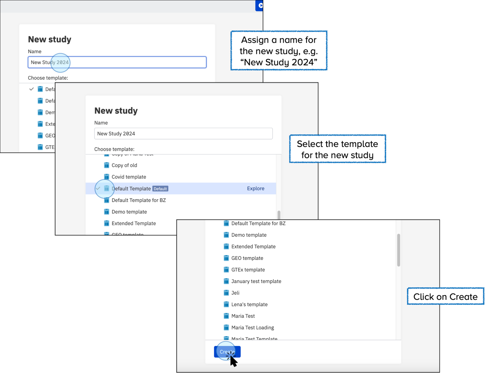
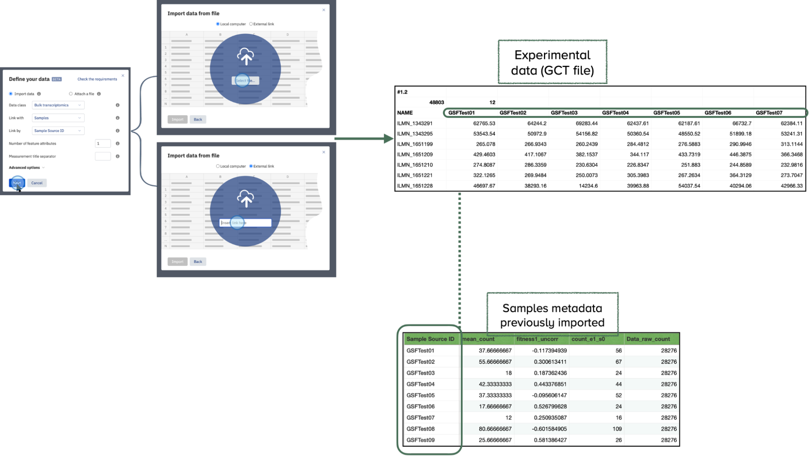

# Contributor in the User Interface

As a Data Contributor, you can create new studies and manage data efficiently 
through the Open Data Manager interface. Follow these steps to get started.

## Create a New Study

To create a new study in the Open Data Manager, follow these steps:

* Click on **Create new study**: Start by selecting the option to create a New Study. 
* Assign a **Name**: Give your study a descriptive name to identify it easily. 
* Select the **Template**: Choose the template you want to use for your study. 

Templates define the metadata structure and validation rules for your study. 
You can create your own template, and there is no limit on the number of templates you can use.

!!! tip "Understanding Templates"
    For more information about what a template is and how it works, refer 
    to the [Key Concepts](../key-concepts/key-concepts.md){:target="_blank"} section. 
    This section provides definitions and details about templates, including how to create 
    and edit them. If you require more information or need detailed guidance, 
    explore the [Templates section](../doc-odm-user-guide/template-editor.md){:target="_blank"}.

## Explore and Edit Study Details:

* Once your study is created, explore the tabs and features presented.
* To edit the details of your study, click on **Edit**.

* Select the feature you want to edit, for example, **Study Source**.

* Click **Publish** to save the changes. You can customize the name for the version you are updating.

## Upload Samples
* Click on **Samples**. 
* Then click on **Edit**. 
* Select tabular files **(TSV)** to upload by clicking on the indicated symbol.
* Click **Select tsv file...** and choose your file.
* Click **Import**. 
* Ensure the changes are saved by clicking **Publish**.

* Customize the version you are saving by assigning any preferred name, label, or description.

* To see all the versions created before, click on the bottom of the page.

## Data Versioning

* View previously created versions and restore any previous version if needed. 
* If you don't intend to restore any version, simply click on **Back to the latest version**.

## Upload Libraries and Preparations

* Click on **+ More** button:
    * To add libraries, click on **Libraries**. 
    * To add preparations, click on **Preparations**.

## Upload Data

### Explore the Data Tab

* **Navigate to the Data Tab:** Click on the **Data** tab to import and attach data.

* **Select Data Type:** Choose the type of data to import and link, 
such as transcriptomics, proteomics, or other types of data.

### Link Data

* Default Linking: By default, the data is linked with the Samples file using the **Sample 
Source ID** column. Ensure that the imported file includes the **Sample Source ID** column 
for references and identification within the ODM. 
* Custom Linking: Users can now select a different column to link the data, such as **Sample Name**, **Date**, etc. 
This provides flexibility in how data is associated, but it is still recommended to include the 
**Sample Source ID** column for consistent referencing and identification within the ODM.

### Attach a file

* To attach a file, click on **Add data** and then select **Attach a file**. 
* You can attach any format files such as PDF, PNG, etc. 
* Click **Select file...**

* Your files will be displayed in the **Data** tab.

## Data curation

* Click on the **Samples** tab to explore previously uploaded data. 
* To start the curation process, click on **Edit**.

* **Identify data that is not validated**. Validation is crucial for ensuring data quality, 
facilitating data harmonization and streamlining data management. 

!!! tip "Find more information regarding validation in the [Key Concepts](../key-concepts/key-concepts.md){:target="_blank"} section."

* **Add data by typing the details**. 
Values and labels will be suggested based on the ontologies selected for specific features.

* Validated values will be highlighted in **green**.

* Replace all values in a column by clicking on **Bulk replace** and typing the new values.
Preferred values are suggested based on the template ontologies.

* You can also copy or reassign values from another column.

* To save changes, click on **Publish**.

By following these steps, you can efficiently create, manage, and curate studies as a 
Data Contributor using the GUI of the Open Data Manager.
