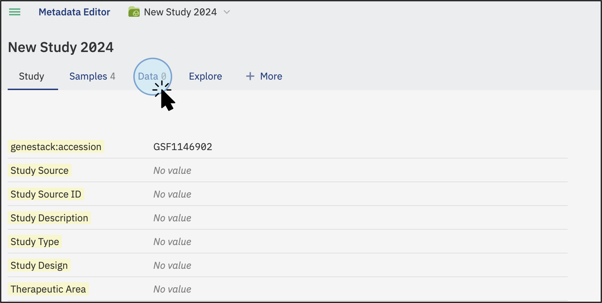

# Data Contributor in the User Interface

As a **Data Contributor**, you can create new studies and manage data efficiently 
through the Open Data Manager interface. Follow these steps to get started.

## Create a New Study
  
### Understanding the Data Model in ODM

The organization of data and metadata in ODM ensures thorough documentation and seamless 
integration from study design to data analysis.

* **Study**: Defines the context, aims, and statistical design. 
* **Samples Metadata**: Documents biological attributes like tissue type, disease status, and treatment conditions.
* **Libraries/Preparations**: Details sample preparation methods and libraries used, if applicable. 
* **Experimental Data Metadata**: Describes data processing techniques, including normalization, instrumentation, 
and data types (e.g., GCT, VCF). 
* **Experimental Data**: The actual data generated from the study (e.g. bulk transcriptomics, gen variant, etc.).

The diagram below outlines the flow of data in a biological study, highlighting key stages:

### Create a Study

To create a new study in the Open Data Manager, follow these steps:

1. **Click on 'Create new study'**: Start by selecting the option to create a New Study on the main dashboard 
(a) or from the menu in the top left corner, then click on “Create a New Study” (b).
  

2. **Assign a Name**: Give your study a descriptive name to identify it easily.
3. **Select the Template**: Choose the template you want to use for your study. 
Templates define the metadata structure and validation rules for your study. 
You can create your own template, and there is no limit on the number of templates you can use.

!!! tip "Understanding Templates"
    For more information about what a template is and how it works, refer 
    to the [Key Concepts](../key-concepts/key-concepts.md){:target="_blank"} section. 
    This section provides definitions and details about templates, including how to create 
    and edit them. If you require more information or need detailed guidance, 
    explore the [Templates section](../doc-odm-user-guide/template-editor.md){:target="_blank"}.

## Explore and Edit Study Details

Once you click on “Create,” a new study will be automatically created, and you will be redirected to it. 
Here, you can explore the various tabs and features that are available.

### Accession number
In addition, a unique accession number is automatically generated for each study in the ODM. 
The accession number allows you to identify the specific study and to further work with the study via API endpoints.

### Edit details
1. To edit the details of your study, select a tab and click on **Edit** (at the bottom of the page).
  

2. Select the feature you want to edit, for example, **Study Source**. Type the new value for the field.
  

3. Click **Publish** to save the changes. You can customize the name for the version you are updating by clicking 
the **Publish** button at the bottom of the screen. A new window will pop up, allowing you to customize the version name.
  

## Upload Samples Metadata
1. To upload sample metadata, click on the **Samples** tab on the main screen of the study.
   

2. Click on **Edit** at the bottom left of your sample table.
3. Select tabular files **(TSV)** by clicking on the cloud symbol in the top right of your sample table. 
You can upload sample metadata from any experiment (e.g., flow cytometry, gene variant, transcriptomics) as 
long as the file is in a tabular format (TSV).
   

4. A new window will pop up. Click **Select tsv file...** and choose your file. 
5. Once your file is recognized, click **Import**.
   

6. Ensure the changes are saved by clicking **Publish**.
7. In the resulting pop-up box, enter the preferred name, label, or description for
the activity you just performed to add it to the version log, e.g., *“Sample Metadata has been added.”* 
For more information on versioning, see the Data Versioning section below.
   

## Data Versioning

1. To see all the versions of your metadata previously published, click on the clock icon at the bottom of the page.
   

2. The resulting view will show you all the previously created versions of this data when they were created, 
the description entered at the time of publication, and the user who altered the data. 
3. You can click on any of the lines in the table and then **Restore** at the bottom of the page to restore 
a previous version of the data. 
4. To return to the latest version without changing the version simply click on **Back to the latest version** 
at the bottom of the screen.
  

## Upload Libraries and Preparations

### Add Libraries and Preparations
In addition to sample metadata, you can also add Libraries and Preparations metadata. 
To do so, click on the tab **+More** to display both options:

* To add libraries, click on **Libraries** and select the tabular file to import from your local computer. 
* To add preparations, click on **Preparations** and select the tabular file to import from your local computer.
  
Both types of files are linked to the samples metadata file (from the Samples tab) via the **SampleSource ID** column. 
Ensure this column is included in all files to maintain the link between sample metadata, libraries, and preparations.

### Link Metadata Files
* Ensure that the SampleSource ID column is included in all files to maintain the link between samples metadata, 
libraries, and preparations.
* Additionally, include the Library ID column for libraries and the Preparation ID column for preparations 
to ensure proper recognition and linking of the data.
* Once the data is recognized and linked via these columns, the new metadata tabs will display the recently added data.

## Upload experimental Data and attach files

In addition to the samples, libraries, and preparations metadata described above, you can upload experimental 
data such as bulk transcriptomics, lipidomics, single-cell data, and gene variants that are linked to your study
via sample metadata and libraries/preparations. You can also supplement your study by attaching related research 
materials like PDFs, XLSX, DOCX, PPTX files, images, and more. Please note, the contents of these attached files 
won't be indexed or made searchable.

* To upload experimental data or attach files, navigate to the **Data** Tab: 
On the main screen of the study, click on the **Data** tab to import and attach data.
  

* On the Data tab, click on the **Add data** button. This will open a new window where you can select 
the action to perform: import data or attach a file.
  

You can upload your experimental data, such as bulk transcriptomics, proteomics, chemoinformatics, 
and more, in a supported tabular format like TSV, GCT, VCF, or FACS. The contents of the uploaded file 
will be indexed and searchable. Select **Data class** to choose the type of data to import. 
If the type of data is not listed, select the **Other** option.

* Click "Next." This will open a window where you can select a file containing experimental data from your 
local computer or a cloud-based storage system (such as AWS)
  

### Linking Data

* **Default Linking**: By default, the data is linked with the Samples file using the **SampleSource ID** column. 
To ensure proper linking, make sure your file includes a column called **Sample Source ID** with the same 
IDs used in the Sample Metadata table uploaded previously (see section "Upload Samples Metadata"). 
* **Custom Linking**: Alternatively you can select a different column to link the experimental data, such as 
**Sample Name**, **Date**, etc. This provides flexibility in how data is associated, but it is recommended to 
include the SampleSourceID column for consistent referencing and linking samples metadata files with additional 
data types like libraries and preparations.

The selected files will be scanned to find an appropriate link (typically the **SampleSource ID** column) and 
the uploading will automatically begin.

### Attach a file
In addition, supplement your study by attaching related research materials like PDFs, XLSX, DOCX, PPTX files, 
images, and more. Note that the contents of these attached files won't be indexed or made searchable.
Attachment of additional files is different from linked files, allowing you to add files that 
are part of your research but not directly linked to the samples metadata or experimental data. 
These files may contain budget reports, manuscripts, presentations, logos, etc. This tool helps you keep 
all your data in one place.

To attach a file:

* Click on **Add data** and then select **Attach a file**. 
* You can attach any format files such as PDF, PNG, etc. 
* Click **Select file...**. Select the file from your local computer.

The files will be uploaded (upload time will depend on the size of the files). 
Your files will be displayed in the Data tab under "Attached Files."

Once the files are selected, the upload will begin and the files will be attached. Available data will be 
displayed in the Data tab by type: Experimental (e.g., bulk transcriptomics) and Attached files 
(e.g., manuscripts, reports).

## Data curation

Data curation involves the process of creating, organizing, and maintaining data sets so they can be accessed and
used by people looking for information. This process includes collecting, structuring, indexing, and cataloging data 
for users in an organization, group, or the general public. In ODM, you can validate and harmonize your metadata 
across studies to ensure it conforms to your data model, allowing you to spend less time on data wrangling and 
more time on data analysis. Follow these steps to integrate and curate your data seamlessly.

### Access the Samples Tab:

* Click on the **Samples** tab from the main study screen to explore previously uploaded data. 
* To start the curation process, click on **Edit** at the bottom left corner of your window.

### Identify any data

* Identify any data that is not valid according to the applied template. 
Invalid data will be highlighted in **red** under the yellow template columns.
  

* Validation is crucial for ensuring data quality, facilitating data harmonization, and streamlining data management.

!!! tip "Find more information regarding validation in the [Key Concepts](../key-concepts/key-concepts.md){:target="_blank"} section."

* Click on the **Invalid Metadata** text at the top right of your table to see an explanation of which 
attributes are not valid and why.

### Correct Invalid Data

* Add or correct any invalid data by typing the details. Suggested values and labels will be based 
on the selected ontologies for specific features.

* Once the data is corrected, the new and validated values will be shown in **green**.

### Bulk replace Values
* Replace all values in a column by clicking on **Bulk replace** and typing the new values.
Preferred values are suggested based on the template ontologies. 
* Add missing values in bulk by clicking on the empty field and typing the new value. Suggested values will appear 
based on the dictionaries selected for the template, e.g., for the Age unit, suggested values will be shown. 
Click on **replace** to apply the changes.

* If you are correcting invalid values rather than adding missing data, you can also use this function 
to correct data in groups.

!!! example "Correct values in bulk"
    Correct values in bulk by selecting the new name (suggested values from the dictionary will display). 
    Select and apply changes to replace values in the selected cells, e.g., change “cell type: brain ventricle” 
    to “brain ventricle”. The change will apply to all 5 cells where the values are found. 
    The process is visualised on the screenshot below.

### Copy or Reassign Values

* Copy or reassign values from another column by clicking on the selected column and clicking **Copy values to...**
* Select the column where you want to copy the existing values and click on **Copy values**. 
If the selected column contains data, you will receive a notification to confirm you want to replace the existing data.

### Save Changes

Once you are done with the changes, click on **Publish** at the bottom left of the page to save the current changes. 
Customize the name of the changes you have made in the current version.

By following these steps, you can efficiently create, manage, and curate studies as a Data Contributor 
using the interface of the Open Data Manager.
