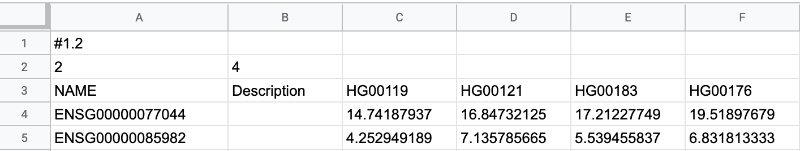

# GCT (Gene Expression)

GCT (Gene Cluster Text) is a tab-delimited text format for storing gene expression datasets, such as microarray and RNA-seq data. ODM automatically recognizes GCT files and imports them as Expression objects, enabling integration with sample metadata and downstream analysis.

**Example files:**

- [Test_1000g.gct](https://s3.amazonaws.com/bio-test-data/odm/Test_1000g/Test_1000g.gct) — example GCT expression matrix
- [Test_1000g.gct.tsv](https://s3.amazonaws.com/bio-test-data/odm/Test_1000g/Test_1000g.gct.tsv) — example expression metadata file

---

## Supported file extensions

| Extension | Description |
|---|---|
| `.gct` | Standard GCT file |
| `.gct.gz`, `.gct.zip` | Compressed GCT file (available via API) |
| `.gct.tsv`, `.gct.tsv.gz`, `.gct.tsv.zip` | GCT file with additional expression-level metadata (available via API) |

---

## Supported GCT versions

ODM supports **GCT 1.2**. The first line of a valid GCT file must be:

```
#1.2
```

---

## File structure



A GCT file has four components in order:

1. **Version line** — always `#1.2`.
2. **Dimensions line** — two integers separated by a tab: the number of data rows (features, e.g., genes) and the number of data columns (samples). These counts exclude the `Name` and `Description` columns.
3. **Header row** — column labels:
    - `Name` (gene or feature identifier; case-insensitive)
    - `Description` (text description of the feature; case-insensitive)
    - Sample identifiers — must be unique, single words with no whitespace
4. **Data matrix** — one row per feature:
    - Column 1: unique feature identifier (e.g., Ensembl gene ID)
    - Column 2: text description (`NA` or `NULL` are acceptable; the field must not be empty)
    - Remaining columns: numeric expression values for each sample; missing values may be left empty

The number of data rows and columns in the matrix must match the dimensions declared on line 2.

Names and descriptions may contain spaces but must not be empty — use `NA` or `NULL` for absent values.

For the full GCT specification, see the [Broad Institute GCT documentation](https://software.broadinstitute.org/software/igv/GCT).

---

## Expression metadata file (.gct.tsv)

A `.gct.tsv` file is a companion tab-delimited file that stores text metadata describing the expression dataset (e.g., normalisation method, genome version). The first row contains attribute names; the second row contains the corresponding values.

| Expression Source    | Normalization Method | Genome Version |
|----------------------|----------------------|----------------|
| 1000 Genomes Project | RPKM                 | GRCh38.91      |

Compressed variants (`.gct.tsv.gz`, `.gct.tsv.zip`) are also accepted.

---

## How ODM uses GCT files

- GCT files are automatically recognized as Expression objects on import; no manual type selection is required.
- Expression values are indexed, enabling search and filtering by gene, sample, and expression level via the API (`GET /api/v1/as-user/omics/expression/data`).
- Sample identifiers in the GCT header are matched against the `Sample Source ID` column in the linked Samples metadata file.

---

## Limitations

- Only GCT version 1.2 (`#1.2`) is supported.
- Sample identifiers must be unique and must not contain whitespace.
- The dimension counts on line 2 must exactly match the actual matrix dimensions.
