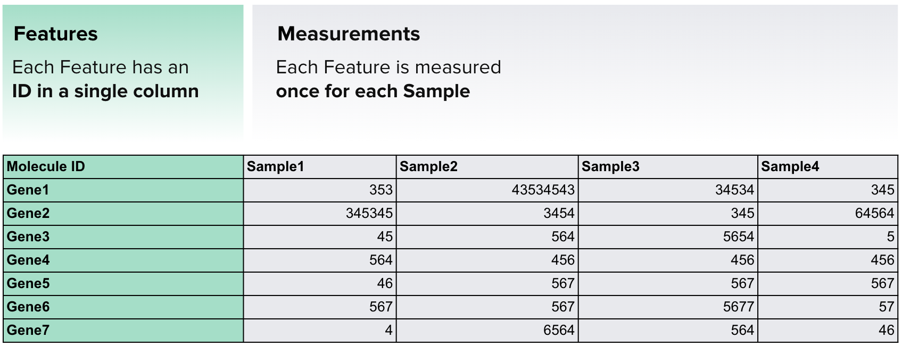
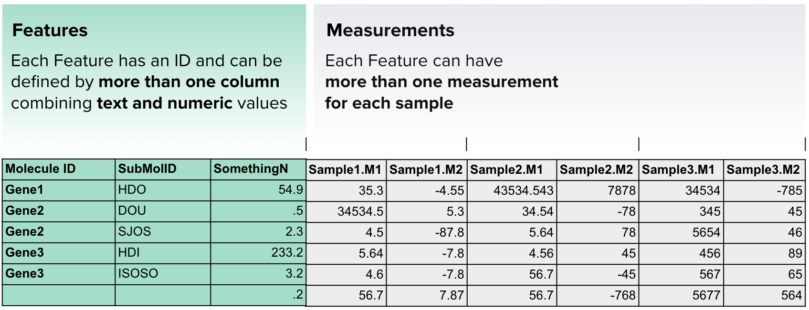

# Supported Data Formats

!!! info "About this guide"
    This guide provides a basic overview of file formats and data supported in the ODM.
    For a detailed description and instructions on using various data formats and working with them
    (sorting, filtering, sampling), visit the **[Supported Data Formats page](../doc-odm-user-guide/supported-formats.md)** 
    in our **Advanced User Guide**.

- :octicons-table-16: __[TSV (Tabular data)](../supported-data/supported-data.md/#tsv-tabular-data)__

    ---

    Upload and manage tabular data (TSV files) seamlessly within the ODM. Work with Samples, 
    Libraries, Preparations, Expression data, and more.

- :fontawesome-solid-signal:{ .lg .middle } __[GCT (Gene Expression)](../supported-data/supported-data.md/#gct-gene-xpression)__ 

    ---

    Upload and work with GCT (Gene Cluster Text) files in the Open Data Manager (ODM). 
    Optimize the analysis of matrix-compatible datasets.

- :material-dna:{ .lg .middle } __[VCF (Variants)](../supported-data/supported-data.md/#vcf-variants)__

    ---

    Upload and work with VCF (Variant Call Format) files to search, filter, retrieve, and analyze 
    genetic variants in the ODM.

- :fontawesome-solid-disease:{ .lg .middle } __[HDF5 (e.g. Single Cell)](../supported-data/supported-data.md/#hdf5-single-cell)__

    ---
    Upload and store HDF5 (Hierarchical Data Format 5) files as attachments in the ODM. Future releases will enable 
    seamless analysis of Single Cell data stored within TSV and HDF5 formats.

- :fontawesome-solid-wave-square:{ .lg .middle } __[FACS (Flow Cytometry)](../supported-data/supported-data.md/#facs-flow-cytometry)__

    ---
    Upload and work with FACS (Fluorescence-Activated Cell Sorting) files in the Open Data Manager (ODM) 
    to efficiently analyze Flow Cytometry data.

- :fontawesome-solid-file-lines:{ .lg .middle } __[Attached Files](../supported-data/supported-data.md/#attached-files)__

    ---
    Upload and organize a diverse range of attached non-indexed files in the ODM. 
    Easily manage your entire data catalog, access and collaboration across any file types.

## TSV (Tabular data)

In ODM, you can upload any tabular data formatted as **TSV (tab-separated values)**. 
As long as your file represents a data frame, ODM can import and index it. A data frame is a data structure that 
organizes data into a two-dimensional table of **rows** and **columns**, similar to a spreadsheet.

A data frame contains two main elements:

- **Features**: These are the entities measured in an experiment (e.g., genes, proteins, metabolites, 
pathways, sales regions, etc.).
- **Measurements (or values)**: These are the actual values recorded for each feature under different 
conditions (e.g., gene expression values, protein abundance, pathway activity, sales volume, etc.).

### Simple Data Frame 

The example below demonstrates the simplest and most common type of data frame. 

Here, the features (genes) 
are listed in the first column, while the rest of the table contains measurements of gene expression across 
multiple samples. Each column represents a different sample, with the column name indicating the 
corresponding dataset of gene expression values.

### Complex Data Frame

This format provides a wide range of data types that can be uploaded and indexed in ODM.

For a detailed description and instructions on using TSV, visit the **[Supported Data Formats page](../doc-odm-user-guide/supported-formats.md)**
in our **Advanced User Guide**.

## GCT (Gene Expression)

The ODM supports **GCT (Gene Cluster Text) files**, which are commonly used for storing gene expression 
datasets, such as microarray and RNA-seq data. These files provide a structured, tab-delimited format for organizing 
expression values across different samples. ODM automatically recognizes GCT files enabling integration and analysis.

#### Supported GCT Formats
ODM accepts the following GCT file formats:

  * **.gct** – Standard GCT file
  * **.gct.gz, .gct.zip** – Compressed versions of the standard GCT file (available via API)
  * **.gct.tsv, .gct.tsv.gz, .gct.tsv.zip** – GCT files with additional expression metadata (available via API)

#### Structure of a GCT File
A GCT file consists of a structured matrix with gene expression values. The key components include:

1. **File Version**: The first line always contains the file version, which is `#1.2` for the GCT format.
2. **Matrix Dimensions**: The second line specifies the number of genes (rows) and the number of samples (columns), excluding metadata columns.
3. **Header Row**: The third line contains column labels:
    * `Name` (gene identifier, case insensitive)
    * `Description` (text description of the gene, case insensitive)
    * `Sample identifiers` (unique, single-word names without spaces)
4. **Data Matrix**:
    * Each row corresponds to a gene, with its identifier and description in the first two columns.
    * The remaining columns contain expression values for each sample.

For a detailed description and instructions on using GCT, visit the **[Supported Data Formats page](../doc-odm-user-guide/supported-formats.md)**
in our **Advanced User Guide**.

## VCF (Variants)

The ODM supports **VCF (Variant Call Format) files**, a widely used format for storing genetic variation data. 
VCF files provide a structured, tab-delimited representation of genetic variants and are typically generated 
as output from variant calling pipelines. These files contain detailed information about sequence variations, 
including single nucleotide polymorphisms (SNPs), insertions, deletions, and structural variants.

### Supported VCF Formats
ODM accepts the following VCF file formats:

   * **.vcf** – Standard uncompressed VCF file
   * **.vcf.gz, .vcf.zip** – Compressed versions of the standard VCF file (available via API) 

### Structure of a VCF File
A VCF file consists of three main components:

1. **Meta-information lines (`##`)**
2. **Header line (`#`)** – The final metadata line, which defines the column names for variant data:
    * `CHROM` (chromosome)
    * `POS` (genomic position)
    * `ID` (variant identifier)
    * `REF` (reference allele)
    * `ALT` (alternate allele(s))
    * `QUAL` (quality score)
    * `FILTER` (filter status)
    * `INFO` (additional annotations)
3. **Data lines** – Each row represents a variant, detailing its position, reference and alternate alleles, 
quality scores, and annotations.

### Common Fields in VCF Files
VCF files provide essential information for genomic studies, with key fields including:

- **INFO**: Contains annotations about the variant, such as depth of coverage (`DP`), allele frequency (`AF`), and functional effect (`EFF`).
- **FILTER**: Specifies whether the variant has passed quality control thresholds (`PASS` or filter conditions like `q10` for quality < 10).
- **FORMAT**: Defines the structure of genotype-related fields in the sample data.
- **Sample Columns**: Contain individual genotype information, including genotype (`GT`), depth (`DP`), and phasing status (`PS`).

For detailed specifications on the VCF format, refer to the official **[VCF documentation](https://samtools.github.io/hts-specs/)**.

### Using VCF Files in ODM
The ODM allows users to:

- Import and store genomic variants.
- Integrate variant data with sample metadata for downstream analysis.
- Searching and filtering of genetic variants.
- Perform cross-sample comparisons and study variant distributions.

For a detailed description and instructions on ODM capabilities for using VCF, visit the **[Supported Data Formats page](../doc-odm-user-guide/supported-formats.md)**
in our **Advanced User Guide**.

## HDF5 (e.g. Single Cell)

!!! info "Limitations"
    HDF5 is supported as Attached File in ODM with ability to observe and search by File Structure (Contents) only.
    We are working on full functionality for HDF5 data content parsing, search, and filtering.

**HDF5 (Hierarchical Data Format version 5)** is a widely used data format in genomic research, particularly in 
Single Cell studies. It is designed to store large, complex datasets efficiently, making it a preferred choice for 
structured biological data such as gene expression matrices and metadata.

The ODM now supports HDF5 file upload as Attached File, search by File Structure (Contents), and manage these 
files within Studies.

### Supported HDF5 Formats

- **.h5, .h5ad** - Standard HDF5 files
- **.h5.gz, .h5ad.zip** - Compressed versions of standard HDF5 files

### Viewing File Structure (Contents)

- **Access File Contents via GUI**: The ODM displays File Contents on the Data Tab of Metadata Editor. It is 
    accessible on `Contents` button click.
- **Retrieve File Contents via API**: You can retrieve File Contents for the list of files or by unique 
    Genestack Accession.

### Searching HDF5 Files by File Contents

Users can search via GUI and API for:

- **Unique File**: by Genestack Accession.
- **Files**:

    - By File Contents fields/pathways.
    - By Study Genestack Accession.

- **Studies**:

    - By File Contents fields/pathways.
    - By File Genestack Accession.

For a detailed description and instructions on using HDF5, visit the **[Supported Data Formats page](../doc-odm-user-guide/supported-formats.md)**
in our **Advanced User Guide**.

## FACS (Flow Cytometry)

### Data Overview

- The FACS format in the ODM represents processed (post-gating) flow cytometry data for human-readable analysis and integration.

1. **Key Columns:**

    * **Sample:**
        * A string representing the sample name without additional extraction.

    * **CellPopulation:**
        - Describes cell subtypes in a hierarchical, path-like structure (e.g., `CD45+, live/CD45+, CD3+/CD4`).
        - Counts at parent levels equal the sum of their children, but marker-specific counts may not add up due to cells expressing multiple markers.

    * **ReadoutType:**
        - Defines the type of value recorded:
        - **Median**: Median intensity of a fluorophore (decimal).
        - **Count**: Number of cells (integer).
        - **Percentage**: Proportion relative to the parent population.

    * **Marker:**
        - Identifies proteins or fluorophores on the cell surface (e.g., `PD-1`, `GZB`, `BV786`).
        - Some markers may have different names but refer to the same entity.

2. **Considerations:**

    - Cell populations are hierarchical, and cells may carry multiple markers simultaneously.
    - Marker counts do not fully represent the total population due to overlapping markers.

### Using FACS in ODM

ODM indexes FACS files and provide API endpoints to search via them:

1. Find FACS objects and groups by its metadata and data:
    - Run
    - Readout Type
    - Population
    - Marker
    - Value

2. Find objects and groups by its Genestack Accession.

3. Find objects and groups by entities:
    - Study
    - Samples

4. Update FACS group metadata by object id.

For a detailed description and instructions on using FACS, visit the **[Supported Data Formats page](../doc-odm-user-guide/supported-formats.md)**
in our **Advanced User Guide**.

## Attached Files

The ODM allows users to upload and manage any attachments related to their Studies.
Attachments can be uploaded via the GUI or API, and for every uploaded file **must be assigned a Data Class** to ensure 
proper organization within catalogue and retrieval.

### Uploading Attachments

Users can upload any file type through the GUI, the `POST /api/v1/jobs/import/file` endpoint in `job` endpoints definition, or the `import_odm_data.py` script. 
All uploaded attachments are stored in S3 and reflected in the system but are not indexed. 
To maintain structured catalogue, each attachment must be assigned a Data Class.

!!! danger "Limitation"
    S3 bucket is mandatory to upload and work with Attached files functionality in the ODM.

### Managing and Viewing Attachments

Attachments are displayed in the appropriate Data Class group on the `Data` tab in User Interface. 
Users can view and manage uploaded files, ensuring they are correctly categorized and accessible within their Studies. 
Metadata can be added, edited, and customized for attachments, and additional non-template attributes can be specified.

### Searching for Attachments

The Study Browser and API allows users to find Studies by Attached file metadata. Study Browser also allows to search for Studies
by Data Class assigned to Attached files.

### API Support

The API provides endpoints to manage attachments:

1. Upload Attached files.
2. Find all Attached files metadata.
3. Find metadata of particular Attached file. 
4. Find Studies by Attached file id or metadata.
5. Download Attached file. 
6. Delete Attached files.

For a detailed description and instructions on using Attached Files, visit the **[Supported Data Formats page](../doc-odm-user-guide/supported-formats.md)**
in our **Advanced User Guide**.
