# Tutorial: Curate a Study

In this tutorial you will take a newly imported study from raw to validated state. You will rename the study, correct invalid metadata fields using the Metadata Editor, and apply bulk replacement to bring all values into conformance with the assigned template.

---

## Goal

Transform an unvalidated study — one that shows "Invalid metadata" warnings — into a fully validated study with a green "Metadata is valid" indicator on every tab.

---

## Prerequisites

- **Role:** Contributor (or Administrator).
- A study that has already been imported into ODM, with at least one sample loaded.
- A metadata template already assigned to the study.

---

## Steps

### Step 1 — Navigate to your study in the Study Browser

From the Dashboard, click **Browse studies**. In the Study Browser, check the **Owned by me** option to filter the list to studies you have uploaded.

Click the study title to open it in the Metadata Editor. If the study has no title yet, it will appear as "New Study".

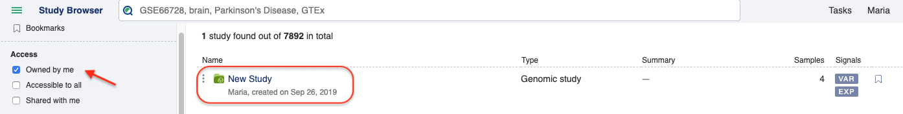

---

### Step 2 — Rename the study

In the Metadata Editor, click the study title link at the top of the page and select **Rename** from the dropdown.

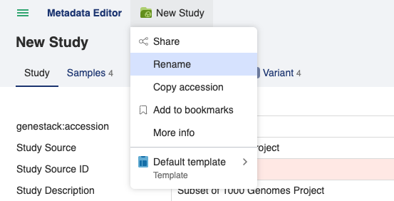

Type the new name and click the blue **Rename** button to confirm.

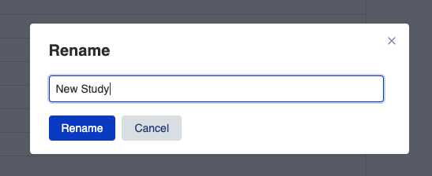

---

### Step 3 — Review the assigned template

The template determines which fields are required and what values are valid. If you need to change which template is applied to the study, click the study title dropdown and select **Apply another..**.

Metadata fields are checked against the active template. Fields with missing or non-conforming values are shown with a red background and the **Invalid metadata** flag appears in the upper right corner of the editor.

Note that the special values **Not applicable** and **Not recorded** always pass validation and can be used when a value is genuinely absent.

---

### Step 4 — Correct individual metadata fields

Click on any field with a red background to edit it directly.

- For **free-text fields**, type the corrected value and press Enter or click away to save.
- For **dictionary-controlled fields** (such as Organism), click the triangle icon to select a term from the controlled vocabulary, or start typing to see autocomplete suggestions. Terms that match the dictionary will turn green.

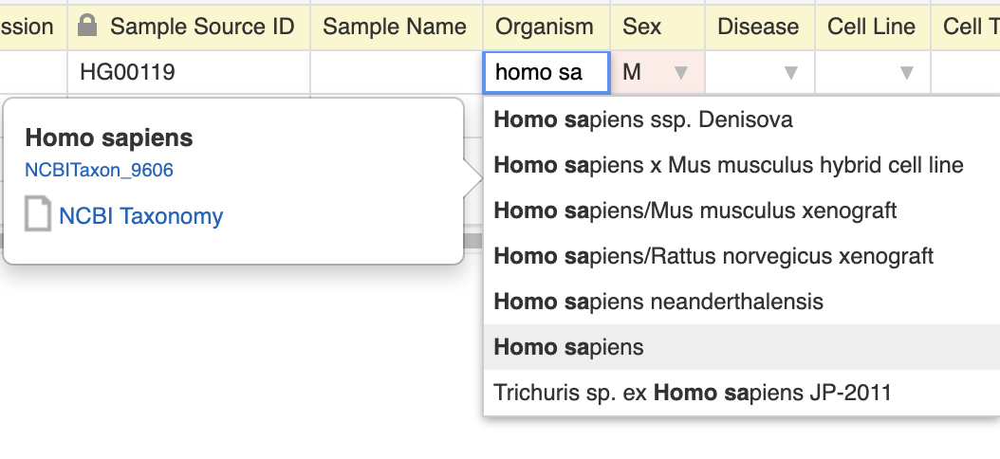

When all required fields on a tab are filled in correctly, the Invalid metadata flag is replaced by a green **Metadata is valid** indicator.

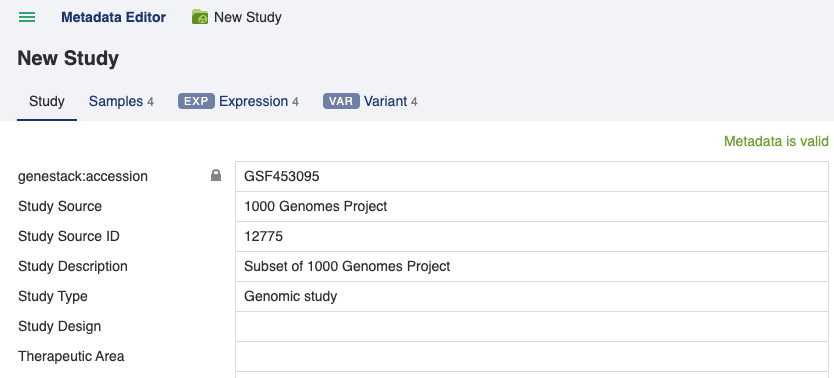

**Tip:** For the Samples tab, you can propagate a single value across multiple rows by dragging the bottom-right corner of a cell — similar to fill-down in a spreadsheet.

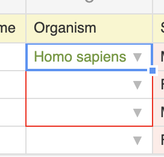

---

### Step 5 — Use Bulk Replace to fix repeated errors

When many cells contain the same invalid value, use **Bulk Replace** instead of editing each cell one at a time.

You can open Bulk Replace in two ways:

- Click the **Invalid metadata** link in the upper right corner of the editor.
- Click the column header of a field that contains incorrect values and select **Bulk replace** from the dropdown.

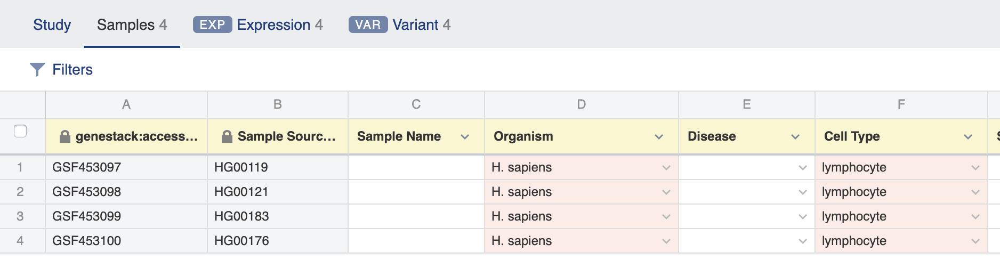
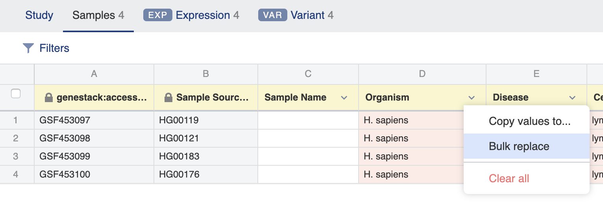

This opens the **Validation Summary** pop-up, which lists all invalid values in the current tab.

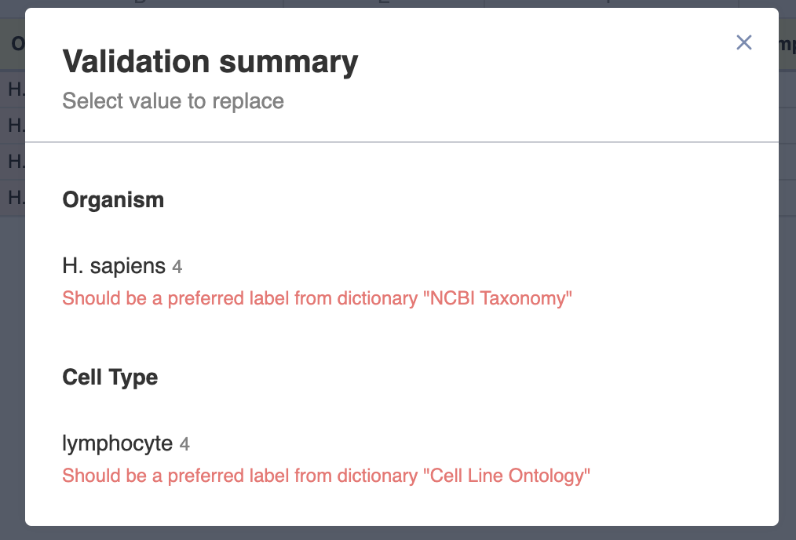

Select the value you want to replace.

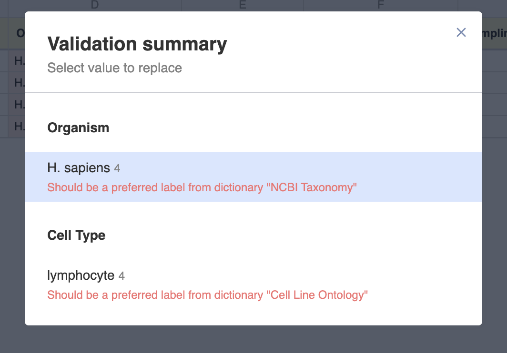

The **Replace values** window opens. Type the correct replacement value — autocomplete will suggest dictionary-matched terms if the field is controlled.

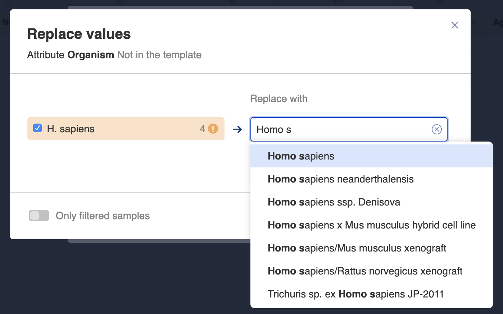

Click **Replace in…** to apply. If you have filters active (for example, filtering samples by "Sex = male"), you can choose to replace only the values visible in the current filtered view.

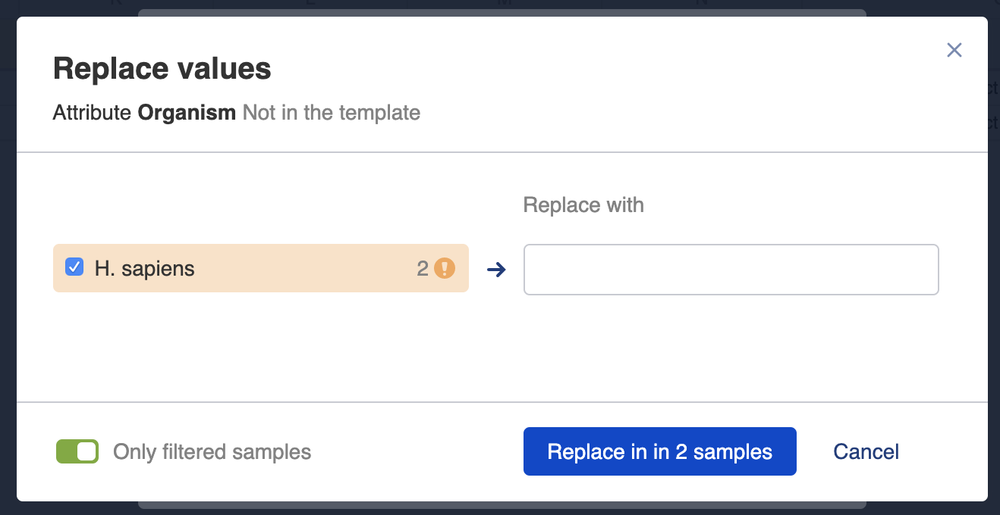

After replacement, the corrected values appear in the table and the validation state updates immediately.

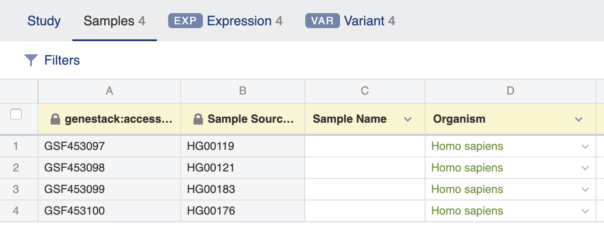

---

### Step 6 — Verify the study is fully validated

Work through each tab (Study, Samples, Libraries, Preparations, and any data tabs) until every tab shows the green **Metadata is valid** indicator. The Invalid metadata flag in the upper right corner will disappear once all issues are resolved.

---

## What happened?

You have taken a newly imported study through the full curation workflow:

1. Located the study in the Study Browser using the "Owned by me" filter.
2. Renamed the study to a meaningful title.
3. Applied or confirmed the template governing validation rules.
4. Corrected individual invalid fields using the inline editor and dictionary autocomplete.
5. Used Bulk Replace to fix repeated errors across many cells at once.
6. Verified that all tabs show a green "Metadata is valid" status.

The study is now curated and ready to be shared or used in downstream analysis.

---

## What's next?

- [Validate metadata with a template](../how-to/metadata-templates/validate-metadata.md) — understand template rules in detail and how to configure validation.
- [Share a study with collaborators](../how-to/sharing-permissions/share-a-study.md) — control who can view or edit your curated study.
- [Manage study versions](../how-to/studies-import/manage-versions.md) — track changes to imported data over time.
