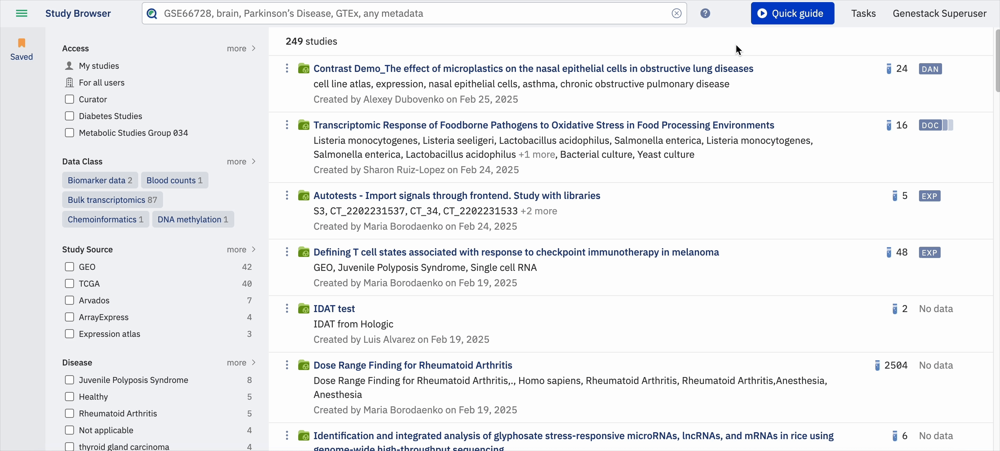
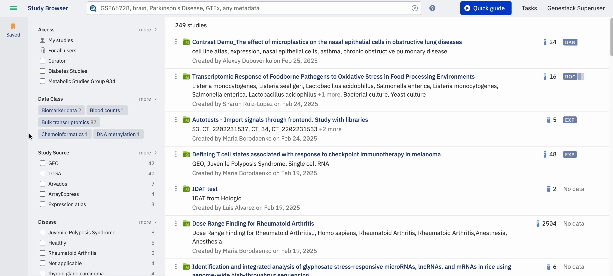
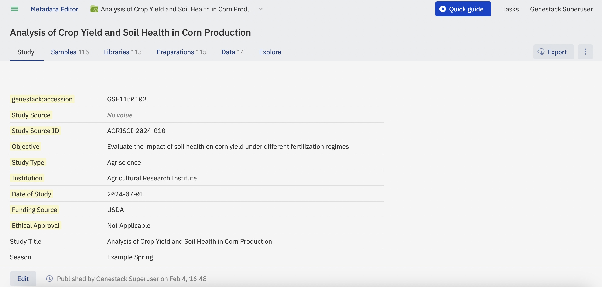

# Tutorial: Your First Session in ODM

By the end of this tutorial you will have logged in, navigated the dashboard, found a study, and opened its metadata.

---

## Goal

Get comfortable with the three core surfaces of ODM: the Dashboard, the Study Browser, and the Metadata Editor. You will not change any data — just explore.

---

## Prerequisites

- An ODM account with any role (Consumer, Contributor, or Administrator).
- The URL of your ODM instance.

---

## Steps

### Step 1 — Log in and orient yourself on the Dashboard

Navigate to your ODM instance URL and sign in with your credentials.

The first thing you will see after logging in is the **Dashboard**. Notice that it provides quick-access links to the main areas of ODM. As a regular user, the most important link is **Browse studies**, which takes you directly to the Study Browser.

The Dashboard is your starting point for every session. Bookmark it for quick access.

---

### Step 2 — Open the Study Browser and find a study

Click the **Browse studies** link on the Dashboard. You will see the **Study Browser** open, showing the studies you have access to.

!!! info "Limitation"
    Only studies you have permission to observe are displayed by default — studies created by you, or studies shared with your group by another user.

Notice the two main ways to find studies:

- **Search bar** — type a study name, accession number, or any metadata value. The search understands controlled vocabularies and ontologies, so it automatically expands results to include synonyms. Click the **?** icon next to the search bar to open built-in help with advanced search syntax.

    

- **Facets panel** — the left-hand panel lets you filter results by any metadata field present in the current result set. Use facets to narrow down a broad search.

    

!!! tip
    Harmonising metadata values with validation rules (configured by your administrator) helps you find all relevant studies without missing results caused by non-standard terminology.

Try searching for a term you know exists in your ODM instance — a disease name, tissue type, or species. Notice how the facets update as you refine your query.

---

### Step 3 — Open a study and explore its metadata in the Metadata Editor

Click the name of any study in the results list. ODM will open the **Metadata Editor** in a new browser tab.

Take a moment to notice what the Metadata Editor contains:

- **Study tab** — top-level metadata describing the study as a whole.
- **Samples, Libraries, and Preparations tabs** — metadata for the biological and technical entities within the study.
- **Data classes** — any signal data attached to the study, such as expression or variant data.

You can scroll through the tabs to see how a study is structured. At this stage you are just exploring — no changes are being saved.

---

## What happened?

You have now seen the three main areas of ODM:

1. The **Dashboard** — your entry point and navigation hub.
2. The **Study Browser** — where you search and filter studies using metadata and ontology-aware search.
3. The **Metadata Editor** — where you inspect the full metadata hierarchy of a single study.

Understanding these three surfaces is the foundation for everything else you will do in ODM.

---

## What's next?

Continue with the guide for your role:

- **Consumer** — learn how to search, filter, and export data: [Consumer guide](../getting-started/consumer.md)
- **Contributor** — learn how to import studies and curate metadata: [Contributor guide](../getting-started/contributor.md)
- **Administrator** — learn how to manage users, templates, and instance configuration: [Administrator guide](../getting-started/admin.md)
