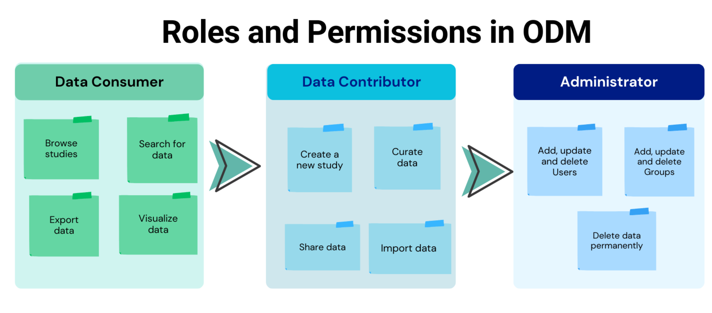

# Defining User Capabilities in ODM

## An Overview of Roles and Permissions

Understanding the roles and permissions within ODM is essential for effective data management and collaboration.
Each role has specific permissions that define the actions users can perform. 
The diagram below illustrates the three primary roles in ODM and their associated permissions.

### Data Consumer

* **Browse Studies**: Access and view available studies. 
* **Search for Data**: Perform searches for specific data (Note: Some studies may not be available to all users). 
* **Export Data**: Download data for further analysis. 
* **Visualize Data**: Generate visual representations of the data.

### Data Contributor

* **Create a New Study**: Initiate and set up new studies within ODM. 
* **Curate Data**: Manage and organize data to ensure its quality and relevance. 
* **Share Data**: Share data with other users and groups. 
* **Import Data**: Upload new data into the system for analysis.

### Administrator

* **Add, Update, and Delete Users**: Manage user accounts and permissions. 
* **Add, Update, and Delete Groups**: Organize users into groups and manage group permissions. 
* **Delete Data Permanently**: Remove data from the system entirely, ensuring it cannot be recovered.

The structured approach to roles and permissions helps facilitate seamless collaboration 
and efficient data management within the ODM platform.

!!! tip "For detailed description for Users and Permissions, please refer to the [Permissions and User Groups](../doc-odm-user-guide/setup.md/#users-and-permissions){:target="_blank"} article"

By defining these roles and permissions clearly, ODM ensures that users have the appropriate access 
and capabilities needed to perform their tasks effectively while maintaining data security and integrity.
